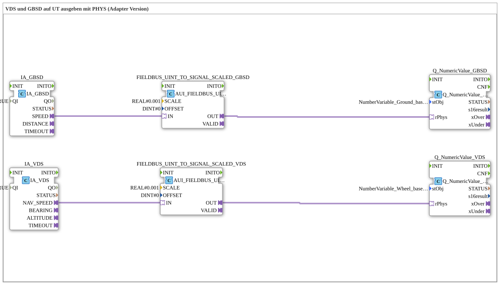

# Exercise_073c_AUI: Outputting VDS and GBSD to a Universal Terminal (UT) using PHYS (Adapter Version)

* * * * * * * * * *
## Introduction
This exercise demonstrates the output of the speed signals **Ground Based Speed (GBSD)** and **Vehicle/Drive Speed (VDS)** to a Universal Terminal (UT) using physical addresses (PHYS). The signals are received via ISOBUS adapters (IA), scaled, and displayed on the UT using the `Q_NumericValue_PHYSA` blocks.
This exercise teaches how to use signal scaling and the adapter concept (*AUI*) in 4diac IDE.

> **Note:** Currently, `NumberVariable_Wheel_based_machine_speed` is used as the target object for navigation speed. For final implementation, `NumberVariable_Navigation_based_vehicle_speed` should be created in the object pool and the corresponding parameter set.

---

## Function Blocks (FBs) Used

This exercise consists of six function blocks, all located within the subapp `Uebung_073c_AUI`.

| Block Name | Type | Parameter | Description |

|--------------|-----|------------|--------------|

| `IA_GBSD` | `isobus::tecu::IA_GBSD` | QI = TRUE | ISOBUS interface block for **ground-based speed**. Returns the measured value as a UINT at output `SPEED`. |

| `IA_VDS` | `isobus::tecu::IA_VDS` | QI = TRUE | ISOBUS interface module for **vehicle-related speed** (Vehicle/Drive Speed). Outputs the measured value as a UINT at output `NAV_SPEED`. |

| `FIELDBUS_UINT_TO_SIGNAL_SCALED_GBSD` | `logiBUS::signalprocessing::fieldbus::AUI_FIELDBUS_UINT_TO_SIGNAL_SCALED` | SCALE = 0.001, OFFSET = 0 | Scales the UINT value from `IA_GBSD` to a REAL value (multiplication by 0.001). |

| `FIELDBUS_UINT_TO_SIGNAL_SCALED_VDS` | `logiBUS::signalprocessing::fieldbus::AUI_FIELDBUS_UINT_TO_SIGNAL_SCALED` | SCALE = 0.001, OFFSET = 0 | Scales the UINT value of `IA_VDS` to a REAL value (multiplication by 0.001). |

| `Q_NumericValue_GBSD` | `isobus::UT::Q::Q_NumericValue_PHYSA` | stObj = `NumberVariable_Ground_based_machine_speed` | Displays the scaled ground-related speed on the UT. Uses the physical address (PHYSA) of the object pool. |

| `Q_NumericValue_VDS` | `isobus::UT::Q::Q_NumericValue_PHYSA` | stObj = `NumberVariable_Wheel_based_machine_speed` | Displays the scaled vehicle-related speed on the UT. *(Note: used as a fallback)* |

---

## Program Flow and Connections

The connections between the function blocks are made via **adapters (AUI)**. The data flow is as follows:

1. **GBSD**

- `IA_GBSD` receives the raw speed (UINT) via ISOBUS.
- The output `SPEED` is routed via an adapter connection to the input `IN` of `FIELDBUS_UINT_TO_SIGNAL_SCALED_GBSD`.
- This module scales the value using `SCALE = 0.001` and outputs the result as REAL at output `OUT`.
- The scaled value is passed to the input `rPhys` of `Q_NumericValue_GBSD` and displayed on the UT.

`` 2. **VDS**

- `IA_VDS` outputs the navigation speed as a UINT signal at output `NAV_SPEED`.
- This value is passed via an adapter connection to the scaling module `FIELDBUS_UINT_TO_SIGNAL_SCALED_VDS`.
- After the same scaling (0.001), the signal is sent to input `rPhys` of `Q_NumericValue_VDS` and displayed on the UT.

The scaling with `0.001` converts the typically integer CAN bus values (e.g., 0–65535) into physical units (e.g., m/s or km/h). The offset is set to 0 here.

The comment on the network indicates that `NumberVariable_Navigation_based_vehicle_speed` should actually be used for navigation speed. The current configuration uses `NumberVariable_Wheel_based_machine_speed` as a placeholder.

---

## Summary

Exercise **Exercise_073c_AUI** demonstrates how to read two speed signals (GBSD and VDS) via ISOBUS adapters (IA), scale them by a factor of 0.001, and output them to a Universal Terminal using the physical addresses of an object pool. The use of adapters (AUI) enables flexible signal processing without fixed point-to-point wiring of the events. This exercise is a typical example of visualizing ISOBUS measurement values in agricultural control systems.

Exercise **Exercise_073c_AUI** demonstrates how to read two speed signals (GBSD and VDS) via ISOBUS adapters (IA), scale them by a factor of 0.001, and output them to a Universal Terminal using the physical addresses of an object pool. ---

### 🌐 Related topic subpages on ms-muc-docs.de
* [🌐 Eclipse 4diac IDE & Color Reference on ms-muc-docs.de](https://www.ms-muc-docs.de/iec-61499/eclipse-4diac/)

]
