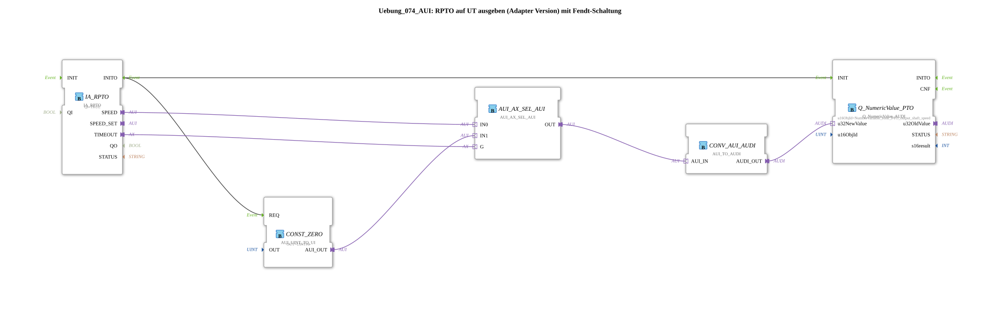

# Exercise_074_AUI: Outputting RPTO to UT (Adapter Version) with Fendt Circuit



* * * * * * * * * *
## Introduction
This exercise demonstrates the output of the rear PTO speed to a user terminal (UT) using adapters. It implements a so-called "Fendt circuit" that displays the value 0 on the UT if the PTO signal times out. This ensures reliable operation in case of sensor failure or communication problems.

The exercise is based on the use of ISOBUS components (especially the TECU interface) and demonstrates the use of adapter modules for type conversion and signal selection.


## Function Blocks (FBs) Used

The SubApp contains the following function blocks, which are interconnected in the network:

### Sub-Blocks: IA_RPTO
- **Type**: `isobus::tecu::IA_RPTO`
- **Internal FBs Used**: none (primitive block)
- **Parameters**: `QI = TRUE` (initialization quality active)
- **Event Outputs**: `INITO`
- **Adapter Outputs**: `SPEED` (current speed as AUI value), `TIMEOUT` (signal on timeout)
- **Functionality**: Provides the interface to the TECU system for the rear PTO. Returns the measured speed and a timeout flag.


### Sub-modules: Q_NumericValue_PTO
- **Type**: `isobus::UT::Q::Q_NumericValue_AUDI`
- **Internal Function Blocks Used**: None

- **Parameters**: `u16ObjId = NumberVariable_Rear_PTO_output_shaft_speed` (Identification of the object to be displayed)

- **Event Inputs**: `INIT`

- **Data Inputs**: `u32NewValue` (AUDI-encoded value)

- **Functionality**: Receives a numeric value in AUDI format and displays it on the user terminal under the specified object ID.


### Sub-Blocks: AUI_AX_SEL_AUI

- **Type**: `adapter::iec61131::selection::AUI_AX_SEL_AUI`
- **Internal Function Blocks Used**: None

- **Parameters**: None

- **Adapter Inputs**: `IN0`, `IN1`, `G`

- **Adapter Output**: `OUT`

- **Functionality**: A 2-to-1 selector block. If the gate signal is `G` or `TRUE`, the value of `IN1` is passed through to `OUT`; Otherwise, the value of `IN0` is used. This is used here to implement the Fendt circuit.

### Sub-Blocks: CONST_ZERO
- **Type**: `adapter::conversion::unidirectional::AUI_UINT_TO_UI`
- **Internal Function Blocks Used**: None

- **Parameters**: `OUT = UINT#0` (constant output value)
- **Event Inputs**: `REQ`
- **Adapter Output**: `AUI_OUT`
- **Functionality**: Returns a constant AUI value of 0 in response to a `REQ` event. Used as a substitute signal in case of timeout.


### Sub-Blocks: CONV_AUI_AUDI

- **Type**: `adapter::conversion::unidirectional::AUI_TO_AUDI`
- **Internal Function Blocks Used**: None

- **Parameters**: None

- **Adapter Input**: `AUI_IN`

- **Adapter Output**: `AUDI_OUT`

- **Functionality**: Converts an AUI value into the AUDI format expected by the display block `Q_NumericValue_PTO`.

## Program Flow and Connections
This exercise is used as a sub-app within a larger application, typically an ISOBUS control unit for tractors.


**Signal Flow**:

1. After initialization (event `INITO` of `IA_RPTO`), the function blocks `Q_NumericValue_PTO` and `CONST_ZERO` are activated (`INIT` and `REQ`, respectively).

2. The current PTO speed is sent as an AUI value via `IA_RPTO.SPEED` to the input `IN0` of the selector `AUI_AX_SEL_AUI`.


``` 3. Simultaneously, the timeout flag `IA_RPTO.TIMEOUT` is applied to the selector's gate input `G`. Under normal operation, `TIMEOUT = FALSE` is present, causing the selector to pass through the value of `IN0` (the measured rotational speed).

4. In the event of a timeout (e.g., due to sensor failure), `TIMEOUT = TRUE` is present. The selector then switches to the second input, `IN1`, which is set to the constant value 0 via `CONST_ZERO`.


5. The selected AUI value is passed from `AUI_AX_SEL_AUI.OUT` to `CONV_AUI_AUDI.AUI_IN`, converted to the AUDI format there, and finally fed to the display module as `u32NewValue`.

6. `Q_NumericValue_PTO` displays the value on the user terminal – the actual engine speed during normal operation, and 0 during a timeout.

**Learning Objectives**:

- Understanding the use of adapters for communication between different protocols (AUI, AUDI).

- Implementing a simple fallback logic (Fendt circuit) with a 2-channel selector.

- Working with ISOBUS TECU commands and UT display modules in 4diac.


- Detecting and handling timeout situations in fieldbus communication.

**Difficulty Level**: Medium
**Prerequisites**: Basic knowledge of the 4diac IDE, structure of SubApp types, understanding of adapter interfaces and event-driven programming.

**Setup Instructions**:

This exercise requires the project libraries containing the FPGA components used (e.g., `isobus`, `adapter`). The symbol and object ID (`NumberVariable_Rear_PTO_output_shaft_speed`) must be defined in the ISOBUS system being used.

## Summary
The exercise `Uebung_074_AUI` implements a reliable display of the PTO speed on a user terminal. By combining an adapter selector with a constant zero value in case of a fault, a simple yet robust Fendt circuit is implemented. It conveys fundamental concepts of the ISOBUS protocol, adapter communication, and event-based data preprocessing in 4diac.

---

### 🌐 Related topic subpages on ms-muc-docs.de

* [🌐 Eclipse 4diac IDE & color reference on ms-muc-docs.de](https://www.ms-muc-docs.de/iec-61499/eclipse-4diac/)

]