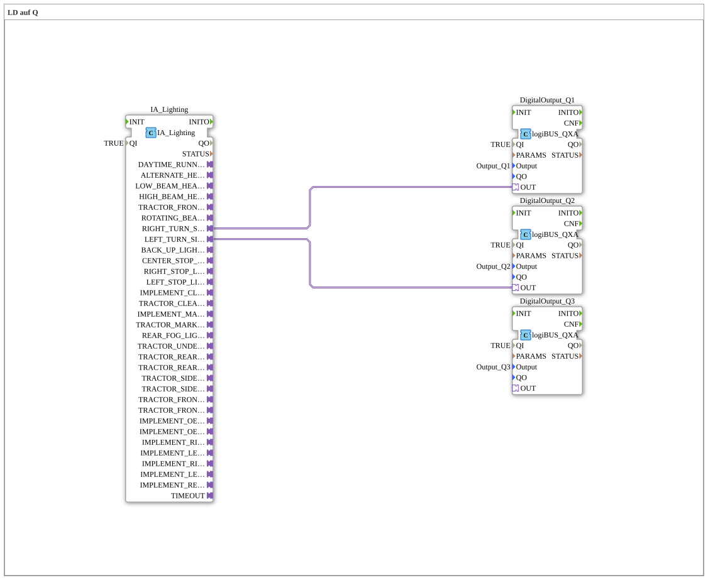

# Exercise_075_AX: LD to Q

* * * * * * * * * *
## Introduction
This exercise demonstrates the control of digital outputs via an ISOBUS lighting adapter. The sub-app element "Exercise_075_AX" processes the turn signal signals (right/left) of a vehicle and forwards them to corresponding digital outputs (e.g., logiBUS outputs). The comment "LD to Q" indicates the transmission of lighting data (LD) to the outputs (Q).
## Function Blocks (FBs) Used

### Sub-Blocks:

#### IA_Lighting
- **Type**: `isobus::tecu::IA_Lighting`
- **Internal FBs Used**: None
- **Parameters**:
- `QI` = TRUE (Enable)
- **Functionality**:

This function block provides an ISOBUS-compliant lighting control interface. Various lighting functions are provided via adapter outputs, including right and left turn signals (`RIGHT_TURN_SIGNAL_LIGHTS`, `LEFT_TURN_SIGNAL_LIGHTS`). The signals are activated as soon as a higher-level controller sends the corresponding lighting commands.

#### DigitalOutput_Q1, DigitalOutput_Q2, DigitalOutput_Q3
- **Type**: `logiBUS::io::DQ::logiBUS_QXA`
- **Internal Function Blocks Used**: None
- **Parameters**:
- `QI` = TRUE (Enable)
- `Output` = `Output_Q1` / `Output_Q2` / `Output_Q3` (each with its own value)
- **Functionality**:

These function blocks encapsulate digital outputs of the logiBUS hardware. With `QI = TRUE`, they are activated and switch the connected physical output according to the incoming adapter signal. They can be used, for example, for lamps, relays, or other binary actuators.

## Program Flow and Connections

Wiring within the SubApp network is done exclusively via **adapter connections**:

1. The module `IA_Lighting` receives the turn signal commands (from a higher-level application) and makes them available at its adapter outputs.

2. The connection 
- **`IA_Lighting.RIGHT_TURN_SIGNAL_LIGHTS` → `DigitalOutput_Q1.OUT`** 
routes the signal for the right turn signal to digital output Q1.

- **`IA_Lighting.LEFT_TURN_SIGNAL_LIGHTS` → `DigitalOutput_Q2.OUT`** routes the signal for the left turn signal to digital output Q2.

3. The third output module, `DigitalOutput_Q3`, remains unused in this exercise (it can be used as a spare or for future expansion).

Thanks to the adapter technology, complex parameter transfer is eliminated – signal propagation is standardized and automatic.

**Learning Objectives**:

- Understanding adapter connections (socket/plug) in 4diac IDE
- Integrating an ISOBUS lighting adapter and logiBUS digital outputs
- Creating reusable SubApp components for vehicle lighting control

**Difficulty Level**: Easy (basic adapter configuration)
**Prerequisites**: Basic knowledge of 4diac IDE, working with function blocks and networks

## Summary

Exercise "Exercise_075_AX" demonstrates how an ISOBUS lighting adapter controls two digital outputs via adapter connections. Right and left turn signal signals are transmitted to the logiBUS outputs Q1 and Q2. The SubApp is a compact, prototypical element for simple lighting control in agricultural vehicles. It highlights the advantages of adapter-based communication in IEC 61499 and can serve as a building block for more complex lighting functions.

---

### 🌐 Related topic subpages on ms-muc-docs.de
* [🌐 Eclipse 4diac IDE & Color Reference on ms-muc-docs.de](https://www.ms-muc-docs.de/iec-61499/eclipse-4diac/)

]
