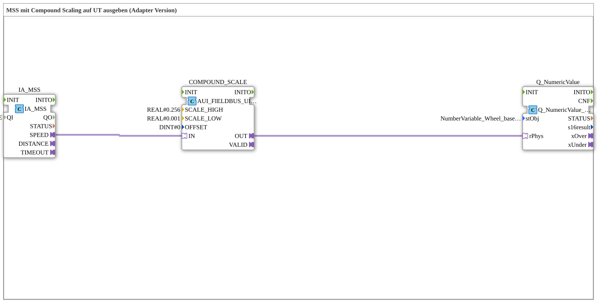

# Exercise_076_AUI: Outputting MSS to UT with Compound Scaling (Adapter Version)

* * * * * * * * * *
## Introduction
This exercise demonstrates the processing of the Machine Selected Speed (MSS) and its transmission as a physical quantity to the Universal Terminal (UT).
Compound scaling is used to adapt the signal range to the requirements of the UT. Communication between the function blocks is via adapter connections.

## Function Blocks (FBs) Used

### IA_MSS
- **Type**: `isobus::tecu::IA_MSS`
- **Parameter**: QI = TRUE
- **Functionality**: This FB provides the interface to the ISO-bus-based machine control system. It delivers the current machine setpoint speed (MSS) as an output signal at adapter port `SPEED`. The parameter QI (Qualifier Input) is permanently set to TRUE to activate data provision.

### COMPOUND_SCALE
- **Type**: `logiBUS::signalprocessing::fieldbus::AUI_FIELDBUS_UINT_TO_SIGNAL_COMPOUND_SCALE`
- **Parameters**:
- `SCALE_HIGH` = REAL#0.256
- `SCALE_LOW` = REAL#0.001
- `OFFSET` = DINT#0
- **Functionality**: This function block receives the raw value (UINT) from the IA_MSS via the adapter input `IN` and scales it to a physical value using compound scaling. The scaling parameters define the upper and lower limits of the linear range; the offset remains zero. The scaled value is provided at output `OUT`.

### Q_NumericValue
- **Type**: `isobus::UT::Q::Q_NumericValue_PHYSA`
- **Parameters**:
- `stObj` = `NumberVariable_Wheel_based_machine_speed`
- **Functionality**: This function block (FB) outputs a physical value to the Universal Terminal (UT) via the ISO-bus UT interface. The parameter `stObj` references an object from the object pool (here: `NumberVariable_Wheel_based_machine_speed`), which serves as the target variable for the value display. The scaled value is received via the adapter input `rPhys`.

> **Note:**
> The object pool entry used is only a placeholder. In practice, a separate ``NumberVariable_Machine_selected_speed`` object should be created and the parameter modified accordingly (see the comment in the network).

## Program Flow and Connections

The flow is as follows:

1. The function block ``IA_MSS`` returns the current target machine speed as a UINT value via its adapter output ``SPEED``.

2. This value is forwarded via an adapter connection to the input ``IN`` of the function block ``COMPOUND_SCALE``.

3. ``COMPOUND_SCALE`` performs the compound scaling and outputs the resulting physical value (real value) at the output ``OUT``.

`` 4. The scaled value is transferred via another adapter connection to the input `rPhys` of the function block `Q_NumericValue`.

5. `Q_NumericValue` writes the value to the referenced object pool object so that it can be displayed on the UT.

All communication between the blocks takes place via adapters (no direct data or event connections), which facilitates modular design and reusability.

## Summary

This exercise illustrates the typical ISO-bus data processing chain:

**Sensor/MSS → Scaling → Output to Terminal**.

The use of adapter connections keeps the configuration flexible and extensible.

Learning objectives include:

- Understanding MSS processing in agricultural engineering
- Application of compound scaling
- Working with ISO-bus adapter function blocks and object pool references

This exercise requires basic knowledge of the 4diac IDE and working with ISO-bus function blocks.

--

### 🌐 Related topic subpages on ms-muc-docs.de
* [🌐 Eclipse 4diac IDE & color reference on ms-muc-docs.de](https://www.ms-muc-docs.de/iec-61499/eclipse-4diac/)

]
