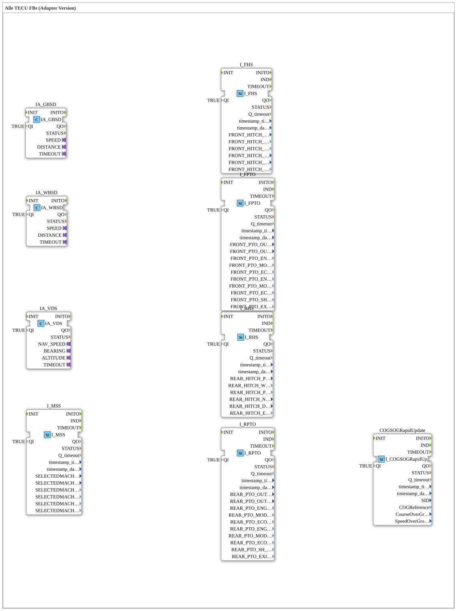

# Exercise_079_AX: All TECU FBs (Adapter Version)

* * * * * * * * * *
## Introduction
This exercise introduces the most important ISOBUS-compliant function blocks (FBs) for the TECU platform in the adapter version. You will learn about the basic interface blocks used in agricultural applications for controlling and monitoring tractor or implement functions. The exercise provides a collection of all the necessary ISOBUS adapter FBs, which serve as the basis for more complex control tasks within the 4diac IDE.
## Function Blocks (FBs) Used

This exercise contains only the following predefined ISOBUS adapter function blocks from the library `isobus::tecu`. Each function block has a Boolean input `QI` (Quality/Enable), which is set to `TRUE` for activation. No additional connections are established between the function blocks.

``` - **IA_GBSD** – Transmission/Brake Control (Generic Brake System Device)

- **IA_VDS** – Virtual Display Server (Display and Operation)
- **IA_WBSD** – Working Body Set Device (Implements)
- **I_MSS** – Management System Server (System Administration)
- **I_FHS** – Front Hitch System (Front Linkage)
- **I_FPTO** – Front Power Take-Off (Front PTO)
- **I_RHS** – Rear Hitch System (Rear Linkage)
- **I_RPTO** – Rear Power Take-Off (Rear PTO)
- **COGSOGRapidUpdate** – (Course Guidance Update, Lane Guidance)

All modules are of type `isobus::tecu::<Name>` and are used in the network without any further interconnection solely for providing the interfaces.

## Program Flow and Connections

In this exercise, the ISOBUS adapter function blocks (FBs) are **not** connected to each other or integrated into a flow. The goal is to become familiar with the individual blocks and their respective functional areas. The blocks are implemented as pure adapter versions and can later be used in your own applications as connection points to real TECU devices or simulations.

**Possible Learning Objectives:**

- Recognizing the ISOBUS adapter structure (QI input, event ports, data ports)
- Understanding the functional areas of common TECU functions (PTO, power lift, display, etc.)
- Preparing to connect multiple adapters to form a functional controller

The exercise can be started directly after importing it into the 4diac IDE. No prior knowledge beyond basic IDE operation is required.

## Summary

Exercise_079_AX provides a complete list of all essential ISOBUS adapter function blocks for TECU. It offers an ideal introduction to modeling agricultural control systems with 4diac and forms the basis for further exercises in which the building blocks are interconnected and supplemented with custom logic.

---

### 🌐 Related topic subpages on ms-muc-docs.de
* [🌐 Eclipse 4diac IDE & Color Reference on ms-muc-docs.de](https://www.ms-muc-docs.de/iec-61499/eclipse-4diac/)

]