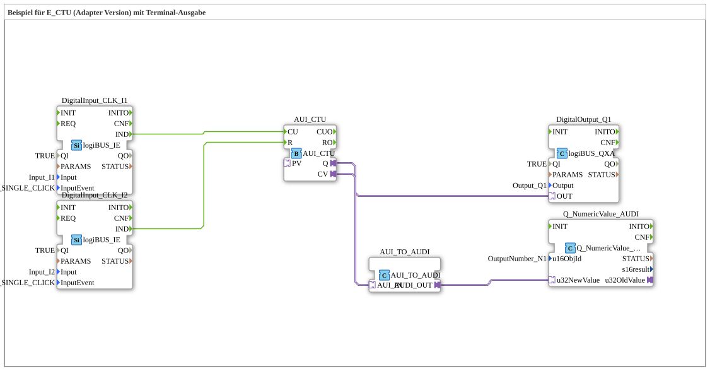

# Exercise_080_AUI: Example for E_CTU (Adapter Version) with Terminal Output

* * * * * * * * * *

## Introduction

This exercise demonstrates the use of an **adapter-based up counter (AUI_CTU)** in 4diac. The counter is incremented via an event input from a push button (Input_I1) and reset via a second push button (Input_I2). The current counter value is output both on a digital output (Output_Q1) and as a numeric value via a terminal output. This exercise teaches how to use the adapter interface for events and convert them into data values.

## Function Blocks (FBs) Used

The network editor of the subapplication contains six function blocks. These are described in detail below.

### DigitalInput\_CLK\_I1

- **Type**: `logiBUS::io::DI::logiBUS_IE`
- **Parameters**:
- `QI` = `TRUE`
- `Input` = `Input_I1`
- `InputEvent` = `BUTTON_SINGLE_CLICK`
- **Function**: This function block responds to a single key press at the physical input `Input_I1` and generates the event `IND` at the output.

### DigitalInput\_CLK\_I2

- **Type**: `logiBUS::io::DI::logiBUS_IE`
- **Parameters**:
- `QI` = `TRUE`
- `Input` = `Input_I2`
- `InputEvent` = `BUTTON_SINGLE_CLICK`
- **Function**: Analogous to `DigitalInput_CLK_I1`, but for the reset button on `Input_I2`.

### AUI\_CTU

- **Type**: `adapter::events::unidirectional::AUI_CTU`
- **Parameters**: No configured parameters in the XML.
- **Function**: This is an adapter function block that implements an up counter. It has the event inputs `CU` (increment) and `R` (reset), as well as the event outputs `Q` (counter reached) and `CV` (current count value as adapter output). The count threshold (PV) is set to a predefined value by default.

### AUI_TO_AUDI

- **Type**: `adapter::conversion::unidirectional::AUI_TO_AUDI`
- **Parameters**: No configured parameters.
- **Function**: This function block converts an AUI adapter output (event with value) into a raw data value (AUDI). It receives the signal `CV` at the adapter input `AUI_IN` and outputs the current counter value as the value `UINT` at the data output `AUDI_OUT`.

### Q\_NumericValue\_AUDI

- **Type**: `isobus::UT::Q::Q_NumericValue_AUDI`
- **Parameters**:
- `u16ObjId` = `OutputNumber_N1`
- **Function**: This function block receives a numeric value (via the adapter input `u32NewValue`) and displays it as output on the terminal. The parameter `u16ObjId` specifies the object identifier for the terminal output.

### DigitalOutput\_Q1

- **Type**: `logiBUS::io::DQ::logiBUS_QXA`
- **Parameters**:
- `QI` = `TRUE`
- `Output` = `Output_Q1`
- **Function**: This function block sets the physical output `Output_Q1` to `TRUE` as soon as an event arrives at the event input `OUT`. It is used to display the counter value (e.g., reaching a threshold) as a binary signal.

## Program Flow and Connections

This exercise is set up as a subapplication (`Uebung_080_AUI`) and does not require any dedicated interfaces – all inputs and outputs are internal hardware mappings.

**Event Connections**:

- The event `IND` from `DigitalInput_CLK_I1` is connected to the event input `CU` of the AUI_CTU. Each key press at Input_I1 increments the counter by 1.
- The event `IND` from `DigitalInput_CLK_I2` is connected to the event input `R` of the AUI_CTU. A key press at Input_I2 resets the counter.

**Adapter Connections**:

- The adapter output `Q` of `AUI_CTU` (indicating that the counter reading has reached the threshold) is connected to the event input `OUT` of `DigitalOutput_Q1`. When the threshold is reached, the output `Output_Q1` is activated.
- The adapter output `CV` of `AUI_CTU` (current counter value) is connected to the adapter input `AUI_IN` of the converter `AUI_TO_AUDI`.

- The data output `AUDI_OUT` from `AUI_TO_AUDI` provides the counter value as an integer and is connected to the adapter input `u32NewValue` of the terminal module `Q_NumericValue_AUDI`. This ensures that the current counter value is continuously displayed on the terminal.

**Process**:

1. After the application starts, the counter value is 0.
2. Each press of `Input_I1` increments the counter by 1.

The new value is immediately displayed on the terminal.

1. When the preset threshold (PV) is reached, `Output_Q1` is set to `TRUE`.
2. Pressing `Input_I2` resets the counter to 0 (the output also reverts to `FALSE`).

## Summary

This exercise demonstrates how to link an adapter-based counter (AUI_CTU) in 4diac with hardware inputs and outputs. Using the converter `AUI_TO_AUDI`, the adapter's native value is converted into a simple data value that can then be output to a terminal. The separate control of the counter input and reset, along with the binary feedback via a digital output, makes this exercise a fundamental example of time- and event-driven counting functions in the IEC 61499 architecture.

**Learning Objectives**:

- Understanding the adapter interfaces (AUI) for events and data.
- Integrating hardware inputs (pushbuttons) and outputs into a control program.
- Conversion between adapter and data formats.
- Using a terminal output function block for runtime monitoring.

---

### 🌐 Related topic subpages on ms-muc-docs.de

- [🌐 E_CTU Event Counter block on ms-muc-docs.de](https://www.ms-muc-docs.de/iec-61499/event-function-blocks/e_ctu/)
- [🌐 Eclipse 4diac IDE & Color Reference on ms-muc-docs.de](https://www.ms-muc-docs.de/iec-61499/eclipse-4diac/)
