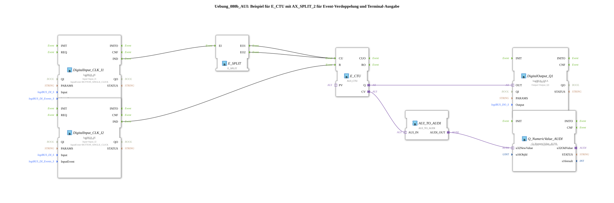

# Exercise_080b_AUI: Example for E_CTU with AX_SPLIT_2 for Event Doubling and Terminal Output

* * * * * * * * * *
## Introduction
This exercise demonstrates the use of an up-counting counter (E_CTU) with event doubling via an E_SPLIT function block. Two hardware pushbuttons (connected to Input_I1 and Input_I2) serve as the counter pulse generator and reset signal. The current counter value is output via an adapter output (CV) and displayed on a numeric terminal (OutputNumber_N1). An additional digital output (Output_Q1) indicates the counter's Q state.
**Learning Objectives**:

- Application of the E_CTU counter (up counter)
- Use of E_SPLIT to double an event signal
- Use of AUI adapter interfaces for data and event transmission
- Parameterization of logiBUS inputs and outputs
- Output of numeric values to a terminal (Q_NumericValue_AUDI)

**Difficulty Level**: Medium
**Prerequisites**: Basic knowledge of the 4diac IDE, handling event and data connections, input/output configuration

## Function Blocks (FBs) Used

The following function blocks are used in the SubApp network:

### `DigitalInput_CLK_I1` (Type: `logiBUS::io::DI::logiBUS_IE`)
- **Parameters**: `QI=TRUE`, `Input=Input_I1`, `InputEvent=BUTTON_SINGLE_CLICK`
- **Function**: Reads a digital input (button I1) and generates the event `IND` with a single click.

### `DigitalInput_CLK_I2` (Type: `logiBUS::io::DI::logiBUS_IE`)
- **Parameters**: `QI=TRUE`, `Input=Input_I2`, `InputEvent=BUTTON_SINGLE_CLICK`
- **Function**: Reads a digital input (button I2) and generates the event `IND` with a single click (serves as a reset signal).

### `E_SPLIT` (Type: `iec61499::events::E_SPLIT`)
- **Parameters**: None
- **Function**: Splits an incoming event (EI) into two identical output events (EO1, EO2).

### `E_CTU` (Type: `adapter::events::unidirectional::AUI_CTU`)
- **Parameters**: None
- **Function**: Up counter with two event inputs: CU (Count Up) and R (Reset). The counter value is output as a Boolean value (when CV>0) via the adapter output `Q`, and the current counter value (data adapter) is output via `CV`.

### `E_CTU` (Type: `adapter::events::unidirectional::AUI_CTU`)

### `E_CTU` (Type: `adapter::events::unidirectional::AUI_CTU`)

#
## `adapter::events::unidirectional::AUI_CTU` ... ### `AUI_TO_AUDI` (Type: `adapter::conversion::unidirectional::AUI_TO_AUDI`)
- **Parameters**: None
- **Function**: Converts an AUI data adapter (here, the counter value CV) into an AUDI data adapter (u32), which can be processed by subsequent function blocks.

### `DigitalOutput_Q1` (Type: `logiBUS::io::DQ::logiBUS_QXA`)
- **Parameters**: `QI=TRUE`, `Output=Output_Q1`
- **Function**: Controls a digital output (Q1) based on the incoming value at adapter pin `OUT`.

### `Q_NumericValue_AUDI` (Type: `isobus::UT::Q::Q_NumericValue_AUDI`)
- **Parameter**: `u16ObjId=OutputNumber_N1`
- **Function**: Receives a 32-bit numeric value (via `u32NewValue`) and outputs it to the configured terminal object (here `OutputNumber_N1`).

## Program Flow and Connections

1. **Event Generation**:

- When the button on `Input_I1` is pressed, `DigitalInput_CLK_I1` generates an event `IND`.
- When the button on `Input_I2` is pressed, `DigitalInput_CLK_I2` generates an event `IND`.

2. **Event Duplication**:

- The `IND` event from I1 is routed to the `EI` input of `E_SPLIT`.
- `E_SPLIT` outputs two identical events at its outputs `EO1` and `EO2`.
- Both events are connected – via separate connections – to the CU input of `E_CTU`. **This means that each key press on I1 is counted as two counting pulses.**

3. **Counter**:

- Each CU event increments the internal counter of `E_CTU` by 1.
- The `IND` event of I2 (reset button) is connected to the input `R` of `E_CTU` and resets the counter to 0.

4. **Output**:

- The counter output `Q` (adapter) is connected to the adapter input `OUT` of `DigitalOutput_Q1`. As long as the counter value is > 0, the digital output Q1 is active (TRUE).
- The counter reading `CV` (also an AUI adapter) is converted to an AUDI adapter via `AUI_TO_AUDI` and passed to `Q_NumericValue_AUDI.u32NewValue`. This function block displays the current counter value on the configured terminal (OutputNumber_N1).

**Summary of Connections** (from the XML):

| Source | Destination | Type |

|--------|------|-----|

| `DigitalInput_CLK_I1.IND` | `E_SPLIT.EI` | Event |

| `E_SPLIT.EO1` | `E_CTU.CU` | Event |

| `E_SPLIT.EO2` | `E_CTU.CU` | Event |

| `DigitalInput_CLK_I2.IND` | `E_CTU.R` | Event |

| `E_CTU.Q` | `DigitalOutput_Q1.OUT` | Adapter |

| `E_CTU.CV` | `AUI_TO_AUDI.AUI_IN` | Adapter |

| `AUI_TO_AUDI.AUDI_OUT` | `Q_NumericValue_AUDI.u32NewValue` | Adapter |

## Summary

Exercise **Exercise_080b_AUI** illustrates the combination of an up counter with event doubling using `E_SPLIT`. The counter responds to two buttons: one counts (with a doubled pulse rate), the other resets. The results are output on both a digital output (Q1) and a terminal (OutputNumber_N1). You will learn how to use adapter-based data and event interfaces and how to configure logiBUS inputs and outputs in the 4diac IDE.

---

### 🌐 Related topic subpages on ms-muc-docs.de
* [🌐 E_CTU Event Counter Block on ms-muc-docs.de](https://www.ms-muc-docs.de/iec-61499/event-function-blocks/e_ctu/)
* [🌐 Eclipse 4diac IDE & Color Reference on ms-muc-docs.de](https://www.ms-muc-docs.de/iec-61499/eclipse-4diac/)

]
