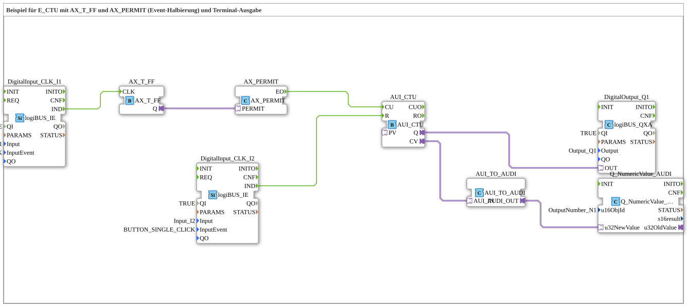

# Exercise_080c_AUI: Example of E_CTU with AX_T_FF and AX_PERMIT (Event Halving) and Terminal Output

* * * * * * * * * *

## Introduction

This exercise demonstrates the use of an up counter (E_CTU) in combination with a T flip-flop (AX_T_FF) and an event enable block (AX_PERMIT).

The events of a button (I1) are halved by the T flip-flop before incrementing the counter. A second button (I2) serves as a reset.

The current counter value is sent via a converter to a numeric output on a terminal, and the counter status (Q) toggles a digital output.

---

## Function Blocks (FBs) Used

- **DigitalInput_CLK_I1** (Type: `logiBUS::io::DI::logiBUS_IE`)

- Parameters: QI = TRUE, Input = `Input_I1`, InputEvent = `BUTTON_SINGLE_CLICK`

- Event output: `IND` → connected to `AX_T_FF.CLK`

- **DigitalInput_CLK_I2** (Type: `logiBUS::io::DI::logiBUS_IE`)

- Parameters: QI = TRUE, Input = `Input_I2`, InputEvent = `BUTTON_SINGLE_CLICK`

- Event output: `IND` → connected to `E_CTU.R`

- **AX_T_FF** (Type: `adapter::events::unidirectional::AX_T_FF`)

- Adapter input: `CLK` ← `DigitalInput_CLK_I1.IND`

- Adapter output: `Q` → `AX_PERMIT.PERMIT`

- **AX_PERMIT** (Type: `adapter::events::unidirectional::AX_PERMIT`)

- Adapter input: `PERMIT` ← `AX_T_FF.Q`

- Event output: `EO` → `E_CTU.CU`

- **E_CTU** (Type: `adapter::events::unidirectional::AUI_CTU`)

- Event input: `CU` ← `AX_PERMIT.EO`

- Event input: `R` ← `DigitalInput_CLK_I2.IND`

- Adapter output: `Q` → `DigitalOutput_Q1.OUT`

- Adapter output: `CV` → `AUI_TO_AUDI.AUI_IN`

- **DigitalOutput_Q1** (Type: `logiBUS::io::DQ::logiBUS_QXA`)

- Parameters: QI = TRUE, Output = `Output_Q1`

- Adapter input: `OUT` ← `E_CTU.Q`

- **AUI_TO_AUDI** (Type: `adapter::conversion::unidirectional::AUI_TO_AUDI`)  
  - Adapter input: `AUI_IN` ← `E_CTU.CV`  
  - Adapter output: `AUDI_OUT` → `Q_NumericValue_AUDI.u32NewValue`

- **Q_NumericValue_AUDI** (Type: `isobus::UT::Q::Q_NumericValue_AUDI`)  
  - Parameters: `u16ObjId` = `OutputNumber_N1`  
  - Data input: `u32NewValue` ← `AUI_TO_AUDI.AUDI_OUT`

---

## Program Flow and Connections

1. **Event Source I1**

A button connected to `Input_I1` (configured to `BUTTON_SINGLE_CLICK`) triggers a single event at the output `IND` of `DigitalInput_CLK_I1` each time it is pressed.

2. **Event Halving**

The event is forwarded to the clock input `CLK` of the T flip-flop `AX_T_FF`. This flip-flop changes its state (Q) with each clock cycle, thus only passing on every second button event as the active state.

2. **Event Halving** 3. **Enabled by AX_PERMIT**

The output `Q` of `AX_T_FF` is connected to the `PERMIT` input of `AX_PERMIT`. As long as `PERMIT` is active, an incoming event at the internal input (not visible here) is passed through to the output `EO`. This halves the event frequency.

4. **Counter E_CTU**

The enabled event reaches the up counter via its input `CU`. The internal counter value is incremented by 1 with each event.

A second button on `Input_I2` triggers an event that is directly connected via `DigitalInput_CLK_I2.IND` to the reset input `R` of `E_CTU` – when pressed, the counter is reset to 0.

5. **Counter Reading Output**

- The current counter value (`CV`) is converted into an analog data value via the converter `AUI_TO_AUDI`.

- This value is passed to the data block `Q_NumericValue_AUDI`, which displays it on a terminal (e.g., via the configured `OutputNumber_N1`).

- Simultaneously, the counter provides a binary output `Q`, which is active whenever the counter reading is greater than 0. This output is then forwarded to the digital output `DigitalOutput_Q1` (to `Output_Q1`).

**Learning Objectives & Prerequisites:**

- Basic understanding of IEC 61499 event control

- Working with counters, flip-flops, and event enabling

- Simple terminal output via numeric IDs

**Starting the Exercise:**

After loading the subapplication into the 4diac IDE and connecting it to a suitable hardware platform (e.g., logiBUS), the exercise can be started by pressing buttons I1 and I2.

**Learning Objectives & Prerequisites:** ---

## Summary

Exercise `Uebung_080c_AUI` illustrates the combination of a T flip-flop with an event enable to reduce the event frequency, as well as the use of an up counter.

The counter value is visualized by coupling it with a terminal output block.

The interaction of event, adapter, and data connections demonstrates typical patterns for modular automation solutions according to IEC 61499.

---

### 🌐 Related topic subpages on ms-muc-docs.de

* [🌐 E_CTU Event Counter Block on ms-muc-docs.de](https://www.ms-muc-docs.de/iec-61499/event-function-blocks/e_ctu/)

* [🌐 Eclipse 4diac IDE & Color Reference on ms-muc-docs.de](https://www.ms-muc-docs.de/iec-61499/eclipse-4diac/)

