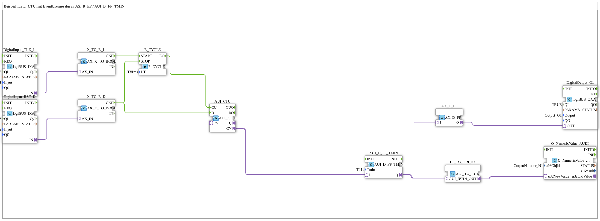

# Exercise_080e2_AX: Example for E_CTU with Event Brake via AX_D_FF / AUI_D_FF_TMIN

* * * * * * * * * *
## Introduction
This exercise demonstrates the use of an event-driven counter (E_CTU) in combination with an **event brake**, implemented using the function blocks `AX_D_FF` and `AUI_D_FF_TMIN`.
The counter is controlled by a cyclic event generator (`E_CYCLE`), which is enabled by an external digital input (CLK). A second digital input (RST) resets the counter and stops the cycle. The counter value is transferred to a numeric output `N1` after a minimum hold time (`Tmin = 1 s`). Additionally, a digital output `Q1` is activated when the counter reaches its end value.

## Function Blocks (FBs) Used

The exercise consists of a sub-application containing the following blocks:

- **DigitalInput_CLK_I1** – `logiBUS_IXA`

Digital input `Input_I1` (CLK) as the source for enabling the cycle.

- **DigitalInput_RST_I2** – `logiBUS_IXA`

Digital input `Input_I2` (RST) for resetting the counter and stopping the cycle.

- **X_TO_B_I1** – `AX_X_TO_BOOL`

Converts the adapter value of `DigitalInput_CLK_I1` to a Boolean value.

- **X_TO_B_I2** – `AX_X_TO_BOOL`

Converts the adapter value of `DigitalInput_RST_I2` to a Boolean value.

- **E_CYCLE** – `E_CYCLE`

Generates an event (`EO`) periodically every 1 ms. Controlled via `START`/`STOP`.

- **E_CTU** – `AUI_CTU`

Event-driven forward counter. The counter input `CU` increments the internal counter value `CV`. When the maximum value is reached, the output `Q` is set. The input `R` resets `CV`.

- **AX_D_FF** – `AX_D_FF`

Event-based D flip-flop. Stores an event (via `I`) and outputs it `Q`. Serves as a buffer for the counter signal `Q`.

- **AUI_D_FF_TMIN** – `AUI_D_FF_TMIN`

D flip-flop with adjustable minimum time (`Tmin = 1 s`). An incoming event is only passed on to output `Q` after the minimum time has elapsed. Serves as an **event brake** for the counter value `CV`.

- **UI_TO_UDI_N1** – `AUI_TO_AUDI`

Converts the event-based signal of the flip-flop `AUI_D_FF_TMIN` into a data-oriented signal.

- **Q_NumericValue** – `Q_NumericValue_AUDI`

Writes the converted counter value to the numeric output `OutputNumber_N1`.

- **DigitalOutput_Q1** – `logiBUS_QXA`

Digital output `Output_Q1`, controlled by the flip-flop `AX_D_FF`.

## Program Flow and Connections

The flow is controlled via event and adapter connections:

1. **Input Processing**

- `DigitalInput_CLK_I1` sends the clock signal (CLK) via `X_TO_B_I1` to `E_CYCLE.START` (event CNF).
- `DigitalInput_RST_I2` sends the reset signal (RST) via `X_TO_B_I2` to `E_CTU.R` and simultaneously to `E_CYCLE.STOP`.

2. **Cyclic Counter**

- Every 1 ms, `E_CYCLE` generates an event `EO` as soon as `START` is active. This event is then passed to `E_CTU.CU`. The counter increments its value `CV` with each event.
- When the reset input (RST) is activated, the counter is reset and the cycle is stopped.

3. **Counter Value Output**

- The current counter value `CV` from `E_CTU` is passed to `AUI_D_FF_TMIN.I` via the adapter.
- After a delay of at least 1 second, `AUI_D_FF_TMIN` passes this value as an event to `AUI_D_FF_TMIN.Q` (event brake).
- Via `UI_TO_UDI_N1` (conversion), the value is passed to `Q_NumericValue` and output to the numeric output `N1`.

4. **Digital Output**

- When the counter reaches its end value, `E_CTU.Q` sets an event. This is stored by `AX_D_FF` and passed to the digital output `DigitalOutput_Q1`.
- The output remains set until a new event (e.g., a reset) changes its state.

`E_CTU.Q` sets an event. This event is stored by `AX_D_FF` and passed to the digital output `DigitalOutput_Q1`.

``` - **Learning Objectives**: Understanding event-driven counters, controlling cycles with external inputs, and using flip-flops for debouncing or minimum hold time (event brakes).

- **Difficulty Level**: Advanced
- **Prerequisites**: Basic knowledge of event processing in 4diac, working with input/output blocks, and concepts of counters and flip-flops.
- **Note**: The exercise can be loaded and executed directly in a 4diac IDE, provided the necessary libraries (logiBUS, isobus, adapter) are available.

## Summary

The exercise `Uebung_080e2_AX` demonstrates how to combine an event-driven counter (`E_CTU`) with an **event brake** consisting of two different flip-flops (`AX_D_FF`, `AUI_D_FF_TMIN`). The minimum flip-flop time prevents an unintentionally rapid update of the output value. The counter is clocked by a cyclic event generator, which can be enabled and reset via an external input. The interaction of these components illustrates important concepts of event-based control in automation technology.

---

### 🌐 Related topic subpages on ms-muc-docs.de
* [🌐 E_CTU Event Counter component on ms-muc-docs.de](https://www.ms-muc-docs.de/iec-61499/event-function-blocks/e_ctu/)
* [🌐 Eclipse 4diac IDE & color reference on ms-muc-docs.de](https://www.ms-muc-docs.de/iec-61499/eclipse-4diac/)

]
