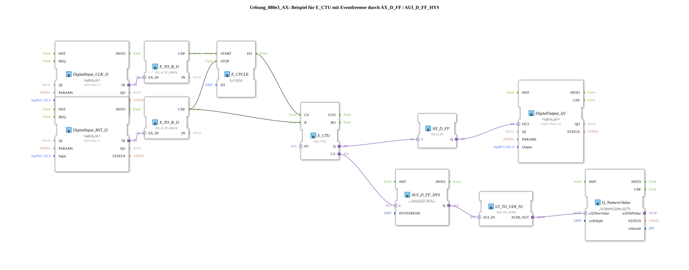

# Exercise_080e3_AX: Example for E_CTU with Event Brake using AX_D_FF / AUI_D_FF_HYS

* * * * * * * * * *
## Introduction
This exercise demonstrates the use of the universal up-counter **E_CTU** in combination with an **event brake**, implemented using the function blocks **AX_D_FF** (D flip-flop) and **AUI_D_FF_HYS** (D flip-flop with hysteresis). The goal is to stabilize and output the counter value, as well as to set a digital output when the counter overflows.
## Function Blocks Used

This exercise uses only primitive function blocks (no sub-applications). All blocks used, along with their parameters and connections, are listed below.

| Block Name | Type | Parameters | Short Description |

|:---|:---|:---|:---|

| DigitalInput_CLK_I1 | logiBUS_IXA | QI = TRUE, Input = Input_I1 | Digital input for the clock signal (CLK) |

| DigitalInput_RST_I2 | logiBUS_IXA | QI = TRUE, Input = Input_I2 | Digital input for the reset pulse (RST) |

| X_TO_B_I1 | AX_X_TO_BOOL | – | Converts the adapter input (AX) to a Boolean value |

| X_TO_B_I2 | AX_X_TO_BOOL | – | Same function for the reset input |

| E_CYCLE | E_CYCLE | DT = T#1ms | Cyclic clock (period 1 ms) |

| E_CTU | AUI_CTU | – | Universal Count Up |

| AX_D_FF | AX_D_FF | – | D flip-flop (AX world), stores a Boolean state |

| AUI_D_FF_HYS | AUI_D_FF_HYS | HYSTERESIS = UINT#25 | D flip-flop with hysteresis on the count value |

| UI_TO_UDI_N1 | AUI_TO_AUDI | – | Converts AUI (unsigned integer) to AUDI (adapter universal data interface) |

| Q_NumericValue | Q_NumericValue_AUDI | u16ObjId = OutputNumber_N1 | Output of a numeric value via the fieldbus |

| DigitalOutput_Q1 | logiBUS_QXA | QI = TRUE, Output = Output_Q1 | Digital output |

## Program Flow and Connections

The process can be divided into several steps:

1. **Acquire Input Signals**

The two digital inputs `DigitalInput_CLK_I1` and `DigitalInput_RST_I2` convert the physical signals into adapter data. The downstream converters `X_TO_B_I1` and `X_TO_B_I2` provide Boolean values from this data (event output `CNF`).

2. **Start/Stop Clock Generation**

- The clock signal `CLK_I1` (via `X_TO_B_I1.CNF`) starts the cyclic clock generator `E_CYCLE` (`START` event).

``` - The reset signal `RST_I2` (via `X_TO_B_I2.CNF`) terminates the clock (`STOP` event) and simultaneously resets the counter `E_CTU` (`R` event).

3. **Incrementing the Counter**

The clock generates a `EO` event every 1 ms, which increments the counter `E_CTU` at the `CU` (Count Up) input.

4. **Counter Reading Output**

- The current counter reading (`CV`) is passed to the function block `AUI_D_FF_HYS`. This D flip-flop with hysteresis (hysteresis value = 25) stabilizes the value and passes it to the converter `UI_TO_UDI_N1`.
- The converted value is then passed to `Q_NumericValue` and made available as a numeric output.

5. **Overflow Signaling**

When the counter reaches its maximum value (overflow, event output `Q`), the D flip-flop `AX_D_FF` is set. Its output `Q` activates the digital output `DigitalOutput_Q1`.

**Connection Overview (Graphical)**
*The images can be exported from the 4diac IDE.*

## Summary

This exercise illustrates the coupling of a cyclic clock with an up counter, an **event brake** (to prevent rapid state changes), and **hysteresis** to smooth the counter value.

After completing this exercise, you will be able to:

- parameterize the function block `E_CTU` and integrate it into a control logic,
- use D flip-flops for state storage,
- apply hysteresis to stabilize counter values,
- understand how to connect adapter function blocks in the 4diac IDE.

**Learning Objectives**: Event-driven counters, state machines, hysteresis filters.

``` **Prerequisites**: Basic knowledge of the 4diac IDE and an understanding of event and data flows.

**Difficulty Level**: Medium

---

### 🌐 Related topic subpages on ms-muc-docs.de
* [🌐 E_CTU Event Counter module on ms-muc-docs.de](https://www.ms-muc-docs.de/iec-61499/event-function-blocks/e_ctu/)
* [🌐 Eclipse 4diac IDE & Color Reference on ms-muc-docs.de](https://www.ms-muc-docs.de/iec-61499/eclipse-4diac/)

