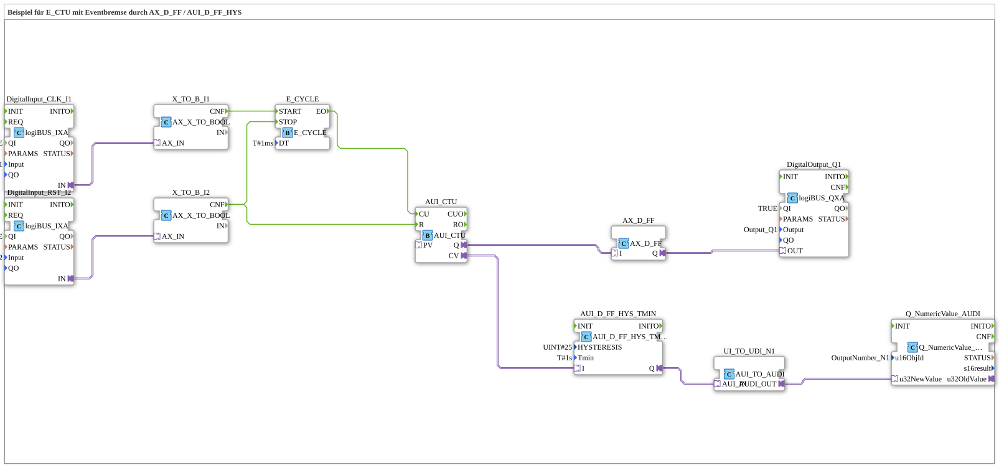

# Exercise_080e4_AX: Example for E_CTU with Event Damping via AX_D_FF / AUI_D_FF_HYS

* * * * * * * * * *
## Introduction

This exercise demonstrates the use of an **E_CTU** counter in combination with event damping, implemented using the function blocks **AX_D_FF** (D flip-flop) and **AUI_D_FF_HYS** (D flip-flop with hysteresis and minimum time). The counter value is output via a digital output (Q1) and numerically via a bus object (N1). The circuit dampens abrupt changes in the counter value and enables targeted event filtering.
## Function Blocks Used

The subapplication does not contain any subblocks. It consists of predefined function blocks:

- **DigitalInput_CLK_I1** – `logiBUS::io::DI::logiBUS_IXA`

Reads the binary input **I1** (clock). Used as the start pulse for the event cycle.

- **DigitalInput_RST_I2** – `logiBUS::io::DI::logiBUS_IXA`

Reads the binary input **I2** (reset). Resets the counter and stops the event cycle.

- **X_TO_B_I1** – `adapter::conversion::unidirectional::AX_X_TO_BOOL`

Converts the AX value from `DigitalInput_CLK_I1` into a BOOL signal.

- **X_TO_B_I2** – `adapter::conversion::unidirectional::AX_X_TO_BOOL`

Converts the AX value from `DigitalInput_RST_I2` to a BOOL signal.

- **E_CYCLE** – `iec61499::events::E_CYCLE`

Generates an event cyclically (period: 1 ms). It is started by input I1 and stopped by I2.

- **E_CTU** – `adapter::events::unidirectional::AUI_CTU`

Up counter. Counts each event at its **CU** input. The current count is at **CV**, and the overflow/limit output is at **Q**. The counter is reset by input **R**.

- **AX_D_FF** – `adapter::events::unidirectional::AX_D_FF`

D flip-flop. Takes the logical state at **I** and outputs it via **Q**. Serves as an event brake: The counter output Q of the E_CTU is only passed to the digital output after the flip-flop.

- **AUI_D_FF_HYS** – `adapter::events::unidirectional::AUI_D_FF_HYS_TMIN`

D flip-flop with hysteresis and minimum time. Parameters:

- `HYSTERESIS = UINT#25` – Hysteresis width
- `Tmin = T#1s` – Minimum dwell time before state change

Filters the counter value **CV** so that only significant changes (greater than the hysteresis) are passed on after the minimum time has elapsed.

- **UI_TO_UDI_N1** – `adapter::conversion::unidirectional::AUI_TO_AUDI`

Converts the filtered counter value from AUI format to AUDI format.

- **Q_NumericValue** – `isobus::UT::Q::Q_NumericValue_AUDI`

Outputs the numeric value via the bus object **OutputNumber_N1**.

- **DigitalOutput_Q1** – `logiBUS::io::DQ::logiBUS_QXA`

Sets the digital output **Q1** according to the state of the flip-flop `AX_D_FF`.

## Program Flow and Connections

1. **Start/Stop of Cycle Sampling**

As long as the input **I1** (clock generator) is active, the event cycle `E_CYCLE` runs with a period of 1 ms. When **I2** (Reset) is activated, the cycle is stopped and the counter is reset simultaneously.

2. **Counter Operation**

Each event (**EO**) generated by `E_CYCLE` is forwarded to the **CU** input of `E_CTU` – the counter increments by 1 with each cycle as long as no reset occurs.

3. **Event Brake with D Flip-Flop**

The counter's overflow/limit output **Q** is fed to the **I** input of `AX_D_FF`. The flip-flop takes over this state event-driven and passes it to the digital output `DigitalOutput_Q1`. This prevents the output from switching cyclically, but rather updates it only when the counter's Q changes.

3. **Event Brake with D Flip-Flop** 4. **Hysteresis and Minimum Time (Counter Value Filtering)**

The current counter value **CV** is fed to the function block `AUI_D_FF_HYS`. This block only passes the value to the numeric output if the change is greater than the set hysteresis (25 units) and the new value remains stable for at least 1 second. This suppresses short-term jumps in the counter value.

5. **Output**

The filtered value is output as a numeric signal to **OutputNumber_N1** via `UI_TO_UDI_N1` and `Q_NumericValue`. The digital output **Q1** indicates the state of the D flip-flop.

**Learning Objectives:**

- Understanding the interaction between event cycles (`E_CYCLE`) and counters (`E_CTU`)
- Using D flip-flops as event dampeners
- Filtering counter values using hysteresis and minimum time
- Working with adapter blocks and format conversions (AX ↔ BOOL, AUI ↔ AUDI)

**Difficulty Level:** Advanced
**Required Prior Knowledge:** Basic 4diac IDE operation, knowledge of event and data flows, simple counters and flip-flops.

## Summary

Exercise `Uebung_080e4_AX` demonstrates an up counter whose output is decoupled by a D flip-flop (event damping) and whose count is filtered by another D flip-flop with hysteresis and a minimum time. This results in a stable, smoothed counter value, both digitally and numerically. The circuit is particularly suitable for applications where short disturbances or rapid counting events need to be suppressed.

---

### 🌐 Related topic subpages on ms-muc-docs.de

* [🌐 E_CTU Event Counter Block on ms-muc-docs.de](https://www.ms-muc-docs.de/iec-61499/event-function-blocks/e_ctu/)
* [🌐 Eclipse 4diac IDE & Color Reference on ms-muc-docs.de](https://www.ms-muc-docs.de/iec-61499/eclipse-4diac/)
