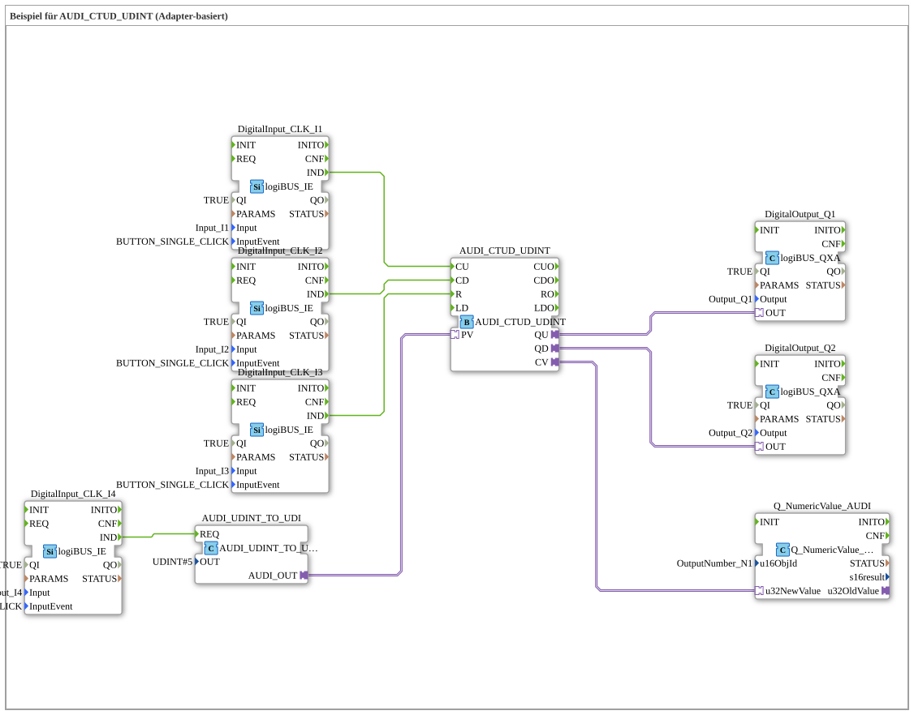

# Exercise_083_AUDI: Example for AUDI_CTUD_UDINT (Adapter-based)

* * * * * * * * * *
This exercise demonstrates the use of an up/down counter based on the adapter function block `AUDI_CTUD_UDINT`. Four digital inputs (pushbuttons with single-click detection) control the counter: count up (CU), count down (CD), reset (R), and take over a new counter end value (PV). The current counter value (CV) is displayed on a numeric display, while the outputs QU and QD indicate whether the counter has reached its upper or lower limit.

- **DigitalInput_CLK_I1** (Type: `logiBUS::io::DI::logiBUS_IE`)
- Parameters: `QI = TRUE`, `Input = Input_I1`, `InputEvent = BUTTON_SINGLE_CLICK`
- Generates an event `IND` when the button at input I1 is pressed.
- **DigitalInput_CLK_I2** (Type: `logiBUS::io::DI::logiBUS_IE`)
- Parameters: `QI = TRUE`, `Input = Input_I2`, `InputEvent = BUTTON_SINGLE_CLICK`
- Generates an event `IND` when the button at input I2 is pressed.
- **DigitalInput_CLK_I3** (Type: `logiBUS::io::DI::logiBUS_IE`)
- Parameters: `QI = TRUE`, `Input = Input_I3`, `InputEvent = BUTTON_SINGLE_CLICK`
- Generates an event `IND` when the button at input I3 is pressed.
- **DigitalInput_CLK_I4** (Type: `logiBUS::io::DI::logiBUS_IE`)
- Parameters: `QI = TRUE`, `Input = Input_I4`, `InputEvent = BUTTON_SINGLE_CLICK`
- Generates an event `IND` when the button at input I4 is pressed.
- **AUDI_CTUD_UDINT** (Type: `adapter::events::unidirectional::AUDI_CTUD_UDINT`)
- Adapter-based up/down counter for 32-bit unsigned integers.

`` - Event inputs: `CU` (Count Up), `CD` (Count Down), `R` (Reset)

- Data outputs: `CV` (Current counter value), `QU` (High if CV ≥ PV), `QD` (High if CV = 0)
- Data/adapter inputs: `PV` (Preset Value) via adapter connection
- **Parameter settings**: not specified in the XML (default values)
- **DigitalOutput_Q1** (Type: `logiBUS::io::DQ::logiBUS_QXA`)
- Parameters: `QI = TRUE` `Output = Output_Q1`
- Outputs the state of the counter (`QU`) as a binary output.
- **DigitalOutput_Q2** (Type: `logiBUS::io::DQ::logiBUS_QXA`)
- Parameters: `QI = TRUE`, `Output = Output_Q2`
- Outputs the state of the counter (`QD`) as a binary output.
- **Q_NumericValue_AUDI** (Type: `isobus::UT::Q::Q_NumericValue_AUDI`)
- Parameter: `u16ObjId = OutputNumber_N1`
- Displays a numeric value (here, the current counter value CV) on a display with object ID `OutputNumber_N1`.
- **AUDI_UDINT_TO_UDI** (Type: `adapter::conversion::unidirectional::AUDI_UDINT_TO_UDI`)
- Parameter: `OUT = UDINT#5` (fixed setpoint 5)
- Converts a constant value (5) into an adapter signal that serves as the PV (Preset Value) for the counter.

The circuit operates event-driven via the button inputs:

1. **Count In (CU)**: Pressing a button on **I1** generates a `IND` event, which is connected to the event input `CU` of the counter `AUDI_CTUD_UDINT`. The counter increments by 1.
2. **Count Down (CD)**: Pressing a button on **I2** generates a `IND` event for input `CD`. The counter decrements by 1.
3. **Reset (R)**: Pressing a button on **I3** resets the counter to 0 via input `R`.
4. **Apply Preset Value (PV)**: Pressing a button on **I4** triggers the function block `AUDI_UDINT_TO_UDI` (event input `REQ`), which sends the constant value **5** via its adapter output `AUDI_OUT` to the PV input of the counter. The counter adopts this value as the new upper limit.

`` The outputs are connected as follows:

- The adapter output `QU` of the counter is connected to the control input `OUT` of `DigitalOutput_Q1`. If the counter reading is ≥ PV (here the initial default value, unless overwritten), lamp Q1 illuminates.
- The adapter output `QD` is connected to `DigitalOutput_Q2`. If the counter reading is 0, Q2 illuminates.
- The current counter reading `CV` is forwarded via an adapter connection to the input `u32NewValue` of the display module `Q_NumericValue_AUDI` and displayed on a numeric display.

`` The constant `UDINT#5` on function block `AUDI_UDINT_TO_UDI` specifies that when I4 is activated, the preset value is set to 5 – the counter will then activate the QU output when it reaches 5.

This exercise illustrates the use of an adapter-based up/down counter (`AUDI_CTUD_UDINT`) in 4diac. Four push-button inputs serve as control signals (count up, count down, reset, and preset takeover). The output signals QU (limit reached) and QD (zero point) are routed to digital outputs, and the current counter value is displayed numerically. The adapter technology decouples event and data flows, enabling flexible and reusable circuitry.

This exercise demonstrates the use of an adapter-based up/down counter (`AUDI_CTUD_UDINT`) in 4diac. Four push-button inputs serve as control signals (count up, count down, reset, and preset takeover). The output signals QU (limit reached) and QD (zero point) are routed to digital outputs, and the current counter value is displayed numerically. The adapter technology decouples event and data flows, enabling flexible and reusable circuitry.

* [🌐 Eclipse 4diac IDE & Color Reference on ms-muc-docs.de](https://www.ms-muc-docs.de/iec-61499/eclipse-4diac/)

]

## Introduction

## Function Blocks Used (FBs)

## Program Flow and Connections

## Summary

### 🌐 Passende Themen-Unterseiten auf ms-muc-docs.de