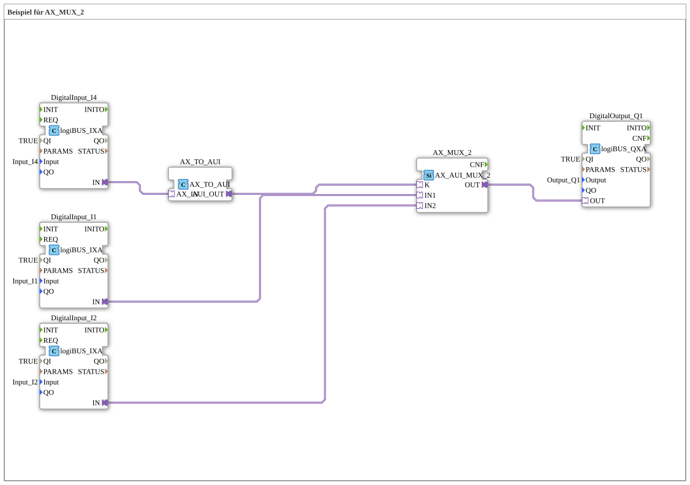

# Exercise_090a1_AX: Example for AX_MUX_2

[(https://notebooklm.google.com/notebook/041f4df4-b729-484d-b786-b6dcdf151961)
This article describes the logiBUS® exercise `Uebung_090a1_AX`
----

## Objective of the exercise

Selecting a signal from multiple sources (switch).

-----

## Description and components

[cite_start]The subapplication `Uebung_090a1_AX.SUB` uses a `AX_MUX_2` function block[cite: 1].

### Function blocks (FBs)

- **`I1` & `I2`**: The two signal sources.
- **`I4`**: The selector switch.
- **`F_MUX_2`**: The multiplexer.
- **`F_BOOL_TO_UINT`**: Auxiliary module for conversion.

----

## Functionality

The multiplexer expects an integer (UINT) at input `K` to determine which input to pass.

Since `I4` provides a Boolean signal, it is converted as follows:

- `I4 = FALSE` -> `K = 0` -> `MUX` switches `IN1` (`I1`) to the output.
- `I4 = TRUE` -> `K = 1` -> `MUX` switches `IN2` (`I2`) to the output.

The output `Q1` follows either `I1` or `I2`, depending on the position of `I4`.

-----

## Application Example

**Manual/Automatic Switching**:

- `I1`: Signal from the automatic control.
- `I2`: Signal from the manual switch.
- `I4`: Key switch "Manual/Auto".

The output (`Q1`) is controlled either automatically or manually, depending on the operating mode.
