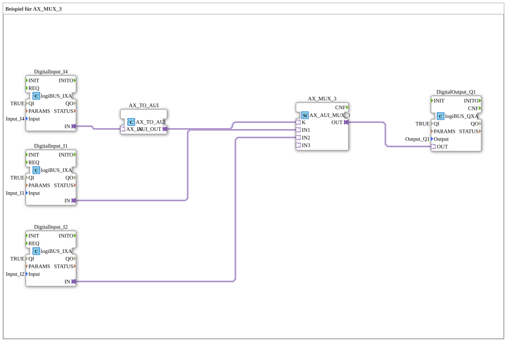

# Exercise_090a2_AX: Example for AX_MUX_3

This article describes the logiBUS® exercise `Uebung_090a2_AX`.
----
## Purpose of the exercise

Extension of the multiplexer.

-----

## Description

[cite_start]Structurally identical to `Uebung_090a1_AX`, but with a `AX_MUX_3`[cite: 1].

-----

## Functionality

Since only a Boolean input (`I4`) is used as the selector, only the first two inputs (`IN1` when K=0, `IN2` when K=1) can be selected. The third input (`IN3`, index 2) is not accessible in this configuration. To use all three, an integer input or two bit inputs would be needed.

