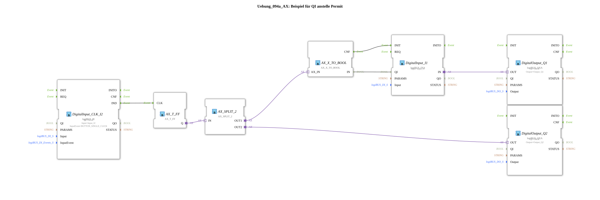

# Exercise_094a_AX: Example of QI instead of Permit

[(https://notebooklm.google.com/notebook/041f4df4-b729-484d-b786-b6dcdf151961)
This article describes the logiBUS® exercise `Uebung_094a_AX`.
----
## Objective of the Exercise

Using the `QI` (Qualifier Input) parameter for runtime control of function blocks.

-----

## Description and Components

[cite_start]The subapplication `Uebung_094a_AX.SUB` activates or deactivates an input path[cite: 1].

### Function Blocks (FBs)

* **`DigitalInput_CLK_I2`**: Toggles the "Active/Inactive" state via a flip-flop.
* **`DigitalInput_I1`**: The actual signal input. Its parameter `QI` is variable.
* **`DigitalOutput_Q1`**: Dependent on `I1`.
* **`DigitalOutput_Q2`**: Displays the "Active" status.

-----

## Functionality

1. Pressing `I2` activates `Q2` (system enabled).
2. Simultaneously, `QI` is set to TRUE by `DigitalInput_I1`.
3. Now `I1` works: Pressing `I1` activates `Q1`.
4. Pressing `I2` again deactivates `Q2` (system disabled).
5. `QI` is set to FALSE by `I1`.
6. The function block `I1` ceases to function. Changes to the physical input `I1` are no longer forwarded to `Q1`.

-----

## Application Example

**Maintenance Mode**: Parts of the sensor system are "disabled" via software to prevent false alarms from being triggered when work is being carried out on the machine.