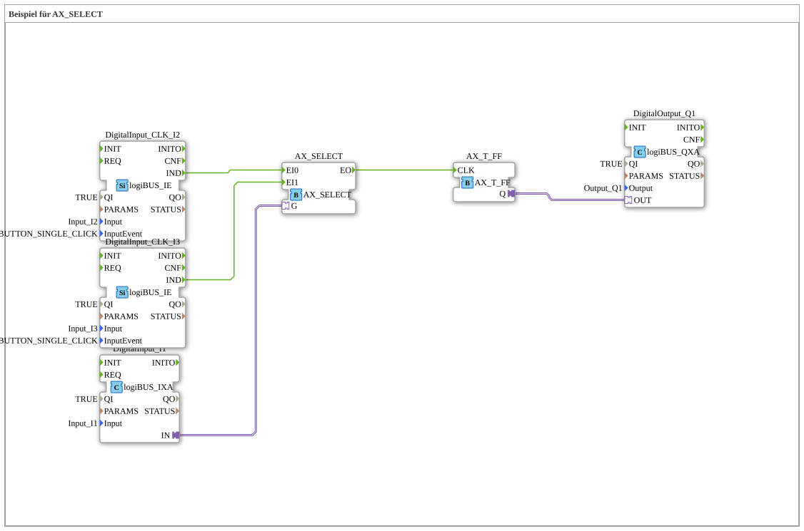

# Exercise_095_AX: Example for AX_SELECT

This article describes the logiBUS® exercise `Uebung_095_AX`.
----
## Purpose of the Exercise
Selecting an event source (opposite of `E_SPLIT` or `E_SWITCH`).

-----

## Description and Components

[cite_start]The subapplication `Uebung_095_AX.SUB` uses a `AX_SELECT` function block[cite: 1].

### Function Blocks (FBs)

* **`I1`**: Selector switch (Gate `G`).
* **`I2`**: Event source A.
* **`I3`**: Event source B.
* **`E_SELECT`**: Forwards either A or B to the output.

-----

## Functionality
* If `I1` is off (`G=FALSE`), events from `I2` (`EI0`) are passed to the output. Events from `I3` are ignored.
* If `I1` is on (`G=TRUE`), events from `I3` (`EI1`) are passed through to the output. Events from `I2` are ignored.

The output triggers a flip-flop (`Q1`). This allows you to select *which* button is allowed to switch the light.

-----

## Application Example

**Operator Switching**: A key switch determines whether the machine is controlled from the main control panel (`I2`) or the maintenance panel (`I3`).