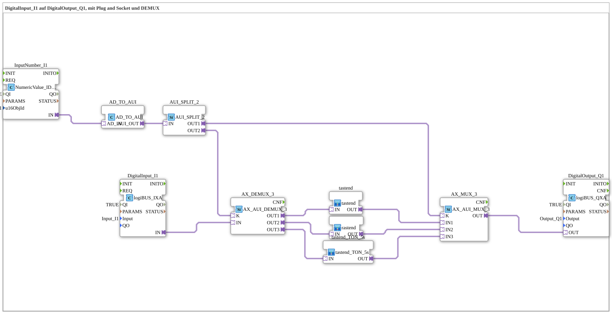

# Exercise_103: DigitalInput_I1 to DigitalOutput_Q1, with Plug and Socket and DEMUX

[(https://notebooklm.google.com/notebook/041f4df4-b729-484d-b786-b6dcdf151961)
This article describes the logiBUS® exercise `Uebung_103`. This is a complex example that demonstrates how to switch the signal path of a push button at runtime
----

## Objective of the Exercise

Dynamic selection between different processing logics (momentary, latching, delayed) for the same physical input and output.

-----

## Description and Components

[cite_start]The subapplication `Uebung_103.SUB` uses an ISOBUS numeric keypad to select between three logic branches[cite: 1].

### Function Blocks (FBs)

- **`InputNumber_I1`**: An input field on the ISOBUS terminal. The user enters 1, 2, or 3 here.
- **`AX_DEMUX_3`**: Distributes the signal from the button `I1` to one of three outputs.
- **`AX_MUX_3`**: Collects the result from the three branches and passes it on to `Q1`.
- **The three branches**:

1. `tastend`: Direct forwarding (1:1).
2. `rastend`: Converts the push button to a toggle switch.
3. `tastend_TON_5s`: Forwards the signal with a 5-second turn-on delay.

-----

## Functionality

1. The user enters the desired mode at the terminal (e.g., "2" for latching).
2. The number is converted and sent to the selectors (`K`) of the MUX and DEMUX.
3. When the user presses the physical push button `I1`, the signal is routed through `DEMUX` to the branch `rastend`.
4. There, it is processed and routed from `MUX` back to output `Q1`.

If the user changes the number to "1", the same button suddenly behaves momentarily.

----

## Application Example

**Multifunctional Control Element**: A joystick button can have a different function or exhibit a different timing behavior depending on the selected device setting (mode).
