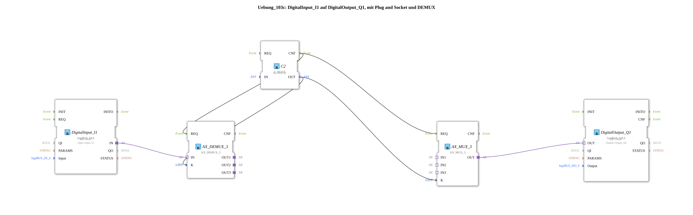

# Exercise_103c: DigitalInput_I1 to DigitalOutput_Q1, with Plug and Socket and DEMUX

[(https://notebooklm.google.com/notebook/041f4df4-b729-484d-b786-b6dcdf151961)
This article describes the logiBUS® exercise `Uebung_103c`.
----
## Objective of the exercise

Testing a specific path of the MUX/DEMUX structure.

-----

## Description

[cite_start]Compared to `Uebung_103`, the input field has been removed[cite: 1]. The selection value is instead fixed to the value `UINT#1` (index 1 -> branch 2 "latching") via a function block `F_MOVE`.

-----

## Functionality

The button `I1` now permanently controls the output `Q1` in "latching" (toggle) mode, even though the structure for other modes still exists. This is often used for debugging or quickly freezing a configuration.

