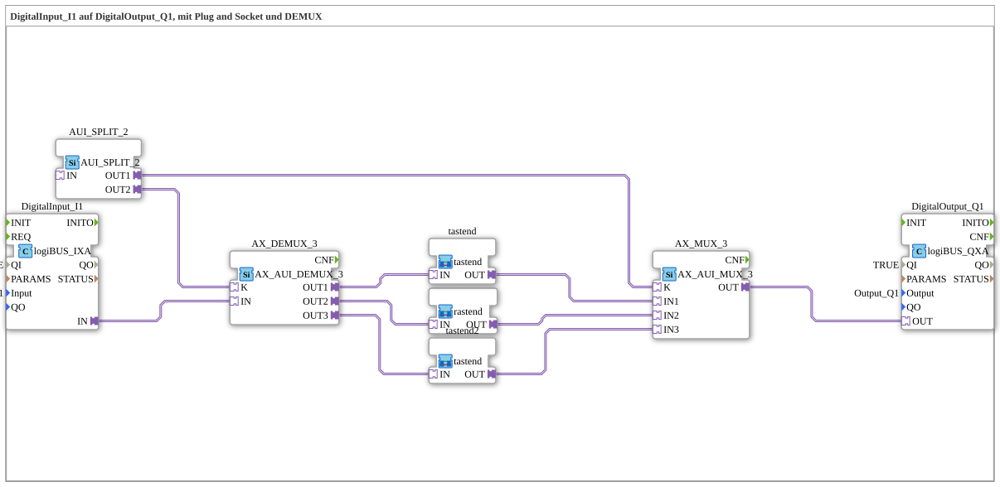

# Exercise_103c2: DigitalInput_I1 to DigitalOutput_Q1, with Plug and Socket and DEMUX

This article describes the logiBUS® exercise `Uebung_103c2`.
----
## Purpose of the Exercise

Variation of the mode selection.

-----

## Description

[cite_start]Another variation of the MUX/DEMUX exercise[cite: 1]. Here, the internal routing of the paths (e.g., `tastend2`) is slightly varied to test different combinations.

[cite_start]