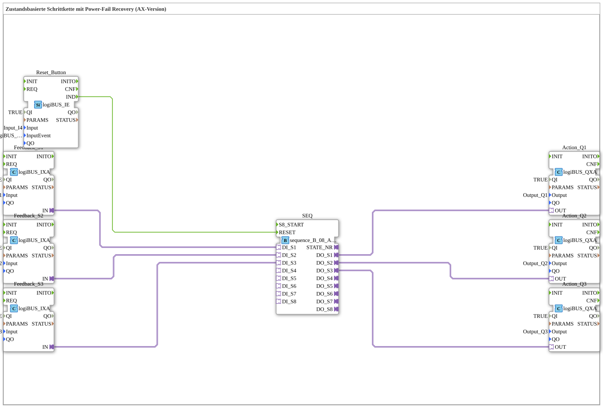

# Exercise_104_AX: State-Based Step Sequence with Power Fail Recovery (AX Version)

* * * * * * * * * *
## Introduction

This exercise implements a **state-based step sequence with power fail recovery** for the AX variant (adapter-based).
After a power failure or restart, the system can automatically return to the state whose corresponding input sensor is currently providing a TRUE signal.

The sequence block `sequence_B_08_AX_AX` forms the core and is connected to the input and output blocks via adapters.

## Function Blocks (FBs) Used

### Sub-block: SEQ

- **Type**: `logiBUS::utils::sequence::boolean::sequence_B_08_AX_AX`
- **Parameters**: No explicit parameters set.
- **Event Inputs**:
- `RESET` – connected to the reset button (Reset_Button.IND)
- **Adapter Inputs**:
- `DI_S1`, `DI_S2`, `DI_S3` – each connected to the feedback adapters
- **Adapter Outputs**:
- `DO_S1`, `DO_S2`, `DO_S3` – each connected to the action adapters
- **Functionality**:

A sequence control for up to eight steps based on Boolean adapter values.

Upon power-up or after a reset, the sequence jumps directly to the step whose corresponding input adapter outputs TRUE (Power-Fail Recovery).

During normal operation, it executes a defined sequence of steps.

### Sub-module: Feedback_S1

- **Type**: `logiBUS::io::DI::logiBUS_IXA`
- **Parameters**:
- `QI` = `TRUE`
- `Input` = `Input_I1`
- **Adapter output**: `IN` – connected to `SEQ.DI_S1`
- **Functionality**:

Digital input adapter that converts the physical sensor `Input_I1` into a logical adapter. The adapter is active for `QI=TRUE`.

### Sub-module: Feedback_S2

- **Type**: `logiBUS::io::DI::logiBUS_IXA`
- **Parameters**:
- `QI` = `TRUE`
- `Input` = `Input_I2`
- **Adapter output**: `IN` – connected to `SEQ.DI_S2`
- **Functionality**:

Analogous to Feedback_S1 for sensor `Input_I2`.

### Sub-module: Feedback_S3

- **Type**: `logiBUS::io::DI::logiBUS_IXA`
- **Parameters**:
- `QI` = `TRUE`
- `Input` = `Input_I3`
- **Adapter output**: `IN` – connected to `SEQ.DI_S3`
- **Functionality**:

Analogous to Feedback_S1 for sensor `Input_I3`.

### Sub-module: Reset_Button

- **Type**: `logiBUS::io::DI::logiBUS_IE`
- **Parameters**:
- `QI` = `TRUE`
- `Input` = `Input_I4`
- `InputEvent` = `logiBUS::io::DI::logiBUS_DI_Events::BUTTON_SINGLE_CLICK`
- **Event Output**: `IND` – connected to `SEQ.RESET`
- **Functionality**:

Detects a single click on the physical input `Input_I4` and generates an event at the output `IND`, which resets the sequence.

### Sub-module: Action_Q1

- **Type**: `logiBUS::io::DQ::logiBUS_QXA`
- **Parameters**:
- `QI` = `TRUE`
- `Output` = `Output_Q1`
- **Adapter input**: `OUT` – connected to `SEQ.DO_S1`
- **Function**:

Digital output adapter that outputs the logical adapter value to the physical output `Output_Q1`.

### Sub-module: Action_Q2

- **Type**: `logiBUS::io::DQ::logiBUS_QXA`
- **Parameters**:
- `QI` = `TRUE`
- `Output` = `Output_Q2`
- **Adapter input**: `OUT` – connected to `SEQ.DO_S2`
- **Functionality**:

Analogous to Action_Q1 for output `Output_Q2`.

### Sub-module: Action_Q3

- **Type**: `logiBUS::io::DQ::logiBUS_QXA`
- **Parameters**:
- `QI` = `TRUE`
- `Output` = `Output_Q3`
- **Adapter input**: `OUT` – connected to `SEQ.DO_S3`
- **Function**:

Analogous to Action_Q1 for output `Output_Q3`.

## Program Flow and Connections

The **Step Chain** (SEQ) has three input adapters (`DI_S1` … `DI_S3`) and three output adapters (`DO_S1` … `DO_S3`).

The inputs are connected to the physical sensors `Input_I1` … `Input_I3` via the feedback blocks.

The outputs control the actuators `Output_Q1` … `Output_Q3` via the action blocks.

... **Reset Behavior:**

Pressing the button on `Input_I4` generates an event (`IND`) that triggers the RESET input of the sequence.

The sequence then jumps to the state whose corresponding input adapter is TRUE (e.g., if sensor 2 is active, step 2 is started).

This behavior represents **Power Fail Recovery**: After a power failure or restart, the controller automatically returns to a defined state.

**Normal Operation:**

In normal operation, the sequence executes a predefined sequence of steps (not shown in the XML, as the steps are configured in the function block `sequence_B_08_AX_AX`).

### Learning Objectives

- Understanding of state-based controllers with recovery mechanisms
- Working with IEC 61499 adapters in the 4diac IDE
- Using logiBUS I/O blocks (input/output adapters)
- Analyzing and handling errors during power failures

### Difficulty Level

Medium – Basic knowledge of 4diac and step sequences is required.

### Prerequisites

- Fundamentals of IEC 61499
- Operation of the 4diac IDE
- Familiarity with logiBUS I/O (sensors, actuators)

### Starting the Exercise

1. Open the exercise `Uebung_104_AX` in the 4diac IDE.
2. Connect the physical inputs/outputs:
- `Input_I1`, `I2`, `I3` – e.g., limit switches or sensors
- `Input_I4` – reset button
- `Output_Q1`, `Q2`, `Q3` – e.g., valves or motors
3. Upload the application to the target hardware (e.g., logiBUS controller).
4. Test the power failure recovery: Interrupt and restore the power supply – the machine should return to the state defined by the sensors.

## Summary

Exercise **Exercise_104_AX** demonstrates a **state-based step sequence with power-fail recovery** using the sequence block `sequence_B_08_AX_AX` in conjunction with logiBUS I/O adapters.

The adapter-based connection allows for the modular integration of sensors and actuators.

The recovery behavior ensures that the controller automatically assumes the appropriate step for the current sensor state after a power failure – an important feature for safety-critical or interruption-sensitive applications.

--

### 🌐 Related topic subpages on ms-muc-docs.de

* [🌐 Eclipse 4diac IDE & color reference on ms-muc-docs.de ](https://www.ms-muc-docs.de/iec-61499/eclipse-4diac/)

]
