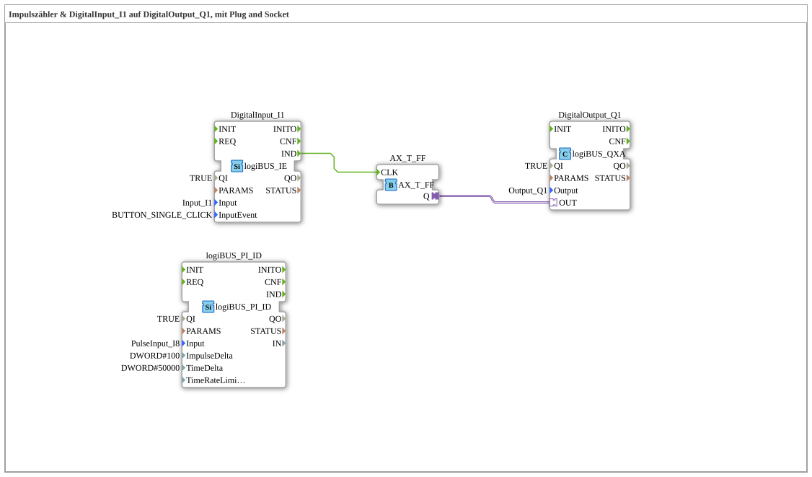

# Exercise_150_AX: Pulse Counter & DigitalInput_I1 to DigitalOutput_Q1, with Plug and Socket

[(https://notebooklm.google.com/notebook/041f4df4-b729-484d-b786-b6dcdf151961)
This article describes the logiBUS® exercise `Uebung_150_AX`. Here, we use the controller's fast counter input.
----
## Objective of the Exercise

Capture of fast pulses (e.g., speed, flow rate).

-----

## Description and Components

[cite_start]The sub-application `Uebung_150_AX.SUB` combines standard lighting logic with a pulse counter module[cite: 1].

### Function Blocks (FBs)

* **`logiBUS_PI_ID`**: Type `PulseInput_ID`. Detects pulses at hardware input `I8`.
* **`DigitalInput_I1`**: Push button for the lamp.
* **`AX_T_FF`**: Toggle switch for the lamp.

-----

## Functionality

The function block `logiBUS_PI_ID` operates in the background. It counts the pulses at input `I8`.

* `ImpulseDelta = 100`: The function block sends an event when 100 new pulses have been counted.
* `TimeDelta = 50000` (µs): Or after 50 ms.

This enables the detection of high-speed signals that would be too fast for normal digital inputs. The rest of the circuit (`I1` to `Q1`) continues to operate completely independently.

-----

## Application Example

**Radar Sensor / Speed Measurement**: A sensor on the wheel delivers pulses. The controller counts these to calculate the tractor's speed.