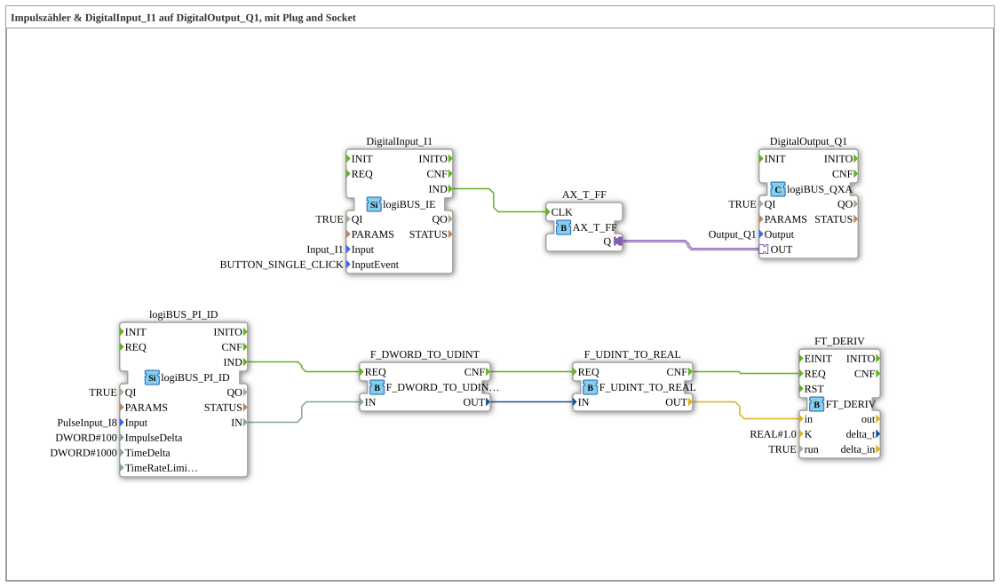

# Exercise_151_AX: Pulse Counter & DigitalInput_I1 to DigitalOutput_Q1, with Plug and Socket

This article describes the logiBUS® exercise `Uebung_151_AX`.
----
## Objective of the Exercise

Calculation of a time-dependent change (differential quotient) from pulse values.

-----

## Description and Components

[cite_start]The subapplication `Uebung_151_AX.SUB` extends the pulse counter with mathematical functions[cite: 1].

### Function Blocks (FBs)

* **`logiBUS_PI_ID`**: Returns the current counter reading.
* **`FT_DERIV`**: A function block from the **OSCAT** library for calculating the rate of change.

-----

## Functionality

1. The counter value (DWORD) is converted into a floating-point number (REAL).
2. The `FT_DERIV` function block calculates how quickly this value changes over time.
3. The result is directly proportional to the frequency of the input pulses (e.g., km/h or rpm).

-----

## Application Example

**Speed Monitoring**: A sensor on the fan wheel provides pulses. If the rate of change per second rises or falls below a threshold, an alarm can be triggered.