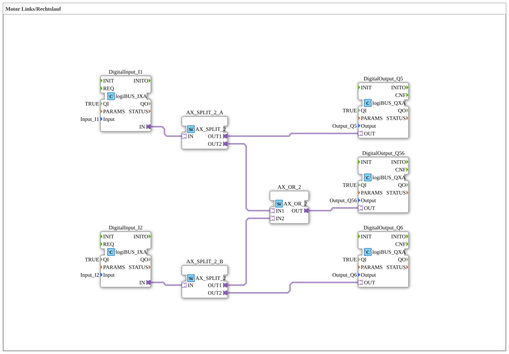

# Exercise_160_AX: Motor Left/Right Rotation

[(https://notebooklm.google.com/notebook/041f4df4-b729-484d-b786-b6dcdf151961)
This article describes the logiBUS® exercise `Uebung_160_AX`.
----
## Objective of the Exercise

Combination of individual outputs and a collective message.

-----

## Description and Components

[cite_start]The sub-application `Uebung_160_AX.SUB` controls two directions of rotation and a common status output[cite: 1].

### Function Blocks (FBs)

- **`I1`**: Pushbutton for Left (`Q5`).
- **`I2`**: Button for right (`Q6`).
- **`AX_OR_2`**: Combines both signals.
- **`Q56`**: A third output.

-----

## Functionality

1. Pressing `I1` activates `Q5`.
2. Pressing `I2` activates `Q6`.
3. The function block `AX_OR_2` ensures that `Q56` is always active when **either** `Q5` **or** `Q6` (or both) are active.

-----

## Application Example

**Main Contactor Control**: In a motor control system, `Q5` and `Q6` are the directional contactors. `Q56` controls the main contactor, which must be engaged in both cases to supply power to the power section.
