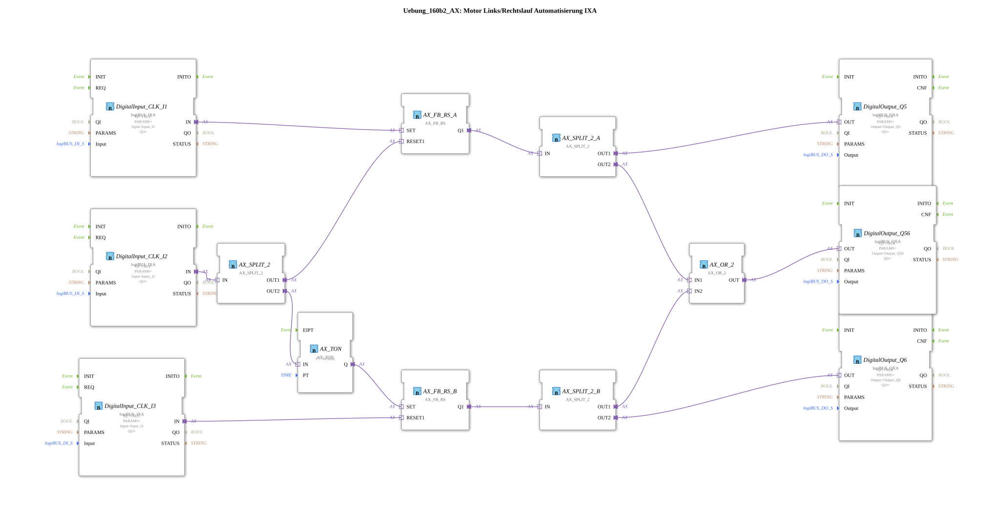

Here is the documentation for exercise `Uebung_160b2_AX` based on the provided file contents.
# Exercise_160b2_AX: Motor Forward/Reverse Rotation Automation IXA

* * * * * * * * * *
## Introduction

Exercise **Exercise_160b2_AX** implements a control system for a motor with forward and reverse rotation functionality using adapter technology (AX/IXA/QXA). The focus is on a safe switching of the direction of rotation, with a dead time (delay) implemented to protect the motor and the mechanics during the change of direction. Additionally, the operating status is signaled via outputs.

## Function Blocks (FBs) Used

This sub-application uses various function blocks from the `logiBUS` and `adapter` libraries to process the input/output signals and establish the logical connections.

### Sub-Blocks: I/O Interfaces (logiBUS)

These function blocks establish the connection to the physical hardware.

- **Type**: `logiBUS::io::DI::logiBUS_IXA` (inputs) and `logiBUS::io::DQ::logiBUS_QXA` (outputs)
- **Internal Function Blocks Used**:
- **DigitalInput_CLK_I1**: `logiBUS_IXA`
- Parameters: `Input` = `Input_I1`
- Function: Start signal for direction 1 (e.g., counterclockwise).
- **DigitalInput_CLK_I2**: `logiBUS_IXA`
- Parameters: `Input` = `Input_I2`
- Function: Switching signal / Stops direction 1 and starts direction 2 with a delay.
- **DigitalInput_CLK_I3**: `logiBUS_IXA`
- Parameter: `Input` = `Input_I3`
- Function: Stop signal for direction 2
- **DigitalOutput_Q5**: `logiBUS_QXA`
- Parameter: `Output` = `Output_Q5`
- Function: Control of contactor/motor for direction 1
- **DigitalOutput_Q6**: `logiBUS_QXA`
- Parameter: `Output` = `Output_Q6`
- Function: Control of contactor/motor for direction 2
- **DigitalOutput_Q56**: `logiBUS_QXA`
- Parameter: `Output` = `Output_Q56`
- Function: Collective display "Motor running" (direction 1 or 2).

### Sub-modules: Logic and Memory (Adapter)

These modules process the signals logically.

- **Type**: `adapter::iec61131::bistableElements::AX_FB_RS`
- **Internal Function Blocks Used**:
- **AX_SR_A**: `AX_FB_RS`
- Function: Memory element (RS flip-flop) for rotation direction 1.
- **AX_SR_B**: `AX_FB_RS`
- Function: Memory element (RS flip-flop) for rotation direction 2.

### Sub-Blocks: Timers

- **Type**: `adapter::events::unidirectional::timers::AX_TON`
- **Internal Function Blocks Used**:
- **AX_TON**: `AX_TON`
- Parameter: `PT` = `T#50ms`
- Function: 50-millisecond turn-on delay for smooth direction changes.

### Sub-Blocks: Signal Distribution and Linking

- **Type**: `adapter::events::unidirectional::AX_SPLIT_2` and `adapter::booleanOperators::AX_OR_2`
- **Internal Function Blocks Used**:
- **AX_SPLIT_2, AX_SPLIT_2_A, AX_SPLIT_2_B**: `AX_SPLIT_2`
- Function: Distributes an incoming adapter signal to two outputs to trigger parallel processes or to branch off signals.
- **AX_OR_2**: `AX_OR_2`
- Function: Logical OR. Combines the status messages of both directions of rotation for the collective display.

## Program Flow and Connections

The circuit implements a classic reversing contactor control with a special feature in the switching mechanism using push-button interlocking and a time delay.

1. **Start Direction 1 (Q5):**
* The signal from **Input_I1** sets the memory **AX_SR_A**.
* The output of **AX_SR_A** is routed directly to **Output_Q5** via a splitter (**AX_SPLIT_2_A**). The motor runs in direction 1.
2. **Switching / Start Direction 2 (Q6):**
* The signal from **Input_I2** is routed to a splitter (**AX_SPLIT_2**).
* **Branch 1:** The signal immediately resets the memory **AX_SR_A**. This immediately switches off **Output_Q5**.
* **Branch 2:** The signal starts the timer **AX_TON**. After 50 ms (parameter `PT`), the memory **AX_SR_B** is set.
* The output of **AX_SR_B** activates **Output_Q6** via **AX_SPLIT_2_B**. The motor now runs in direction 2.
* *Note:* The 50ms delay serves as a locking time to prevent a short circuit between the phases during direct switching.
3. **Stop Direction 2:**
* The signal from **Input_I3** resets the memory **AX_SR_B**, which switches off **Output_Q6**.
4. **Operating Indicator (Q56):**
* The signals from both directions of rotation (coming from splitters A and B) are combined in the **AX_OR_2** function block.
* As soon as either Q5 or Q6 is active, **Output_Q56** is activated. This serves as an indicator that the motor is running.
*
## Summary

The `Uebung_160b2_AX` demonstrates advanced motor control using adapter blocks. It shows how to duplicate signals using splitters (`AX_SPLIT_2`) to perform simultaneous actions (resetting one side, starting the timer for the other). The integrated safety logic using `AX_TON` prevents an immediate reversal of direction, thus protecting the connected hardware. This exercise is ideal for deepening your understanding of sequential control and signal routing in 4diac.

--

### 🌐 Related topic subpages on ms-muc-docs.de

* [🌐 Eclipse 4diac IDE & color reference on ms-muc-docs.de ](https://www.ms-muc-docs.de/iec-61499/eclipse-4diac/)

]
