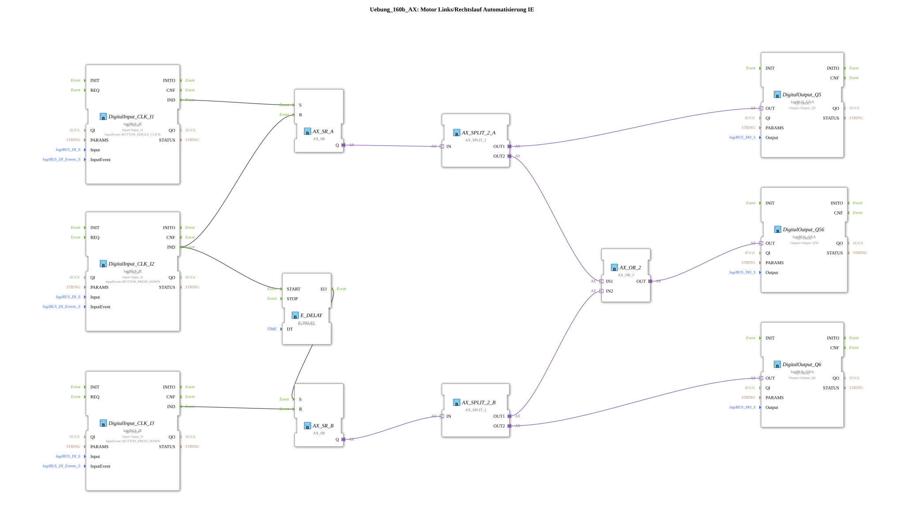

Here is the documentation for exercise `Uebung_160b_AX` based on the provided XML data.

# Exercise_160b_AX: Motor Forward/Reverse Automation IE

* * * * * * * * * *

## Introduction

This exercise implements a control system for a motor with forward and reverse rotation using the adapter concept (AX) in 4diac. The goal of the exercise is to control two outputs (Q5 and Q6) via separate input events (set/reset) and activate a common status output (Q56) as soon as one of the two motor outputs is active. Additionally, a delay during the switching process is implemented using push button I2.

## Function Blocks (FBs) Used

This exercise uses various standard function blocks from the `logiBUS` library as well as logical adapter blocks.

### Sub-Blocks: Logic and I/O

This section describes the specific function blocks responsible for logic and hardware connectivity.

- **DigitalInput_CLK_I1 / I2 / I3**
- **Type**: `logiBUS::io::DI::logiBUS_IE`
- **Description**: Used to capture button inputs.

- **Parameters**:

- `QI` = `TRUE`
- `Input` = `Input_I1` (or I2, I3)
- `InputEvent` = `BUTTON_SINGLE_CLICK` (for I1), `BUTTON_PRESS_DOWN` (for I2, I3)
- **Functionality**: Converts hardware signals into IEC 61499 events.
- **DigitalOutput_Q5 / Q6 / Q56**
- **Type**: `logiBUS::io::DQ::logiBUS_QXA`
- **Description**: Adapter-based outputs for controlling hardware (motor relays or LEDs).
- - **Parameters**:
- `QI` = `TRUE`
- `Output` = `Output_Q5` (or Q6, Q56)
- **Functionality**: Outputs the status of the connected adapter to the hardware.
- **AX_SR_A / AX_SR_B**
- **Type**: `adapter::events::unidirectional::AX_SR`
- **Description**: Memory component (flip-flop) based on adapter connections.
- **Functionality**: Stores the "On" (Set) or "Off" (Reset) state. `AX_SR_A` controls the path for Q5, `AX_SR_B` the path for Q6.
- Input S (Set): Enables adapter output Q.
- Input R (Reset): Disables adapter output Q.
- **AX_SPLIT_2_A / AX_SPLIT_2_B**
- **Type**: `adapter::events::unidirectional::AX_SPLIT_2`
- **Description**: Signal distributor for adapter connections.
- **Function**: Receives an adapter signal and makes it available at two outputs (OUT1, OUT2). This allows an SR flip-flop to feed both the direct motor output and the OR gate for the status indicator.
- **AX_OR_2**
- **Type**: `adapter::booleanOperators::AX_OR_2`
- **Description**: Logic OR for adapters.
- **Function**: Output OUT is active when either IN1 or IN2 is active. Used here to turn on Q56 when either Q5 or Q6 is running.
- **E_DELAY**
- **Type**: `iec61499::events::E_DELAY`
- **Description**: Turn-on delay.
- **Parameters**:
- `DT` = `T#50ms`
- **Function**: Delays the event signal by 50 milliseconds.

## Program Flow and Connections

The network implements a latched control with the following sequence:

1. **Start Motor Left (Q5):**

- The event `BUTTON_SINGLE_CLICK` at **Input_I1** sets the function block **AX_SR_A** (input S).
- The signal from `AX_SR_A` is split by **AX_SPLIT_2_A**:
- One path directly activates **DigitalOutput_Q5**.
- The second path goes to the OR gate **AX_OR_2**, which activates **DigitalOutput_Q56** (power indicator).
1. **Switch/Stop Left (I2):**

- The event `BUTTON_PRESS_DOWN` at **Input_I2** has two functions:
- It resets **AX_SR_A**. The motor at Q5 stops immediately.
- Simultaneously, it starts the timer **E_DELAY**.
1. **Start Motor Right (Q6) (Delayed):**

- After the delay (50ms) set by **E_DELAY**, the event `EO` is triggered.
- This event sets **AX_SR_B** (Input S).
- The signal from `AX_SR_B` is split by **AX_SPLIT_2_B**:
- One path goes to the OR gate **AX_OR_2** and keeps **DigitalOutput_Q56** active.
- The second path activates **DigitalOutput_Q6**.
1. **Stop Right Motor (I3):**

- The event `BUTTON_PRESS_DOWN` at **Input_I3** resets **AX_SR_B**. The motor at Q6 stops and Q56 goes out (unless Q5 is active).

**In Summary:**

- **I1**: Starts Q5.
- **I2**: Stops Q5 and starts (after 50 ms) Q6.
- **I3**: Stops Q6.
- **Q56**: Lights up when Q5 or Q6 are active.

## Summary

Exercise `Uebung_160b_AX` demonstrates the advanced use of adapter components for encapsulating logic and data flow. By using splitters (`AX_SPLIT`) and logical operators (`AX_OR`) at the adapter level, the circuit diagram remains clear while simultaneously implementing complex dependencies (shared status display, switching logic). The delay (`E_DELAY`) ensures a short dead time when switching the direction of rotation via I2, which is important for machine protection in real-world motor applications.

### 🌐 Related topic subpages on ms-muc-docs.de

- [🌐 Eclipse 4diac IDE & Color Reference on ms-muc-docs.de](https://www.ms-muc-docs.de/iec-61499/eclipse-4diac/)
- [🌐 IEC 61499 Events – The Pulse of Automation on ms-muc-docs.de](https://www.ms-muc-docs.de/iec-61499/events/event/)

]
