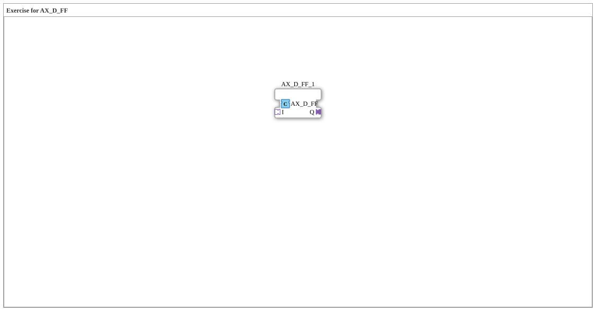

Here is the documentation for exercise `Uebung_170_AX`, based on the provided XML data.

# Exercise_170_AX: Exercise for AX_D_FF

* * * * * * * * * *
The sub-application **Exercise_170_AX** is a basic exercise specifically created for the function block `AX_D_FF`. The goal of this exercise is to demonstrate the instantiation and behavior of this specific adapter block in an IEC 61499 environment.

This exercise uses the following main block within the sub-application network:

## Function Blocks Used (FBs)

## Introduction

### Sub-blocks: AX_D_FF_1

This block is the central component of this sub-application.

- **Type**: `adapter::events::unidirectional::AX_D_FF`
- **Internal Function Blocks Used**:
- Since this is the instantiation of a library element, the internal function blocks of this block are hidden in its own type definition and are not visible in this SubApp file.
- **Functionality**:
- The function block `AX_D_FF` (D Flip-Flop Adapter) is presumably used to store states based on event triggers within a unidirectional adapter structure. It encapsulates the logic of a D flip-flop for use in adapter-based event chains.

## Program Flow and Connections

### 🌐 Network Structure

The network of this sub-application has a minimalist structure:

- It contains a single instance of the block `AX_D_FF` (named `AX_D_FF_1`).
- It is located at coordinates x=-1700, y=0.

In this definition, **no explicit event or data connections** are defined within this sub-application.

- This suggests that this exercise either serves as a template where the learner must add connections, or that the block has adapter interfaces (plugs/sockets) that are connected at a higher level.
- The exercise focuses on deploying the `AX_D_FF` instance.

### Verbindungen

### Learning Objectives & Notes

- **Difficulty Level**: Beginner.
- **Starting the Exercise**: Place this sub-app in an application and connect the corresponding adapter interfaces to observe the switching behavior of the flip-flop.

The **Exercise_170_AX** provides an isolated environment for the `AX_D_FF` block. It serves as a container for this specific adapter element without prescribing internal connections, thus forming a building block for more complex control tasks or test scenarios.

## Summary
