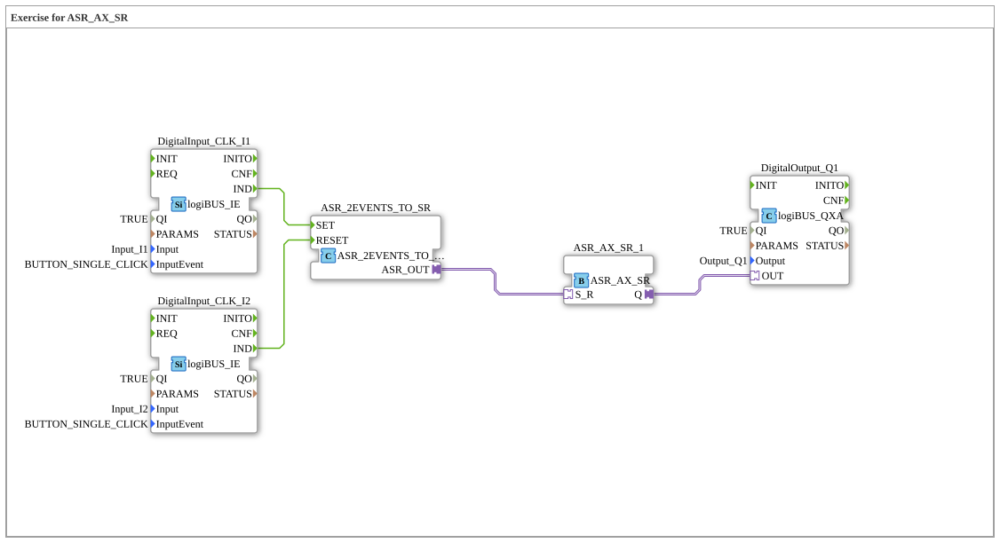

# Exercise_171_ASR: Exercise for ASR_AX_SR

* * * * * * * * * *
## Introduction
This exercise demonstrates the application of an asynchronous set-reset flip-flop (ASR) in the 4diac IDE. Two pushbuttons connected to the digital inputs I1 and I2 control the setting and resetting of a memory chip, whose output switches a digital output Q1. The exercise teaches fundamental concepts of event processing and the coupling of hardware inputs with an RS memory module.

## Function Blocks (FBs) Used

### Sub-Blocks: DigitalInput_CLK_I1 and DigitalInput_CLK_I2
- **Type**: `logiBUS::io::DI::logiBUS_IE`
- **Internal FBs Used**: None (Hardware Configuration Block)
- **Parameters**:
- `QI` = TRUE
- `Input` = `Input_I1` or `Input_I2`
- `InputEvent` = `BUTTON_SINGLE_CLICK`
- **Event Output**: `IND` (triggered when the button is pressed)
- **Data Output**: None
- **Functionality**: The blocks represent the Digital inputs of the logiBUS hardware. They detect a single click on the corresponding input channel and output an event (`IND`).

### Sub-block: ASR_2EVENTS_TO_SR
- **Type**: `adapter::conversion::unidirectional::ASR_2EVENTS_TO_SR`
- **Internal Function Blocks Used**: None (conversion block)
- **Parameters**: None
- **Event Inputs**: `SET`, `RESET`
- **Adapter Output**: `ASR_OUT` (connects to an ASR adapter)
- **Functionality**: This block converts two separate events (SET and RESET) into an adapter interface that enables the control of an ASR flip-flop. An incoming SET event sets the output adapter to the set state, a RESET event to the reset state.

### Sub-module: ASR_AX_SR_1
- **Type**: `adapter::events::unidirectional::ASR_AX_SR`
- **Internal Function Blocks Used**: None (ASR memory module)
- **Parameters**: None
- **Adapter Input**: `S_R` (receives SET/RESET signals from the converter)
- **Data Output**: `Q` (Boolean value, flip-flop state)
- **Functionality**: The module implements an asynchronous set-reset flip-flop. The internal state is controlled via the adapter input `S_R`: A set signal activates the output `Q` (TRUE), a reset signal deactivates it (FALSE). The output remains stable until the next signal.

```
### Sub-Block: DigitalOutput_Q1

- **Type**: `logiBUS::io::DQ::logiBUS_QXA`
- **Internal Function Blocks Used**: None (Hardware Configuration Block)
- **Parameters**:
- `QI` = TRUE
- `Output` = `Output_Q1`
- **Data Input**: `OUT` (receives the switching command from the ASR)
- **Event Output**: None
- **Function**: This block controls the digital output Q1 of the logiBUS hardware. As soon as a TRUE signal is present at the data input `OUT`, the connected actuator (e.g., a lamp) is switched on; if FALSE, it is switched off.

## Program Flow and Connections

The flow is determined by the event and data connections in the SubApp network:

1. **Input Events**:

- Pressing a key on `Input_I1` triggers the event `IND` in the block `DigitalInput_CLK_I1`. This event is then routed to the event input `SET` of the converter `ASR_2EVENTS_TO_SR`.
- Pressing a key on `Input_I2` triggers the event `IND` in the block `DigitalInput_CLK_I2`. This event is then routed to the event input `RESET` of the converter.

` `` ``` triggers the event `IND` in the block `DigitalInput_CLK_I2`. This event is then routed to the event input `RESET` of the converter.

`` 2. **Adapter Processing**:

- The converter `ASR_2EVENTS_TO_SR` sets the output adapter `ASR_OUT` according to the last incoming event (SET or RESET).
- The adapter output is connected to the adapter input `S_R` of the ASR module `ASR_AX_SR_1`.

3. **Memory and Output**:

- The ASR module responds to the incoming adapter signal and updates its output `Q`.
- The output `Q` is connected to the data input `OUT` of the digital output module `DigitalOutput_Q1`. This switches the physical output Q1 on or off accordingly.
- **Learning Objectives**: Understanding event control, working with adapter modules, simple memory function (RS flip-flop).
- **Difficulty Level**: Medium
- **Prerequisites**: Basic knowledge of the 4diac IDE, working with event and data connections, logiBUS configuration.
- **Execution**: The exercise can be executed in the 4diac runtime after loading and compiling. Input channels I1 and I2 must be connected to pushbuttons; output Q1 controls an actuator (e.g., LED or relay).

## Summary

Exercise `Uebung_171_ASR` demonstrates the implementation of an asynchronous RS memory with two pushbuttons as inputs and one digital output. A simple but typical control task is represented by combining hardware configuration modules (logiBUS), an event-to-adapter converter, and an ASR memory module. The user learns how discrete events are passed via adapters to a memory chip and finally switched to a physical output.

---

### 🌐 Related topic subpages on ms-muc-docs.de
* [🌐 Eclipse 4diac IDE & Color Reference on ms-muc-docs.de](https://www.ms-muc-docs.de/iec-61499/eclipse-4diac/)

]
