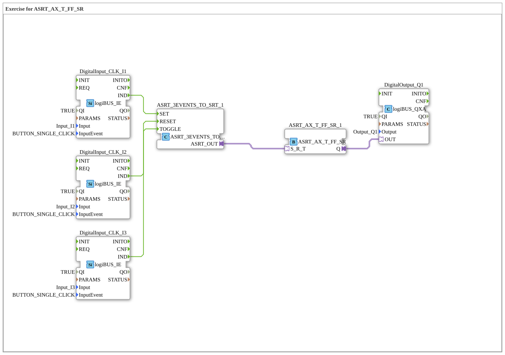

# Exercise_172_ASRT: Exercise for ASRT_AX_T_FF_SR

* * * * * * * * * *

## Introduction

This exercise demonstrates the application of an SR+toggle flip-flop (ASRT) in the 4diac IDE. Three pushbuttons connected to the digital inputs I1, I2, and I3 control the setting, resetting, and toggling of a memory block, whose output switches a digital output Q1. This exercise is the direct successor to `Uebung_171_ASR` and extends the pure SR flip-flop with a third, toggling input.

## Function blocks (FBs) used

### Sub-blocks: DigitalInput_CLK_I1, DigitalInput_CLK_I2, and DigitalInput_CLK_I3

- **Type**: `logiBUS::io::DI::logiBUS_IE`
- **Internal FBs used**: None (hardware configuration block)
  - **Parameters**:
    - `QI` = TRUE
    - `Input` = `Input_I1`, `Input_I2`, or `Input_I3`
    - `InputEvent` = `BUTTON_SINGLE_CLICK`
  - **Event output**: `IND` (triggered when the button is pressed)
  - **Data output**: None
- **Functionality**: These blocks represent the digital inputs of the logiBUS hardware. They detect a single click on the corresponding input channel and output an event (`IND`).

### Sub-block: ASRT_3EVENTS_TO_SRT_1

- **Type**: `adapter::conversion::unidirectional::ASRT_3EVENTS_TO_SRT`
- **Internal FBs used**: None (conversion block)
  - **Parameters**: None
  - **Event inputs**: `SET`, `RESET`, `TOGGLE`
  - **Adapter output**: `ASRT_OUT` (connects to an ASRT adapter)
- **Functionality**: This block converts three separate events (SET, RESET, and TOGGLE) into an adapter interface that drives an ASRT flip-flop. An incoming SET event sets the output adapter to the set state, a RESET event to the reset state, and a TOGGLE event inverts the current state.

### Sub-block: ASRT_AX_T_FF_SR_1

- **Type**: `adapter::events::unidirectional::ASRT_AX_T_FF_SR`
- **Internal FBs used**: None (ASRT memory block)
  - **Parameters**: None
  - **Adapter input**: `S_R_T` (receives SET/RESET/TOGGLE signals from the converter)
  - **Data output**: `Q` (boolean value, flip-flop state)
- **Functionality**: This block implements an SR+toggle flip-flop. The internal state is controlled via the adapter input `S_R_T`: a set signal activates output `Q` (TRUE), a reset signal deactivates it (FALSE), a toggle signal inverts the current state. The output remains stable until the next signal.

### Sub-block: DigitalOutput_Q1

- **Type**: `logiBUS::io::DQ::logiBUS_QXA`
- **Internal FBs used**: None (hardware configuration block)
  - **Parameters**:
    - `QI` = TRUE
    - `Output` = `Output_Q1`
  - **Data input**: `OUT` (receives the switching command from the ASRT)
  - **Event output**: None
- **Functionality**: This block controls digital output Q1 of the logiBUS hardware. As soon as a TRUE signal is present at data input `OUT`, the connected actuator (e.g. a lamp) is switched on; if FALSE, it is switched off.

## Program flow and connections

The flow is determined by the event and adapter connections in the SubApp network:

1. **Input events**:
   - Pressing the button on `Input_I1` triggers the `IND` event in block `DigitalInput_CLK_I1`. This is routed to the `SET` event input of the converter `ASRT_3EVENTS_TO_SRT_1`.
   - Pressing the button on `Input_I2` triggers the `IND` event in block `DigitalInput_CLK_I2`. This is routed to the `RESET` event input of the converter.
   - Pressing the button on `Input_I3` triggers the `IND` event in block `DigitalInput_CLK_I3`. This is routed to the `TOGGLE` event input of the converter.

2. **Adapter processing**:
   - The converter `ASRT_3EVENTS_TO_SRT_1` sets the output adapter `ASRT_OUT` according to the last incoming event (SET, RESET, or TOGGLE).
   - The adapter output is connected to the adapter input `S_R_T` of the ASRT block `ASRT_AX_T_FF_SR_1`.

3. **Memory and output**:
   - The ASRT block responds to the incoming adapter signal and updates its output `Q`.
   - Output `Q` is connected to the data input `OUT` of the digital output block `DigitalOutput_Q1`, switching the physical output Q1 accordingly.

- **Learning objectives**: Understanding event control with three independent inputs, working with adapter blocks, combined SR+toggle memory function, distinguishing this from the pure SR flip-flop in `Uebung_171_ASR`.
- **Difficulty level**: Medium
- **Prerequisites**: Basic knowledge of the 4diac IDE, working with event and data connections, logiBUS configuration, familiarity with exercise `Uebung_171_ASR`.
- **Execution**: The exercise can be run in the 4diac runtime after loading and compiling. Input channels I1, I2, and I3 must be connected to pushbuttons; output Q1 drives an actuator (e.g. LED or relay).

## Summary

Exercise `Uebung_172_ASRT` demonstrates the implementation of an SR+toggle memory with three pushbuttons as inputs and one digital output. It is the direct analog of `Uebung_171_ASR`, but replaces the ASR adapter with the new ASRT adapter, which additionally supports a toggle event alongside set/reset. The user learns how three discrete events are passed via adapters to a combined memory block and finally switched to a physical output.

---

### 🌐 Related topic subpages on ms-muc-docs.de

- [🌐 Eclipse 4diac IDE & Color Reference on ms-muc-docs.de](https://www.ms-muc-docs.de/iec-61499/eclipse-4diac/)
