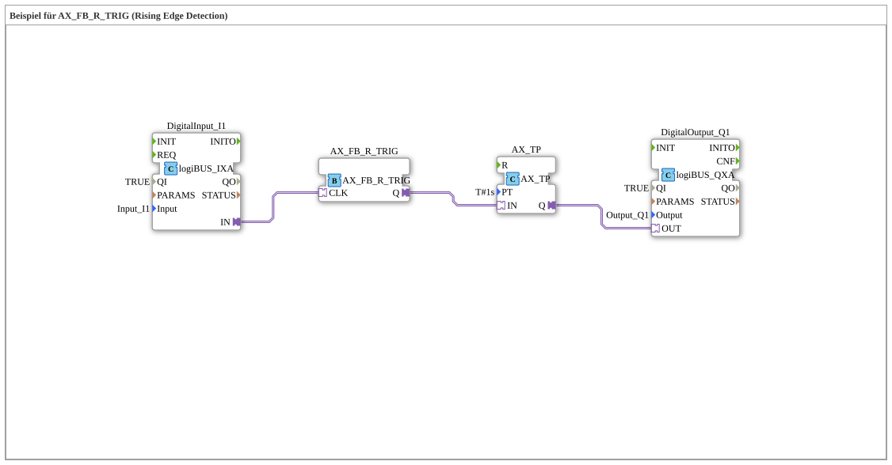

Here is the documentation for exercise `Uebung_177_AX`, based on the provided data.
# Exercise_177_AX: Example for AX_FB_R_TRIG (Rising Edge Detection)

* * * * * * * * * *
## Introduction
This exercise demonstrates the use of **rising edge detection** in combination with a **pulse timer**. The goal is to evaluate a signal at the physical input only at the moment of power-on (change from 0 to 1) and then activate an output for a defined duration.

The focus is on the function block `AX_FB_R_TRIG`, which detects a rising edge.

## Function Blocks (FBs) Used

This sub-application uses hardware driver blocks as well as logic and timing blocks.

### Sub-Blocks:

#### 1. Hardware Input
- **Name**: `DigitalInput_I1`
- **Type**: `logiBUS::io::DI::logiBUS_IXA`
- **Parameters**:
- `Input` = `Input_I1` (reference to physical input I1)
- **Function**: Provides the state of the digital input to the logic.

#### 2. Edge Detection (Rising Trigger)
- **Name**: `AX_FB_R_TRIG`
- **Type**: `adapter::iec61131::edgeDetection::AX_FB_R_TRIG`
- **Function**: This block monitors the input signal. It only outputs a signal at output `Q` when the input signal `CLK` changes from `FALSE` (0) to `TRUE` (1) (rising edge). Continuous signals are ignored.

``` #### 3. Pulse Timer

- **Name**: `AX_TP`
- **Type**: `adapter::events::unidirectional::timers::AX_TP`
- **Parameters**:
- `PT` = `T#1s` (Process Time: 1 second)
- **Function**: Generates a pulse at output `Q` with the duration defined in `PT` as soon as input `IN` is activated.

#### 4. Hardware Output
- **Name**: `DigitalOutput_Q1`
- **Type**: `logiBUS::io::DQ::logiBUS_QXA`
- **Parameters**:
- `Output` = `Output_Q1` (reference to physical output Q1)
- **Function**: Switches the physical output based on the logic signal.

## Program Flow and Connections

The circuit flow is as follows:

1. **Signal Input**: The signal from `DigitalInput_I1` (input I1) is routed to the `CLK` input of the edge detection module `AX_FB_R_TRIG`.

2. **Edge Detection**:

* When the button at I1 is pressed, `AX_FB_R_TRIG` detects the rising edge.
* The trigger's output `Q` is briefly activated.

3. **Time Control**: This signal is forwarded to the input `IN` of the timer `AX_TP`.

4. **Output**: The timer activates its output `Q` for exactly **1 second** (`PT=T#1s`). This signal controls `DigitalOutput_Q1`.

**Relationship of Connections:**

* `DigitalInput_I1.IN` → `AX_FB_R_TRIG.CLK`
* `AX_FB_R_TRIG.Q` → `AX_TP.IN`
* `AX_TP.Q` → `DigitalOutput_Q1.OUT`

## Summary

`Uebung_177_AX` demonstrates a classic application in automation technology: decoupling a mechanical button press from the execution time of an action. By using `AX_FB_R_TRIG`, it doesn't matter how long the button is held down; the process is only started once when the button is pressed. The timer `AX_TP` ensures that the output (e.g. a lamp or a motor) runs for an exact period of time (here 1 second).