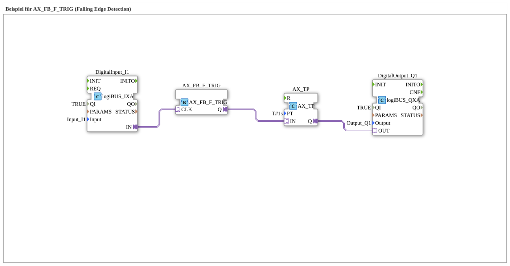

Here is the documentation for exercise `Uebung_178_AX` based on the provided data.

# Exercise_178_AX: Example for AX_FB_F_TRIG (Falling Edge Detection)

* * * * * * * * * *

## Introduction

This exercise demonstrates the use of the function block `AX_FB_F_TRIG` for falling edge detection. The circuit's goal is to trigger an event or signal precisely when an input signal changes from a high state (TRUE) to a low state (FALSE) (e.g., when a button is released).

## Function Blocks (FBs) Used

In this sub-application, various function blocks are combined to implement the logic. Since this is a sub-application, the internally interconnected blocks are described below.

### Sub-Blocks: Internal Logic

This exercise involves networking the following standard and adapter blocks:

- **Internal Function Blocks Used**:
- **DigitalInput_I1**: `logiBUS::io::DI::logiBUS_IXA`
- **Function**: Reads the physical input `Input_I1`.
- **Parameters**:
- `Input` = `Input_I1`
- `QI` = `TRUE`
- **AX_FB_F_TRIG**: `adapter::iec61131::edgeDetection::AX_FB_F_TRIG`
- **Function**: Detects a falling edge on the input signal. The output becomes active when the input changes from TRUE to FALSE.
- **AX_TP**: `adapter::events::unidirectional::timers::AX_TP`
- **Function**: Timer Pulse (pulse generator). Generates a pulse of defined length as soon as the input is activated.
- **Parameters**:
- `PT` = `T#1s` (pulse duration of 1 second).
- **DigitalOutput_Q1**: `logiBUS::io::DQ::logiBUS_QXA`
- **Function**: Controls the physical output `Output_Q1`.
- **Parameters**:
- `Output` = `Output_Q1`
- `QI` = `TRUE`

## Program Flow and Connections

The program flow can be described as follows:

1. **Signal Input**: The digital input `DigitalInput_I1` monitors the status of the hardware input `Input_I1`.
2. **Edge Detection**: The signal is forwarded via an adapter connection to the module `AX_FB_F_TRIG` (input `CLK`). This module monitors the signal for a falling edge. This means it reacts precisely when the signal drops from 1 (TRUE) to 0 (FALSE) (e.g., when a button is released).
3. **Timer**: As soon as the falling edge is detected, the `AX_FB_F_TRIG` sends a signal via its output `Q` to the timer `AX_TP` (input `IN`).
4. **Output**: The timer `AX_TP` is configured as a pulse generator (`TP`). The input signal starts the timer, setting its output `Q` to TRUE for 1 second (`PT` = `T#1s`).
5. **Hardware Control**: The timer's output signal is passed to `DigitalOutput_Q1`, which activates the hardware output `Output_Q1` for the duration of the pulse.

**Summary**: When input I1 is switched off (falling edge), output Q1 is switched on for exactly one second.

## Summary

Exercise `Uebung_178_AX` illustrates the processing of signals based on their switching-off moment. By combining a falling edge detection (`F_TRIG`) with a pulse timer (`TP`), a time-controlled response to the end of an input signal is achieved. This is a typical application for delay controls or responses to the release of operating elements.
