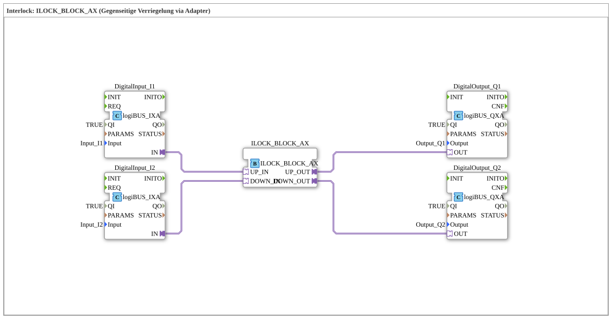

# Exercise_201_AX: Interlock: ILOCK_BLOCK_AX (Mutual Interlock via Adapter)

* * * * * * * * * *
## Introduction
This exercise demonstrates the implementation of a mutual interlock using the function block `ILOCK_BLOCK_AX`. Two digital inputs are connected to the interlock block via adapters. The outputs are configured so that only one of the two outputs can be active at any given time – simultaneous switching is prevented. This is a typical safety function in automation technology, for example, to protect opposing drives.

## Function Blocks Used (FBs)

The exercise consists of five function blocks in the network:

- **DigitalInput_I1** – reads the first digital input (`Input_I1`)
- **DigitalInput_I2** – reads the second digital input (`Input_I2`)
- **ILOCK_BLOCK_AX** – performs mutual interlocking
- **DigitalOutput_Q1** – controls the first digital output (`Output_Q1`)
- **DigitalOutput_Q2** – controls the second digital output (`Output_Q2`)

### Block: `DigitalInput_I1` (Type: `logiBUS::io::DI::logiBUS_IXA`)
- **Type**: Digital Input Block (Adapter Interface)
- **Parameters**:
- `QI` = `TRUE`
- `Input` = `Input_I1`
- **Events/Adapters**: Outputs an adapter interface `IN`, which is connected to the interlock block.

### Block: `DigitalInput_I2` (Type: `logiBUS::io::DI::logiBUS_IXA`)
- **Type**: Digital Input Block (Adapter Interface)
- **Parameters**:
- `QI` = `TRUE`
- `Input` = `Input_I2`
- **Events/Adapter**: Outputs an adapter interface `IN`.

### Block: `ILOCK_BLOCK_AX` (Type: `logiBUS::signalprocessing::interlock::ILOCK_BLOCK_AX`)
- **Type**: Interlock logic block (adapter-based)
- **Parameters**: No explicit parameters in the XML
- **Adapter interfaces**:
- `UP_IN` – Input for the first channel (connected to `DigitalInput_I1.IN`)
- `DOWN_IN` – Input for the second channel (connected to `DigitalInput_I2.IN`)
- `UP_OUT` – Output for the first channel (connected to `DigitalOutput_Q1.OUT`)
- `DOWN_OUT` – Output for the second channel (connected to (`DigitalOutput_Q2.OUT`)
- **Functionality**: The function block implements mutual interlocking. When the `UP_IN` input is active, `UP_OUT` is activated and `DOWN_OUT` is simultaneously deactivated (blocking the second channel). When `DOWN_IN` becomes active, the function block switches accordingly. Simultaneous activation of both outputs is not possible.

### Module: `DigitalOutput_Q1` (Type: `logiBUS::io::DQ::logiBUS_QXA`)
- **Type**: Digital output module (adapter interface)
- **Parameters**:
- `QI` = `TRUE`
- `Output` = `Output_Q1`
- **Events/Adapter**: Receives an adapter interface `OUT` from the interlock block.

### Block: `DigitalOutput_Q2` (Type: `logiBUS::io::DQ::logiBUS_QXA`)
- **Type**: Digital output block (adapter interface)
- **Parameters**:
- `QI` = `TRUE`
- `Output` = `Output_Q2`
- **Events/Adapter**: Receives an adapter interface `OUT` from the interlock block.

## Program Flow and Connections

The exercise proceeds as follows:

1. The two digital input signals `Input_I1` and `Input_I2` are acquired by the `DigitalInput_I1` and `DigitalInput_I2` function blocks, respectively.

2. The adapter outputs of these input blocks (`IN`) are connected to the corresponding inputs of `ILOCK_BLOCK_AX`:

- `DigitalInput_I1.IN` → `ILOCK_BLOCK_AX.UP_IN`
- `DigitalInput_I2.IN` → `ILOCK_BLOCK_AX.DOWN_IN`
3. The interlock logic is executed in `ILOCK_BLOCK_AX`:

- When `UP_IN` is activated, `UP_OUT` is set to TRUE and `DOWN_OUT` is set to FALSE.

``` - When `DOWN_IN` is activated, `DOWN_OUT` is set to TRUE and `UP_OUT` to FALSE.

- If both inputs are active simultaneously, the internal logic ensures a defined priority (usually the one detected first).

4. The output adapters of the interlock block are connected to the output modules:

- `ILOCK_BLOCK_AX.UP_OUT` → `DigitalOutput_Q1.OUT`
- `ILOCK_BLOCK_AX.DOWN_OUT` → `DigitalOutput_Q2.OUT`

5. The output modules forward the signals to the physical outputs `Output_Q1` and `Output_Q2`.

**Learning Objectives:**

- Understanding the interlock concept (mutual locking)
- Working with adapter-based function blocks in 4diac
- Understanding safety logic in automation

**Difficulty Level:** Beginner / Intermediate – Basic knowledge of IEC 61499 and adapter connections is helpful.

## Summary

This exercise implements the mutual locking of two outputs using the function block `ILOCK_BLOCK_AX`. The structure shows a typical application of adapter connections for controlling inputs and outputs in the 4diac IDE. The interlock prevents both outputs from being active simultaneously – an important safety feature for many industrial control applications.

---

### 🌐 Related topic subpages on ms-muc-docs.de
* [🌐 Eclipse 4diac IDE & Color Reference on ms-muc-docs.de](https://www.ms-muc-docs.de/iec-61499/eclipse-4diac/)
