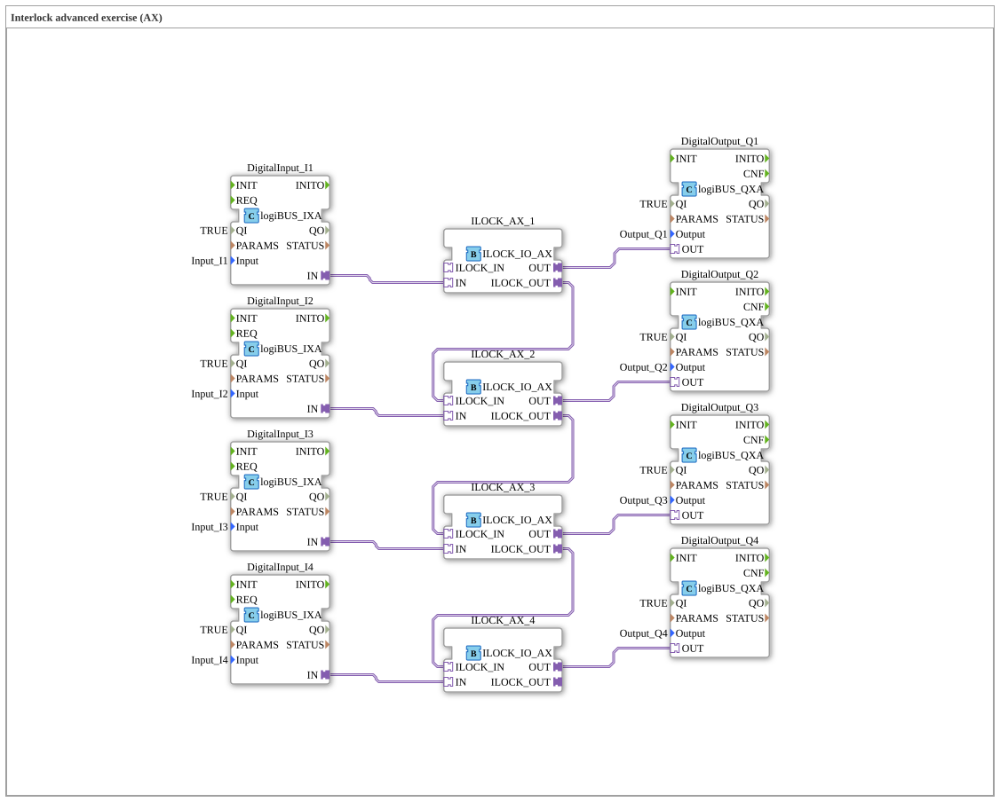

# Exercise_201_Interlock_AX: Interlock Advanced Exercise (AX)



* * * * * * * * * *
## Introduction
This exercise extends the basic interlock circuit to a more complex application (Advanced eXercise). The goal is to connect four digital inputs (I1–I4) to four digital outputs (Q1–Q4) via a chained interlock logic. The special feature lies in the serial connection of the interlock components: The enable output of one component is connected to the enable input of the next, creating a dependency chain. This allows for time-based or logical blocking between successive outputs and is suitable for applications such as sequential machine controls or safety circuits.


## Function Blocks (FBs) Used

### Sub-Blocks: DigitalInput_Ix
- **Type**: `logiBUS::io::DI::logiBUS_IXA`
- **Internal FBs Used**: None (Hardware-integrated)
- **Parameters**:

- `QI` = `TRUE`

- `Input` = corresponding physical input signal (Input_I1–I4)

- **Functionality**: Converts a digital input signal from the logiBUS hardware into an internal adapter or data signal. Provides the sensor value at the adapter output `IN`.


### Sub-Blocks: DigitalOutput_Qx
- **Type**: `logiBUS::io::DQ::logiBUS_QXA`
- **Internal Function Blocks Used**: None (Hardware-integrated)
- **Parameters**:

- `QI` = `TRUE`

- `Output` = corresponding physical output signal (Output_Q1–Q4)

- **Functionality**: Receives a signal at the adapter input `OUT` and activates the corresponding digital hardware output (e.g., relay, valve, lamp).


### Sub-Block: ILOCK_AX_x
- **Type**: `logiBUS::signalprocessing::interlock::ILOCK_IO_AX`
- **Internal Function Blocks Used**: None (closed function block)

- **Parameters**: No explicit parameters in this project (default parameters)

- **Adapter Inputs**:

- `IN`: Digital input enable interface

- `ILOCK_IN`: Interlock chain input (from previous block)
- **Adapter Outputs**:

- `OUT`: Digital output enable interface

- `ILOCK_OUT`: Interlock chain output (to the next block)

- **Functionality**: The block implements interlock control logic. The output `OUT` is only activated if the input `IN` is active *and* the chain input `ILOCK_IN` is enabled. Once activated, it then passes the enable signal to the next component in the chain via `ILOCK_OUT`. This creates a sequential dependency: Q1 must be activated first for Q2 to be enabled, then Q3, then Q4.

## Program Flow and Connections
The circuit consists of four identical interlock stages connected in series. Each stage contains:

- one digital input
- one ILOCK_IO_AX module
- one digital output

Network connections:

1. **Input side**: Each `DigitalInput` module is connected to its corresponding `ILOCK_AX` module via the `IN` adapter.

- `DigitalInput_I1.IN` → `ILOCK_AX_1.IN`

- `DigitalInput_I2.IN` → `ILOCK_AX_2.IN`

- `DigitalInput_I3.IN` → `ILOCK_AX_3.IN`

- `DigitalInput_I4.IN` → `ILOCK_AX_4.IN`

2. **Output Side**: Each `ILOCK_AX` forwards its release signal via the adapter `OUT` to the corresponding `DigitalOutput`.


2. **Output Side**: Each `ILOCK_AX` forwards its release signal via the adapter `OUT` to the corresponding `DigitalOutput`.


- `ILOCK_AX_1.OUT` → `DigitalOutput_Q1.OUT`

- `ILOCK_AX_2.OUT` → `DigitalOutput_Q2.OUT`

- `ILOCK_AX_3.OUT` → `DigitalOutput_Q3.OUT`

- `ILOCK_AX_4.OUT` → `DigitalOutput_Q4.OUT`

3. **Interlocking Interlock**:

- `ILOCK_AX_1.ILOCK_OUT` → `ILOCK_AX_2.ILOCK_IN`

- `ILOCK_AX_2.ILOCK_OUT` → `ILOCK_AX_3.ILOCK_IN`

- `ILOCK_AX_3.ILOCK_OUT` → `ILOCK_AX_4.ILOCK_IN`

The sequence: To activate Q2, Q1 must first be active (because `ILOCK_IN` from block 2 comes from `ILOCK_OUT` from block 1). Similarly, for Q3, both Q1 and Q2 must be active, and for Q4, all preceding ones. This chain ensures that the outputs can only be activated in the specified order – a typical safety or sequential behavior.

**Operating Instructions**: This exercise can be tested in the 4diac IDE by loading the subapp type `Uebung_201_Interlock_AX` and then running it on a logiBUS hardware platform. The inputs should be activated alternately or sequentially to observe the sequential activation.


**Notes on operation**: The exercise can be tested in the 4diac IDE by loading the subapp type `Uebung_201_Interlock_AX` and then running it on a logiBUS hardware platform. The inputs should be activated alternately or sequentially to observe the sequential activation.

** ## Summary
The exercise `Uebung_201_Interlock_AX` demonstrates the practical application of chained interlock devices (`ILOCK_IO_AX`) in a 4diac environment. Four independent input/output pairs are connected in series such that each subsequent output is only enabled if the preceding output is already active. This principle is frequently used in automation technology for startup sequences, safety interlocks, or machine safety. The learner deepens their understanding of adapter interconnection and the creation of dependency chains according to IEC 61499.

---

### 🌐 Related topic subpages on ms-muc-docs.de

* [🌐 Eclipse 4diac IDE & color reference on ms-muc-docs.de](https://www.ms-muc-docs.de/iec-61499/eclipse-4diac/)


```