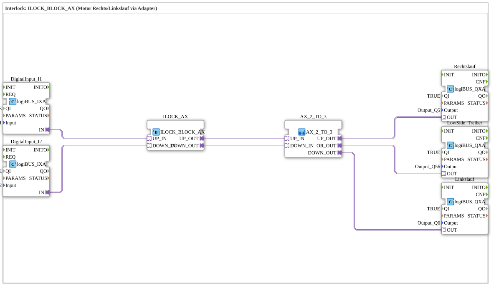

# Exercise_201b_AX: Interlock: ILOCK_BLOCK_AX (Motor clockwise/counterclockwise rotation via adapter)

* * * * * * * * * *
## Introduction
This exercise demonstrates the control of a motor with clockwise and counterclockwise rotation using an interlock circuit. The function block `ILOCK_BLOCK_AX` prevents both directions of rotation from being active simultaneously. The input signals come from two digital sensors (I1 and I2) via logiBUS digital signal adapters. The outputs control the motor (clockwise rotation Q5, counterclockwise rotation Q6) and a common low-side driver (Q56) via logiBUS output blocks. Signal adaptation is implemented by the sub-application block `AX_2_TO_3`.

## Function Blocks (FBs) Used
- **DigitalInput_I1** / **DigitalInput_I2**

Type: `logiBUS::io::DI::logiBUS_IXA`

Parameterized with the physical inputs `Input_I1` and `Input_I2`, respectively. These blocks convert the binary sensor signals into adapter signals.

- **ILOCK_AX**

Type: `logiBUS::signalprocessing::interlock::ILOCK_BLOCK_AX`

Central interlock block. It receives two inputs (`UP_IN`, `DOWN_IN`) and outputs two signals (`UP_OUT`, `DOWN_OUT`) – but only if both inputs are not active simultaneously. This ensures mutual interlocking of the rotation directions.

- **Choking** / **Reverse**

Type: `logiBUS::io::DQ::logiBUS_QXA`

Parameterized with outputs `Output_Q5` (Choking) and `Output_Q6` (Reverse). These function blocks switch the corresponding motor phases.

- **Lowside Driver**

Type: `logiBUS::io::DQ::logiBUS_QXA`

Parameterized with `Output_Q56`. This output activates the common low-side switch (e.g., ground connection for the motor).

### Sub-Blocks: `AX_2_TO_3`
- **Type**: `MyLib::sys::AX_2_TO_3` (Sub-application, no standalone FB declaration)
- **Internal FBs Used**: The internal structure is not detailed in this exercise. It is a logical implementation that splits two adapter inputs (`UP_IN`, `DOWN_IN`) into three output signals (`UP_OUT`, `DOWN_OUT`, `OR_OUT`).
- **Functionality**:
- `UP_IN` → `UP_OUT` (clockwise rotation signal)
- `DOWN_IN` → `DOWN_OUT` (counterclockwise rotation signal)
- The OR operation of both inputs generates the signal for the low-side driver (`OR_OUT`), since the motor requires a common ground in every direction of rotation.

The exact logic (e.g., edge processing or delay) is determined by the manufacturer of the sub-component.

```
## Program Flow and Connections

1. **Digital Inputs**: The sensors at `Input_I1` and `Input_I2` are provided as adapter signals via `DigitalInput_I1` and `DigitalInput_I2`.

2. **Interlock**: These signals are sent to the adapter inputs `UP_IN` and `DOWN_IN` of `ILOCK_BLOCK_AX`. Only if both are not active simultaneously are the signals passed through to `UP_OUT` and `DOWN_OUT`, respectively.

3. **Signal Conversion**: The outputs of the Interlock module (`UP_OUT`, `DOWN_OUT`) are connected to the corresponding inputs of the Sub-Application module `AX_2_TO_3`. This converts the two adapter signals into three output signals:

- `UP_OUT` → Clockwise (to `Rechtslauf.OUT`)
- `DOWN_OUT` → Counterclockwise (to `Linkslauf.OUT`)
- `OR_OUT` → Low-side driver (to `LowSide_Treiber.OUT`)
4. **Output Blocks**: The three logiBUS_QXA blocks convert the adapter signals into physical outputs at `Output_Q5`, `Output_Q56`, and `Output_Q6`.

**Learning Objectives**:

- Understanding the interlock principle for motor rotation directions
- Working with logiBUS input/output adapters
- Signal conditioning through sub-applications
- Error prevention through mutual interlocking

**Notes**: The exercise can be started in the 4diac IDE after the required logiBUS libraries have been imported. The entire process is real-time capable and simulates safe motor control.

## Summary

The exercise `Uebung_201b_AX` implements an interlock-controlled motor with clockwise and counterclockwise rotation. The core component is `ILOCK_BLOCK_AX`, which prevents simultaneous activation of both rotation directions. The adapter-based inputs and outputs are connected to the peripherals via logiBUS modules. A sub-application module (`AX_2_TO_3`) ensures the correct distribution of signals to three outputs (clockwise rotation, counterclockwise rotation, low-side driver). The circuit is a simple yet practical example of interlock logic in automation technology.

---

### 🌐 Related topic subpages on ms-muc-docs.de
* [🌐 Eclipse 4diac IDE & color reference on ms-muc-docs.de](https://www.ms-muc-docs.de/iec-61499/eclipse-4diac/)
