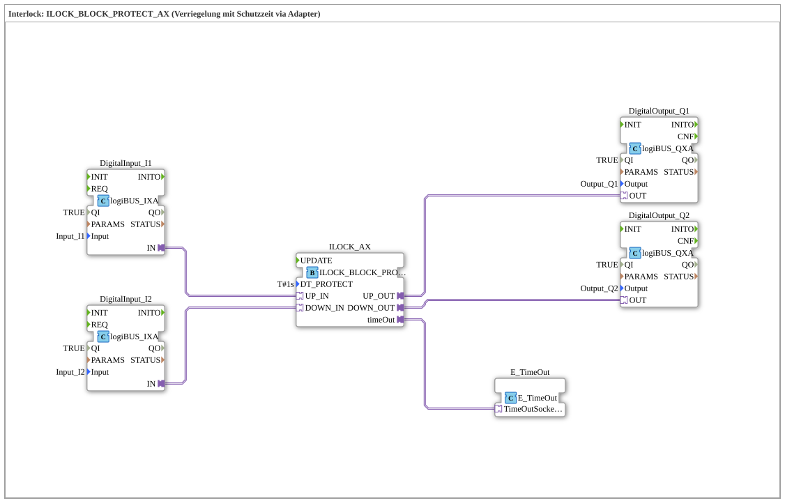

# Exercise_202_AX: Interlock: ILOCK_BLOCK_PROTECT_AX (Interlock with Protection Time via Adapter)

* * * * * * * * * *
## Introduction
This exercise demonstrates the implementation of an interlock with a protection time using adapters. The function block `ILOCK_BLOCK_PROTECT_AX` is used to interlock two input signals (e.g., switches or sensors) and monitor them over a configurable protection time. The outputs control corresponding actuators. An additional timer (`E_TimeOut`) indicates when the protection time expires.
The network is implemented as a SubAppType and can be integrated into higher-level applications.

## Function Blocks (FBs) Used

### Sub-Blocks:

#### DigitalInput_I1 / DigitalInput_I2 (each `logiBUS::io::DI::logiBUS_IXA`)
- **Type**: logiBUS Digital Input Adapter
- **Parameters**:
- `QI` = TRUE
- `Input` = `Input_I1` (or `Input_I2`)
- **Functionality**: Provides the physical digital input as an adapter socket. The incoming signals are read via the logiBUS hardware and are available for further connections via the output `IN`.

#### ILOCK_AX (`logiBUS::signalprocessing::interlock::ILOCK_BLOCK_PROTECT_AX`)
- **Type**: Interlock block with timeout (adapter)
- **Parameters**:
- `DT_PROTECT` = `T#1s` (timeout 1 second)
- **Internal Function Blocks Used**: None (Blackbox)
- **Functionality**: Implements mutual interlocking of two inputs (`UP_IN`, `DOWN_IN`) and enables the corresponding outputs (`UP_OUT`, `DOWN_OUT`). The timeout prevents unintentional rapid switching. Activating the timeout also triggers an event at output `timeOut`.

#### DigitalOutput_Q1 / DigitalOutput_Q2 (each `logiBUS::io::DQ::logiBUS_QXA`)
- **Type**: logiBUS Digital Output Adapter
- **Parameters**:
- `QI` = TRUE
- `Output` = `Output_Q1` (or `Output_Q2`)
- **Functionality**: Receives the signal at input `OUT` and forwards it to the connected hardware via the logiBUS output channel.

#### E_TimeOut (`iec61499::events::E_TimeOut`)
- **Type**: Event Timer
- **Parameters**: None
- **Function**: A simple timer that is started by an incoming event at input `TimeOutSocket` and triggers an output event after the set time has elapsed. It is used here to capture the timeout signal from the ILOCK block and process it further.

## Program Flow and Connections

The sub-app is connected as follows:

1. **Inputs**: The two logiBUS digital input adapters (`DigitalInput_I1`, `DigitalInput_I2`) read the hardware signals from channels `Input_I1` and `Input_I2`. Your `IN` outputs are connected to the corresponding inputs of the interlock block via **adapter connections**:

- `DigitalInput_I1.IN` → `ILOCK_AX.UP_IN`
- `DigitalInput_I2.IN` → `ILOCK_AX.DOWN_IN`

2. **Interlock Processing**: The FB `ILOCK_AX` evaluates the signals. As long as no interlock is active, the outputs `UP_OUT` and `DOWN_OUT` are set according to the inputs. If the switching time exceeds the set protection time (`DT_PROTECT`), the output `timeOut` becomes active.

3. **Outputs**: The enabled signals are routed to the logiBUS digital output adapters via adapter connections:

- `ILOCK_AX.UP_OUT` → `DigitalOutput_Q1.OUT`
- `ILOCK_AX.DOWN_OUT` → `DigitalOutput_Q2.OUT`

Outputs `Output_Q1` and `Output_Q2` control the connected actuators.

4. **Timer**: The timeout event of the interlock block (`ILOCK_AX.timeOut`) is connected to socket `E_TimeOut.TimeOutSocket`. The timer can be used in a higher-level application to generate an error or acknowledgment message.

**Learning Objectives of the Exercise**:

- Understanding the interlock concept with a timeout
- Using logiBUS IO adapters in 4diac
- Using event timers (`E_TimeOut`)
- Troubleshooting and analyzing timing problems in controllers

**Difficulty Level**: Medium
**Prerequisites**: Basic operation of the 4diac IDE, knowledge of logiBUS hardware, and experience with function blocks and adapters.

## Summary

The exercise `Uebung_202_AX` illustrates an industry-typical interlock circuit with a timeout based on the function block `ILOCK_BLOCK_PROTECT_AX`. Digital inputs and outputs are connected using logiBUS adapters, while an additional timer handles the timeout event. The interaction of the function blocks is established via adapter connections, enabling a flexible and modular structure.

---

### 🌐 Related topic subpages on ms-muc-docs.de
* [🌐 Eclipse 4diac IDE & Color Reference on ms-muc-docs.de](https://www.ms-muc-docs.de/iec-61499/eclipse-4diac/)

]