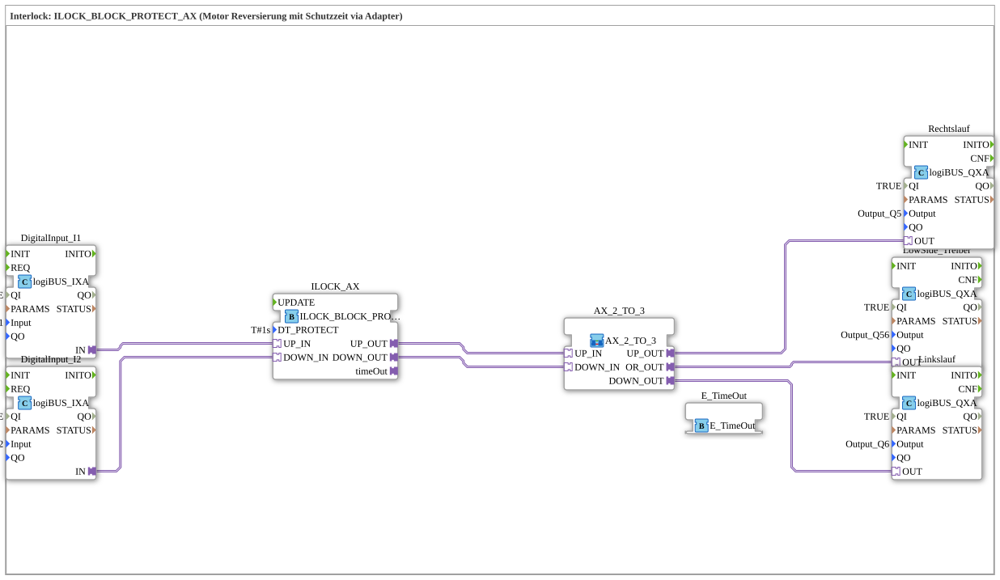

# Exercise_202b_AX: Interlock: ILOCK_BLOCK_PROTECT_AX (Motor Reversing with Protection Time via Adapter)

* * * * * * * * * *
## Introduction

This exercise demonstrates the use of the function block `ILOCK_BLOCK_PROTECT_AX` for the safe control of a motor with a reversing function.
A **switching delay (protection time)** is implemented, which prevents the motor from immediately switching from one direction of rotation to the other.

Additionally, a **low-side driver** is used for the common power supply of the outputs.

The logic is implemented as a sub-application and uses an adapter-based data flow.

---

## Function Blocks (FBs) Used

- **DigitalInput_I1** – Type: `logiBUS::io::DI::logiBUS_IXA`
- Parameters: QI = TRUE, Input = `Input_I1`
- Converts a digital input signal (e.g., push button for up) into a logic signal.
- **DigitalInput_I2** – Type: `logiBUS::io::DI::logiBUS_IXA`
- Parameters: QI = TRUE, Input = `Input_I2`
- Converts a digital input signal (e.g., push button for down) into a logic signal.
- **ILOCK_AX** – Type: `logiBUS::signalprocessing::interlock::ILOCK_BLOCK_PROTECT_AX`
- Parameter: DT_PROTECT = `T#1s` (protection time of 1 second)
- Core component of the exercise: Generates delayed output signals (`UP_IN`, `DOWN_IN`) and a time signal (`DOWN_OUT`) from the two input signals (`UP_IN`, `DOWN_IN`). The protection time prevents switching too quickly.
- **Low-Side Driver** – Type: `logiBUS::io::DQ::logiBUS_QXA`
- Parameters: QI = TRUE, Output = `Output_Q56`
- Controls a common low-side output (e.g., for enabling the motor brake or a shared power supply).
- **Counter-Rotation** – Type: `logiBUS::io::DQ::logiBUS_QXA`
- Parameters: QI = TRUE, Output = `Output_Q6`
- Switches the motor for counter-clockwise rotation.
- **Choker-Rotation** – Type: `logiBUS::io::DQ::logiBUS_QXA`
- Parameters: QI = TRUE, Output = `Output_Q5`
- Switches the motor for clockwise rotation.
- **E_TimeOut** – Type: `iec61499::events::E_TimeOut`
- Receives the time signal from `ILOCK_AX` (e.g., for visualization or further processing).

### Sub-block: `AX_2_TO_3`

- **Type**: `MyLib::sys::AX_2_TO_3` (subapplication)
- **Internal Function Blocks Used**: not defined in this exercise file (encapsulated logic)
- **Functionality** (derived from the adapter connections):
- Receives the signals `UP_IN` and `DOWN_IN` from `ILOCK_AX`.
- Forwards `UP_IN` to `UP_OUT` and `DOWN_IN` to `DOWN_OUT` (or performs a logical operation).
- Generates an OR signal (`OR_OUT`) from both inputs, which controls the **LowSide_Driver**.
- Serves to distribute the ILOCK outputs to the individual motor outputs and the common enable output.

---

## Program Flow and Connections

1. **Inputs**
- The digital inputs `Input_I1` (Up) and `Input_I2` (Down) are read via the function blocks `DigitalInput_I1` and `DigitalInput_I2`.
- Their signals are passed directly to the adapter inputs `UP_IN` and `DOWN_IN` of the `ILOCK_AX`.
2. **Interlock Logic**
- `ILOCK_AX` evaluates the incoming signals. When changing from one direction of rotation to the other, the parameterized **protection time DT_PROTECT = 1s** is activated.
- Only after this time has elapsed is the new output signal switched to `UP_OUT` or `DOWN_OUT`.
- Simultaneously, the timer signal `timeOut` is set to `TRUE` for the duration of the protection time and transmitted to `E_TimeOut`.
3. **Signal Distribution via SubApp `AX_2_TO_3`**
- The delayed outputs `UP_OUT` and `DOWN_OUT` from `ILOCK_AX` are routed to the subapp `AX_2_TO_3` via adapter connections.

- This sub-app forwards the signals to the corresponding outputs `UP_OUT` and `DOWN_OUT` and generates an OR signal (`OR_OUT`) that activates the **LowSide_Driver** as soon as one of the two rotation directions is requested.

4. **Outputs**
- `Rechtslauf` and `Linkslauf` are controlled directly by the sub-app's outputs.
- `LowSide_Treiber` is activated via the OR signal and controls the common output `Output_Q56`.

**Learning Objectives**

- Understanding the interlock concept for motor reversing
- Application of a protection time block (`ILOCK_BLOCK_PROTECT_AX`)
- Working with adapter connections and sub-applications in 4diac
- Integration of low-side drivers into safety-related controllers

**Difficulty Level:** Advanced
**Prerequisites:** Basic knowledge of the 4diac IDE, working with logiBUS blocks, understanding of event/data flows

---

## Summary

This exercise implements a complete motor reversing controller with **switching delay (protection time)**.

The block `ILOCK_BLOCK_PROTECT_AX` handles the safe interlocking of the directions of rotation, while the sub-application `AX_2_TO_3` handles the signal distribution to the individual outputs and the common low-side driver.

This exercise provides practical knowledge for the safe control of actuators in automation technology.

---

### 🌐 Related topic subpages on ms-muc-docs.de

- [🌐 Eclipse 4diac IDE & color reference on ms-muc-docs.de](https://www.ms-muc-docs.de/iec-61499/eclipse-4diac/)

]
