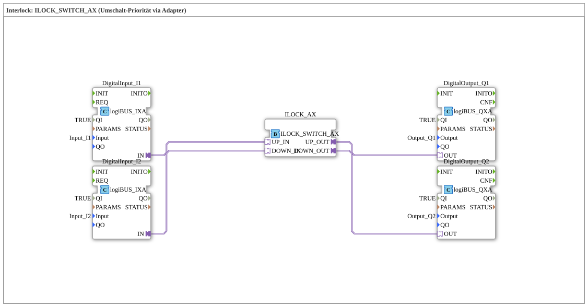

# Exercise_203_AX: Interlock: ILOCK_SWITCH_AX (Switching Priority via Adapter)

* * * * * * * * * *
## Introduction
This exercise demonstrates the use of an **interlock function block with priority switching** (ILOCK_SWITCH_AX). Two digital inputs (Input_I1, Input_I2) control two digital outputs (Output_Q1, Output_Q2) via an adapter-based interlock block. The interlock ensures that only one output can be active at a time – in the event of simultaneous input signals, a defined priority mechanism takes effect. Communication with the peripherals is via logiBUS adapter interfaces.
## Function Blocks (FBs) Used

The subapp contains five function blocks from the logiBUS library:

- **DigitalInput_I1** (Type: `logiBUS::io::DI::logiBUS_IXA`)
- Parameters: `QI = TRUE`, `Input = Input_I1`
- Receives the digital input signal from the logiBUS channel Input_I1.
- **DigitalInput_I2** (Type: `logiBUS::io::DI::logiBUS_IXA`)
- Parameters: `QI = TRUE`, `Input = Input_I2`
- Receives the digital input signal from the logiBUS channel Input_I2.
- **ILOCK_AX** (Type: `logiBUS::signalprocessing::interlock::ILOCK_SWITCH_AX`)
- This function block implements an **interlock function** with two input adapters (`UP_IN`, `DOWN_IN`) and two output adapters (`UP_OUT`, `DOWN_OUT`).
- **Functionality:**
- If only one input is active, the corresponding output is set.
- If both inputs are active simultaneously, an internal **priority logic** (in this configuration: "UP" takes precedence over "DOWN") determines which output is set.
- The other output is reset.
- The priority can be configured via parameters of the function block (here, the default is: UP is prioritized).
- **DigitalOutput_Q1** (Type: `logiBUS::io::DQ::logiBUS_QXA`)
- Parameters: `QI = TRUE`, `Output = Output_Q1`
- Outputs the signal to the logiBUS output channel Output_Q1.
- **DigitalOutput_Q2** (Type: `logiBUS::io::DQ::logiBUS_QXA`)
- Parameters: `QI = TRUE`, `Output = Output_Q2`
- Outputs the signal to the logiBUS output channel Output_Q2.

## Program Flow and Connections

The following adapter connection structure underlies the flow:

1. **Input Signals:**

- `DigitalInput_I1.IN` → `ILOCK_AX.UP_IN`
- `DigitalInput_I2.IN` → `ILOCK_AX.DOWN_IN`

2. **Interlock Processing:**

- The ILOCK_SWITCH_AX block evaluates the incoming signals and decides, based on priority, which output is set.

3. **Output Signals:**

- `ILOCK_AX.UP_OUT` → `DigitalOutput_Q1.OUT`
- `ILOCK_AX.DOWN_OUT` → `DigitalOutput_Q2.OUT`

When **Input_I1** is active, **Output_Q1** is set. When **Input_I2** is active, **Output_Q2** is set. If both inputs are active simultaneously, **Output_Q1** takes precedence ("UP prioritizes"). This behavior is typical for safety-critical applications where mutual interlocking of actuators (e.g., changing the direction of a motor) is required.

**Instructions for Implementation:**

- This exercise is intended for participants with basic knowledge of the 4diac IDE and the logiBUS adapter system.
- The learning objective is to understand interlock mechanisms via adapters and priority control.
- Prerequisite: A functioning logiBUS project with free input/output channels (Input_I1, Input_I2, Output_Q1, Output_Q2).
- Start the exercise by integrating the sub-app into your system and wiring the terminals accordingly.

## Summary
Exercise **Exercise_203_AX** demonstrates the use of a **priority-controlled interlock** via adapter interfaces. Two digital inputs are processed by the function block `ILOCK_SWITCH_AX`, which applies a defined priority (here: UP before DOWN) when signals are received simultaneously and switches the outputs accordingly. The implementation is carried out entirely with logiBUS I/O function blocks and shows a typical interlock circuit frequently required in automation technology.

# Summary ---

### 🌐 Related topic subpages on ms-muc-docs.de
* [🌐 Eclipse 4diac IDE & Color Reference on ms-muc-docs.de](https://www.ms-muc-docs.de/iec-61499/eclipse-4diac/)

]
