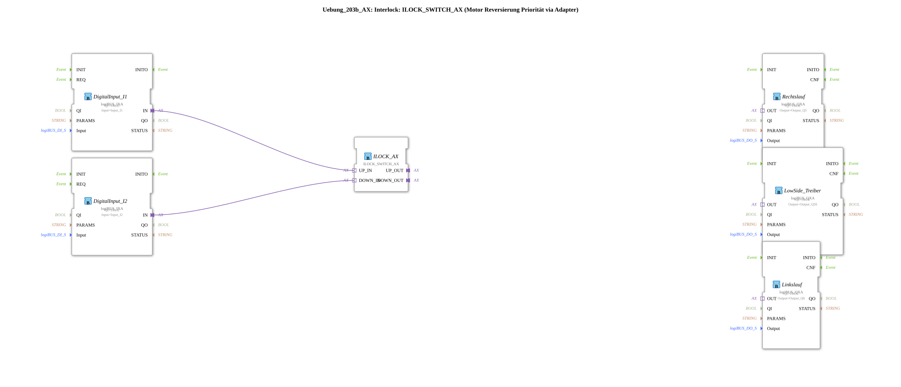

# Exercise_203b_AX: Interlock: ILOCK_SWITCH_AX (Motor Reversing Priority via Adapter)

* * * * * * * * * *
## Introduction
This exercise implements **motor reversing with interlock** using the function block `ILOCK_SWITCH_AX`. The circuit prevents both directions of rotation from being activated simultaneously and passes the prioritized signals via an adapter to a downstream logic module `AX_2_TO_3`. This logic module converts the two direction signals into three outputs – one for clockwise rotation, one for counterclockwise rotation, and a common low-side driver, as is typical for H-bridge control circuits.
Two digital inputs (I1, I2) serve as control signals for the direction of rotation. Outputs Q5 (clockwise rotation), Q56 (low-side rotation), and Q6 (counter-clockwise rotation) are physically controlled via the logiBUS hardware.

## Function Blocks (FBs) Used

### Sub-Blocks: `AX_2_TO_3`
- **Type**: `MyLib::sys::AX_2_TO_3`
- **Description**: This sub-block (SubApp) serves as distribution logic. It receives two prioritized direction signals (`UP_IN`, `DOWN_IN`) from the preceding interlock stage and generates three outputs:
- `UP_OUT` → Clockwise rotation
- `DOWN_OUT` → Counterclockwise rotation
- `OR_OUT` → Low-side driver (active as soon as a direction is active)
- The internal implementation is defined in the file `AX_2_TO_3.subapp` and is used as a black box in this exercise.
- `UP_OUT` → Clockwise rotation
- `DOWN_OUT` → Counterclockwise rotation
- `OR_OUT` → Low-side driver (active as soon as a direction is active)
- The internal implementation is defined in the file `AX_2_TO_3.subapp` and is used as a black box in this exercise.
### Further Function Blocks
- **DigitalInput_I1**, **DigitalInput_I2**
- **Type**: `logiBUS::io::DI::logiBUS_IXA`
- **Parameters**:
- `QI` = `TRUE` (Enable)
- `Input` = `Input_I1` or `Input_I2`
- **Data Output**: `OUT` (Adapter output providing the digital input state)
- **ILOCK_AX**
- **Type**: `logiBUS::signalprocessing::interlock::ILOCK_SWITCH_AX`
- **Parameters**: none
- **Description**: Core of the interlock. It evaluates the two input signals and outputs the currently active direction via `UP_OUT` and `DOWN_OUT`. If both inputs are activated simultaneously, a priority logic (defined in the function block) resets one of the outputs. The outputs are adapter-compatible.
- **Counterclockwise**
- **Type**: `logiBUS::io::DQ::logiBUS_QXA`
- **Parameters**:
- `QI` = `TRUE`
- `Output` = `Output_Q5`
- **Description**: Switches the signal for clockwise rotation to physical output Q5.
- **Low-Side Driver**
- **Type**: `logiBUS::io::DQ::logiBUS_QXA`
- **Parameters**:
- `QI` = `TRUE`
- `Output` = `Output_Q56`
- **Description**: Switches the low-side driver (common ground or brake) to output Q56.
- **Reverse Rotation**
- **Type**: `logiBUS::io::DQ::logiBUS_QXA`
- **Parameters**:
- `QI` = `TRUE`
- `Output` = `Output_Q6`
- **Description**: Switches the signal for reverse rotation to physical output Q6.

## Program Flow and Connections

The logical flow follows a clear chain:

1. **Input Signals**: The two digital inputs (`Input_I1`, `Input_I2`) are converted into adapter signals via the function blocks `DigitalInput_I1` and `DigitalInput_I2`.

2. **Interlock**: These signals reach `ILOCK_AX` via the adapter connections. Priority logic is applied there. Outputs `UP_OUT` (for clockwise rotation) and `DOWN_OUT` (for counterclockwise rotation) are enabled – but never simultaneously.

3. **Signal Distribution**: The prioritized signals are forwarded to the sub-module `AX_2_TO_3`. This generates three outputs from the two direction signals:

- `UP_OUT` → `Rechtslauf` (Q5)
- `DOWN_OUT` → `Linkslauf` (Q6)
- `OR_OUT` → `LowSide_Treiber` (Q56) – becomes active as soon as a direction is active.

4. **Output Stages**: The three output modules of type `logiBUS_QXA` convert the signals to the physical outputs of the logiBUS hardware.

**Adapter Connections** (defined in the XML as `AdapterConnections`):

- `DigitalInput_I1.IN` → `ILOCK_AX.UP_IN`
- `DigitalInput_I2.IN` → `ILOCK_AX.DOWN_IN`
- `ILOCK_AX.UP_OUT` → `AX_2_TO_3.UP_IN`
- `ILOCK_AX.DOWN_OUT` → `AX_2_TO_3.DOWN_IN`
- `AX_2_TO_3.UP_OUT` → `Rechtslauf.OUT`
- `AX_2_TO_3.DOWN_OUT` → `Linkslauf.OUT`
- `AX_2_TO_3.OR_OUT` → `LowSide_Treiber.OUT`

**Instructions for Implementation**:

- This exercise requires basic knowledge of the 4diac IDE and working with adapters.
- Difficulty level: **medium**
- Learning objectives: Understanding interlock logic, working with sub-applications and adapter-based signal routing, and implementing safe motor control.
- To start the exercise, the sub-application `Uebung_203b_AX` must be integrated into a project and linked to the corresponding logiBUS inputs and outputs.

## Summary

The exercise `Uebung_203b_AX` demonstrates complete motor reversal with interlocking using the `ILOCK_SWITCH_AX` block and a downstream signal distribution (`AX_2_TO_3`). The use of adapters ensures a clear, modular structure. The circuit reliably prevents short circuits and incorrect control signals and is suitable for use in industrial control systems.

---

### 🌐 Related topic subpages on ms-muc-docs.de
* [🌐 Eclipse 4diac IDE & Color Reference on ms-muc-docs.de](https://www.ms-muc-docs.de/iec-61499/eclipse-4diac/)

]
