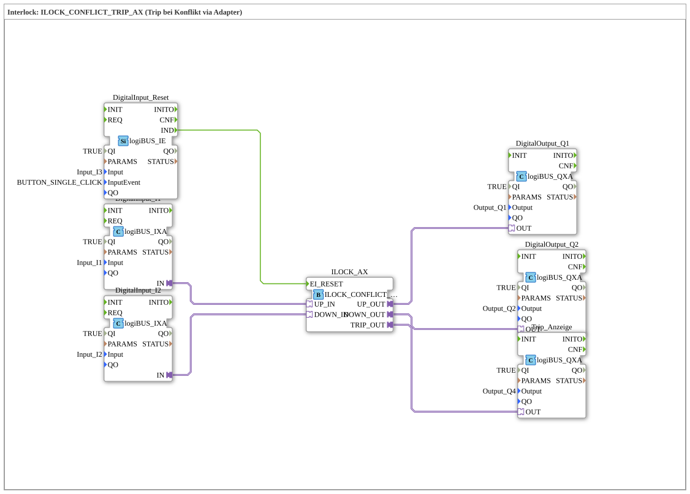

# Exercise_204_AX: Interlock: ILOCK_CONFLICT_TRIP_AX (Trip on conflict via adapter)

* * * * * * * * * *

## Introduction

This exercise implements interlock logic with conflict detection and trip triggering using the function block **ILOCK_CONFLICT_TRIP_AX**.
Two digital inputs (via a logiBUS adapter) report requests in opposite directions (e.g., "Up" and "Down").

If a simultaneous or invalid signal occurs, a trip is triggered and indicated via a separate output. A reset input (single edge) can reset the trip.

The outputs control two digital actuators (Q1, Q2) and a trip indicator (Q4).

## Function Blocks (FBs) Used

### Sub-Blocks: *none*

The entire exercise is set up as a standalone sub-application. All FBs are used directly in the network.

### Overview of FBs in the Network

| Block Name | Type | Parameters | Event Connections | Adapter/Data Connections |
| --- | --- | --- | --- | --- |
| **DigitalInput_I1** | `logiBUS::io::DI::logiBUS_IXA` | `QI = TRUE` `Input = Input_I1` | – | Adapter `IN` → ILOCK_AX.UP_IN |
| **DigitalInput_I2** | `logiBUS::io::DI::logiBUS_IXA` | `QI = TRUE` `Input = Input_I2` | – | Adapter `IN` → ILOCK_AX.DOWN_IN |
| **DigitalInput_Reset** | `logiBUS::io::DI::logiBUS_IE` | `QI = TRUE` `Input = Input_I3` `InputEvent = BUTTON_SINGLE_CLICK` | Event output `IND` → ILOCK_AX.EI_RESET | – |
| **ILOCK_AX** | `logiBUS::signalprocessing::interlock::ILOCK_CONFLICT_TRIP_AX` | *(no parameters set)* | Event input `EI_RESET` from DigitalInput_Reset | Adapter inputs: `UP_IN` (from DigitalInput_I1), `DOWN_IN` (from DigitalInput_I2)   | Adapter outputs: `UP_OUT` → DigitalOutput_Q1, `DOWN_OUT` → DigitalOutput_Q2, `TRIP_OUT` → Trip_Display |
| **DigitalOutput_Q1** | `logiBUS::io::DQ::logiBUS_QXA` | `QI = TRUE` |   | `Output = Output_Q1` | – | Adapter input `OUT` from ILOCK_AX.UP_OUT |
| **DigitalOutput_Q2** | `logiBUS::io::DQ::logiBUS_QXA` | `QI = TRUE` `Output = Output_Q2` | – | Adapter input `OUT` from ILOCK_AX.DOWN_OUT |
| **Trip_Display** | `logiBUS::io::DQ::logiBUS_QXA` | `QI = TRUE` `Output = Output_Q4` | – | Adapter input `OUT` from ILOCK_AX.TRIP_OUT |

## Program Flow and Connections

1. **Inputs**:

- The digital inputs *Input_I1* (via function block "DigitalInput_I1") and *Input_I2* (via function block "DigitalInput_I2") provide the adapter interfaces `UP_IN` and `DOWN_IN`, respectively, for the ILOCK module.
- The reset input *Input_I3* is evaluated as an event (single edge, parameter `BUTTON_SINGLE_CLICK`) via the function block "DigitalInput_Reset". The event `IND` triggers the reset input `EI_RESET` of the ILOCK module.

1. **Interlock Logic**:

- The function block **ILOCK_CONFLICT_TRIP_AX** monitors the two inputs and detects a conflict (e.g., simultaneous requests in both directions).
- Under normal operation, it passes the signals unchanged to outputs `UP_OUT` and `DOWN_OUT`.
- In case of a conflict, output `TRIP_OUT` is activated, and outputs `UP_OUT`/`DOWN_OUT` are put into a defined (locked) state.
1. **Outputs**:

- The adapter output `UP_OUT` controls the digital output *Output_Q1* (FB "DigitalOutput_Q1").
- The adapter output `DOWN_OUT` controls *Output_Q2* (FB "DigitalOutput_Q2").
- The trip output `TRIP_OUT` activates *Output_Q4* (FB "Trip_Display").
1. **Reset Behavior**:

- As long as a trip is active, `TRIP_OUT` remains set. Triggering the reset input (single edge on *Input_I3*) resets the ILOCK block, and the outputs return to their normal state.

## Summary

Exercise **Exercise_204_AX** demonstrates the use of an interlock block with integrated conflict detection and trip triggering via an adapter.

It links:

- two digital inputs for up/down signals,
- a reset input with edge detection,
- the ILOCK module for conflict monitoring,
- three digital outputs (Q1, Q2, Q4) for controlling actuators and a display.

This example is suitable as an introduction to the interlock mechanisms of the logiBUS library and demonstrates how to implement a secure interlock with automatic fault response.

* * * * * * * * * *
