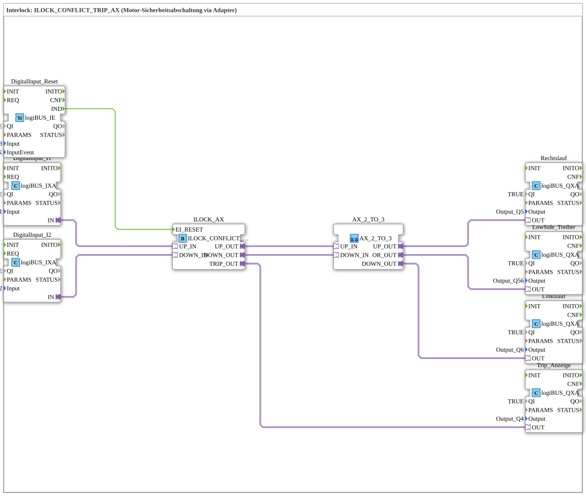

# Exercise_204b_AX: Interlock: ILOCK_CONFLICT_TRIP_AX (Motor Safety Shutdown via Adapter)

* * * * * * * * * *
## Introduction
This exercise demonstrates the use of the function block **ILOCK_CONFLICT_TRIP_AX** for safety-related motor shutdown. An interlock logic is implemented, in which two opposing requirements (e.g., clockwise and counterclockwise rotation) are monitored, and a trip is triggered in the event of a conflict. The entire control is achieved via adapter connections and an intermediate sub-app (AX_2_TO_3), which distributes the signals to the outputs.
```
## Function Blocks Used (FBs)

- **DigitalInput_I1** (Type: `logiBUS::io::DI::logiBUS_IXA`)
- Parameters: `QI` = `TRUE`, `Input` = `Input_I1`
- Function: Digital input for the first direction signal (e.g., clockwise rotation request)
- **DigitalInput_I2** (Type: `logiBUS::io::DI::logiBUS_IXA`)
- Parameters: `QI` = `TRUE`, `Input` = `Input_I2`
- Function: Digital input for the second direction signal (e.g., (Reverse rotation request)
- **DigitalInput_Reset** (Type: `logiBUS::io::DI::logiBUS_IE`)
- Parameters: `QI` = `TRUE`, `Input` = `Input_I3`, `InputEvent` = `BUTTON_SINGLE_CLICK`
- Function: Digital input with event support; serves as a reset button for the interlock unit
- **ILOCK_AX** (Type: `logiBUS::signalprocessing::interlock::ILOCK_CONFLICT_TRIP_AX`)
- Parameters: None
- Function: Central interlock module. Monitors the two adapter inputs **UP_IN** and **DOWN_IN** for conflicting states. In case of a conflict, the output **TRIP_OUT** is activated. In conflict-free states, **UP_OUT** and **DOWN_OUT** are switched accordingly.

`` - **Right Rotation** (Type: `logiBUS::io::DQ::logiBUS_QXA`)

- Parameters: `QI` = `TRUE`, `Output` = `Output_Q5`
- Function: Digital output for right rotation control
- **Left Rotation** (Type: `logiBUS::io::DQ::logiBUS_QXA`)
- Parameters: `QI` = `TRUE`, `Output` = `Output_Q6`
- Function: Digital output for left rotation control
- **LowSide Driver** (Type: `logiBUS::io::DQ::logiBUS_QXA`)
- Parameters: `QI` = `TRUE`, `Output` = `Output_Q56`
- Function: Digital output for a common low-side driver (e.g., enabling a motor output stage)
- **Trip_Display** (Type: `logiBUS::io::DQ::logiBUS_QXA`)
- Parameters: `QI` = `TRUE`, `Output` = `Output_Q4`
- Function: Digital output to display a triggered trip

### Sub-Blocks: **AX_2_TO_3**
- **Type**: `MyLib::sys::AX_2_TO_3`
- **Used Internal FBs**: Not specified – the internal implementation is not defined in detail in this exercise and is assumed to be a library component.
- **Functionality**: The SubApp acts as an adapter that distributes the two adapter inputs **UP_IN** and **DOWN_IN** to three separate outputs: **UP_OUT**, **DOWN_OUT**, and **OR_OUT**. The exact logic depends on the internal implementation; in this setup, the outputs for clockwise rotation, counterclockwise rotation, and the low-side driver are controlled.

## Program Flow and Connections

1. **Input Signals**: The digital inputs **I1** and **I2** (via `DigitalInput_I1` and `DigitalInput_I2`) are passed as adapter signals to the interlock module `ILOCK_AX` (connections: `DigitalInput_I1.IN` → `ILOCK_AX.UP_IN`, `DigitalInput_I2.IN` → `ILOCK_AX.DOWN_IN`).

2. **Interlock Logic**: `ILOCK_AX` checks for conflicting requests. If both inputs are active simultaneously, the trip output **TRIP_OUT** is set. In conflict-free states, the signals are passed through to **UP_OUT** and **DOWN_OUT**.

`` 3. **Signal Distribution**: The outputs of `ILOCK_AX` are forwarded to the sub-app `AX_2_TO_3`:

- `ILOCK_AX.UP_OUT` → `AX_2_TO_3.UP_IN`
- `ILOCK_AX.DOWN_OUT` → `AX_2_TO_3.DOWN_IN`
- `ILOCK_AX.TRIP_OUT` → `Trip_Anzeige.OUT`

4. **Power Amplifier Control**: The sub-app `AX_2_TO_3` distributes the signals to the final outputs:

- `AX_2_TO_3.UP_OUT` → `Rechtslauf.OUT`
- `AX_2_TO_3.DOWN_OUT` → `Linkslauf.OUT`
- `AX_2_TO_3.OR_OUT` → `LowSide_Treiber.OUT`

5. **Reset Function**: The digital input **I3** (via `DigitalInput_Reset`) is connected to the event input **EI_RESET** of `ILOCK_AX` via a button press event (`BUTTON_SINGLE_CLICK`) to reset a triggered trip.

**Exercise Notes**:

- Difficulty level: Medium
- Learning objectives: Understanding interlock mechanisms, adapter-based communication, signal routing via SubApp
- Prerequisites: Basic knowledge of 4diac-IDE and IEC 61499

## Summary

This exercise teaches the construction of a safety-related motor control using the interlock module `ILOCK_CONFLICT_TRIP_AX`. The outputs for clockwise rotation, counterclockwise rotation, low-side driver, and trip indication are implemented through the structured distribution of signals using a SubApp (`AX_2_TO_3`). A reset input allows the safety shutdown to be reset.

---

### 🌐 Related topic subpages on ms-muc-docs.de
* [🌐 Eclipse 4diac IDE & Color Reference on ms-muc-docs.de](https://www.ms-muc-docs.de/iec-61499/eclipse-4diac/)

]
