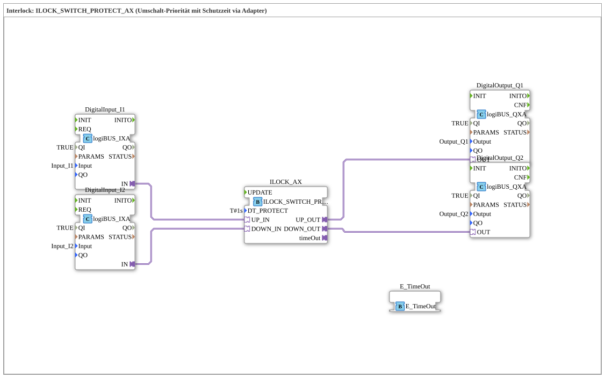

# Exercise_205_AX: Interlock: ILOCK_SWITCH_PROTECT_AX (Switching priority with protection time via adapter)

* * * * * * * * * *
## Introduction

Exercise **Exercise_205_AX** implements a safe switching control with priority and protection time.
Two digital inputs (I1, I2) control two digital outputs (Q1, Q2) via an interlock block.

The interlock prevents simultaneous activation and enforces a protection time of 1 second between switching operations.

An additional E_TimeOut block monitors the timeout signal.

The exercise is modeled as a SubAppType and uses logiBUS adapters for the input/output interface.

## Function Blocks Used (FBs)

The SubApp contains the following function blocks:

### Sub-blocks: DigitalInput_I1 & DigitalInput_I2 (logiBUS_IXA)

- **Type**: `logiBUS::io::DI::logiBUS_IXA`
- **Internal FBs Used**: none (simple adapter block)
- **Parameters**:
- `QI` = TRUE
- `Input` = `Input_I1` or `Input_I2`
- **Functionality**:

Reads the respective digital input (I1/I2) and provides the signal state at output `IN`.

### Sub-Block: ILOCK_AX (ILOCK_SWITCH_PROTECT_AX)

- **Type**: `logiBUS::signalprocessing::interlock::ILOCK_SWITCH_PROTECT_AX`
- **Internal Function Blocks Used**: None (complex, pre-built block)
- **Parameters**:
- `DT_PROTECT` = T#1s (protection time 1 second)
- **Event/Data Interfaces**:
- **Adapter Inputs**: `UP_IN`, `DOWN_IN`
- **Adapter Outputs**: `UP_OUT`, `DOWN_OUT`, `timeOut`
- **Functionality**:

Implements a **switch-prioritized interlock** with Protection time.

– When `UP_IN` is active, output `UP_OUT` is set, while `DOWN_OUT` remains disabled for the protection time.

– When `DOWN_IN` is active, the opposite occurs.

– Signal `timeOut` becomes active when the protection time is exceeded (e.g., due to blockage or overload).

### Sub-Blocks: DigitalOutput_Q1 & DigitalOutput_Q2 (logiBUS_QXA)

- **Type**: `logiBUS::io::DQ::logiBUS_QXA`
- **Internal Function Blocks Used**: None (simple adapter block)
- **Parameters**:
- `QI` = TRUE
- `Output` = `Output_Q1` or `Output_Q2`
- **Functionality**:

Sets the respective digital output (Q1/Q2) according to the signal present at input `OUT`.

### Sub-Block: E_TimeOut (E_TimeOut)

- **Type**: `iec61499::events::E_TimeOut`
- **Internal Function Blocks Used**: None
- **Parameters**: None (default settings)
- **Functionality**:

Generates an event at its output as soon as a time delay has elapsed.

In this exercise, the input `TimeOutSocket` is connected to the `timeOut` output of the Interlock block – for further processing (e.g., alarming).

## Program Flow and Connections

1. **DigitalInput_I1** and **DigitalInput_I2** read the binary signals from `Input_I1` and `Input_I2`, respectively.
2. The **adapter outputs `IN`** of these function blocks are connected to the **adapter inputs `UP_IN`** and **`DOWN_IN`** of the Interlock function block, respectively.

The adapter outputs `IN`** of these function blocks are connected to the **adapter inputs `UP_IN`** and **`DOWN_IN`** of the Interlock function block. 3. **ILOCK_AX** evaluates the inputs, applies the protection time (`DT_PROTECT = T#1s`), and controls its outputs:

- `UP_OUT` → connected to the **OUT input** of **DigitalOutput_Q1**
- `DOWN_OUT` → connected to the **OUT input** of **DigitalOutput_Q2**
- `timeOut` → connected to the **TimeOutSocket** of the **E_TimeOut** block
4. **DigitalOutput_Q1** and **DigitalOutput_Q2** set the corresponding physical outputs (`Output_Q1`, `Output_Q2`).
5. The **E_TimeOut** block can optionally be used for time monitoring (e.g., to trigger an alarm in case of a prolonged timeout).

**Learning Objective**:

This exercise teaches how to use interlock blocks to implement **priority controls** and **protection times** in control applications. It demonstrates the coupling of digital inputs/outputs via adapters and the monitoring of timeout signals.

**Difficulty Level**: Medium

**Prerequisites**: Basic knowledge of IEC 61499 modeling, experience with logiBUS adapters.

## Summary

Exercise **Exercise_205_AX** demonstrates the use of the interlock block `ILOCK_SWITCH_PROTECT_AX` in a sub-application.

The one-second protection time ensures safe and prioritized switching between two digital inputs.

Input/output is handled via logiBUS adapters, and the integrated E_TimeOut module allows for easy monitoring of the timeout status.

This exercise is suitable as a basis for safety-related control systems such as motor switching or valve control.
