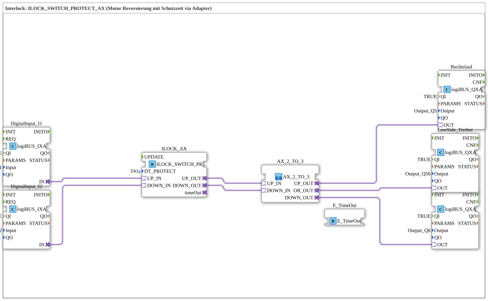

# Exercise_205b_AX: Interlock: ILOCK_SWITCH_PROTECT_AX (Motor Reversing with Protection Time via Adapter)

* * * * * * * * * *
## Introduction
This exercise covers motor reversing with a protection time using an interlock function block (ILOCK_SWITCH_PROTECT_AX). The goal is to control a motor via two inputs (up/down), where a defined protection time (here, 1 second) prevents both directions from being switched on simultaneously and blocks excessively rapid direction changes. Control is achieved via adapter interfaces, which increases the reusability of this sub-application type.
Difficulty level: Advanced
Prerequisites: Basic knowledge of the 4diac IDE, working with input/output function blocks, understanding of interlock logic.

## Function Blocks Used (FBs)
- **DigitalInput_I1** (logiBUS::io::DI::logiBUS_IXA)
- Parameters: QI = TRUE, Input = Input_I1
- Event output/input: —
- Data output/input: IN (Adapter interface)
- **DigitalInput_I2** (logiBUS::io::DI::logiBUS_IXA)
- Parameters: QI = TRUE, Input = Input_I2
- Event output/input: —
- Data output/input: IN (Adapter interface)
- **ILOCK_AX** (logiBUS::signalprocessing::interlock::ILOCK_SWITCH_PROTECT_AX)
- Parameters: DT_PROTECT = T#1s
- Event output/input: timeOut (Event output)
- Data output/input: UP_IN, DOWN_IN (Entrances); UP_OUT, DOWN_OUT (Outputs)
- **Right Rotation** (logiBUS::io::DQ::logiBUS_QXA)
- Parameter: QI = TRUE, Output = Output_Q5
- Event Output/Input: —
- Data Output/Input: OUT (Adapter Interface)
- **Left Rotation** (logiBUS::io::DQ::logiBUS_QXA)
- Parameter: QI = TRUE, Output = Output_Q6
- Event Output/Input: —
- Data Output/Input: OUT (Adapter Interface)
- **LowSide Driver** (logiBUS::io::DQ::logiBUS_QXA)
- Parameter: QI = TRUE, Output = Output_Q56
- Event Output/Input: —
- Data Output/Input: OUT (Adapter Interface)
- **E_TimeOut** (iec61499::events::E_TimeOut)
- Parameters: None (Standard Timeout Block)
- Event Output/Input: TimeOutSocket (Event input, connected to ILOCK_AX.timeOut)
- Data Output/Input: —

### Sub-Blocks: AX_2_TO_3
- **Type**: MyLib::sys::AX_2_TO_3
- **Internal Function Blocks Used**: (No detailed information included in the exercise)
- **Functionality**:

This sub-block is used to forward and logically combine the up and down signals.

- **UP_IN** and **DOWN_IN** are received as inputs.
- **UP_OUT** passes the signal from UP_IN unchanged.
- **DOWN_OUT** passes the signal from DOWN_IN unchanged.

**OR_OUT** is an OR operation on the two inputs (UP_IN OR DOWN_IN). This signal is used to activate the low-side driver as soon as one of the two directions is requested.

This distributes the separate direction signals to two outputs while simultaneously generating a single signal for low-side control.

## Program Flow and Connections

1. **Input Signals**

The digital inputs `Input_I1` and `Input_I2` are read via the function blocks `DigitalInput_I1` and `DigitalInput_I2`. These provide the requests `UP_IN` and `DOWN_IN` to the interlock function block `ILOCK_AX`.

2. **Interlock Logic**

ILOCK_AX` evaluates the two requests.

- When a request is active (e.g., `UP_IN`), the corresponding output (`UP_OUT`) is activated, unless the opposite direction is simultaneously present.
- The protection time `DT_PROTECT = 1s` prevents the other direction from being switched immediately after a direction change.
- If the protection time is active and a request for the opposite direction is received, the output is blocked, and the `timeOut` event output is triggered.

` If a request for the opposite direction is active, the output `ILOCK_AX` evaluates the two requests, the corresponding output (`UP_OUT`) is activated, unless the opposite direction is also present.

` ``ILOCK_AX`` evaluates the two requests.
... 3. **Time Monitoring**

The event output `timeOut` from `ILOCK_AX` is connected to the `E_TimeOut` function block. This can be used, for example, for further processing or visualization (not discussed further here).

4. **Signal Distribution via AX_2_TO_3**

The outputs `UP_OUT` and `DOWN_OUT` from `ILOCK_AX` are passed to the sub-app `AX_2_TO_3`.

- `UP_OUT` → `AX_2_TO_3.UP_IN`
- `DOWN_OUT` → `AX_2_TO_3.DOWN_IN`

The sub-module forwards the signals separately to the output modules `Rechtslauf` (Q5) and `Linkslauf` (Q6).

The OR signal `OR_OUT` activates `LowSide_Treiber` (Q56), which switches the common low-side supply for the motor.

5. **Output Modules**

- `Rechtslauf` (Output_Q5): Controls the relay for clockwise rotation.
- `Linkslauf` (Output_Q6): Controls the relay for reverse rotation.
- `LowSide_Treiber` (Output_Q56): Switches the low-side voltage – necessary as soon as either direction is active.

The entire logic is encapsulated as a reusable sub-application and can be integrated into higher-level control projects.

## Summary

Exercise **Exercise_205b_AX** demonstrates the implementation of a motorized reversing control with interlock and guard time. The use of the specialized function block `ILOCK_SWITCH_PROTECT_AX` ensures safe direction reversal. Adapter-based communication between the function blocks enables a flexible and modular structure. The sub-application `AX_2_TO_3` handles the distribution of the direction signals and the generation of a common low-side signal. This exercise is suitable for deepening your understanding of interlock logic and working with adapters in 4diac.

---

### 🌐 Related topic subpages on ms-muc-docs.de
* [🌐 Eclipse 4diac IDE & Color Reference on ms-muc-docs.de](https://www.ms-muc-docs.de/iec-61499/eclipse-4diac/)

]
