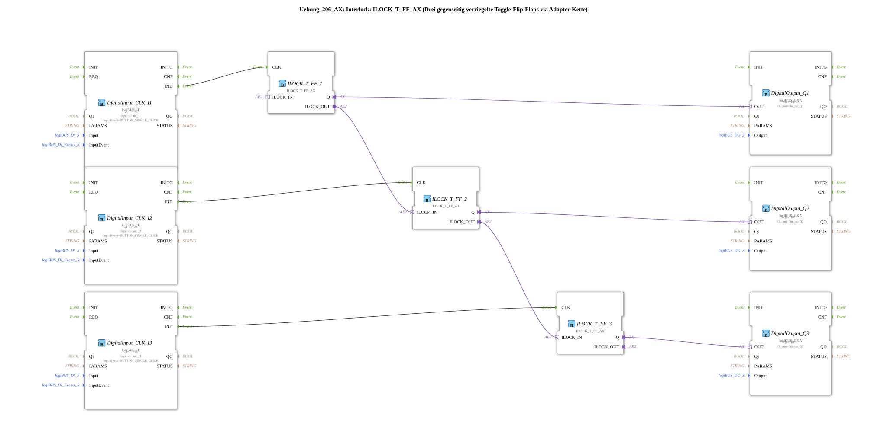

# Exercise_206_AX: Interlock: ILOCK_T_FF_AX (Three mutually interlocked toggle flip-flops via an adapter chain)

*Image of the exercise not available*

* * * * * * * * * *
## Introduction

This exercise demonstrates the implementation of an **interlock** (mutual interlock) using three toggle flip-flops (T-FF). Each flip-flop is toggled by a push button (single-click). The special feature: A bidirectional adapter chain ensures that only one output can be active at any given time – as soon as one flip-flop is set, the others are automatically reset.

This makes the circuit suitable for safety-critical applications, e.g., for the exclusive control of actuators.

## Function Blocks (FBs) Used

| Block Name | Type | Description |
|---------------------|-----------------------------------------|----------------------------------------------|
| `DigitalInput_CLK_I1` | `logiBUS::io::DI::logiBUS_IE` | Digital input for push button on channel I1 |
| `DigitalInput_CLK_I2` | `logiBUS::io::DI::logiBUS_IE` | Digital input for push button on channel I2 |
| `DigitalInput_CLK_I3` | `logiBUS::io::DI::logiBUS_IE` | Digital input for push button on channel I3 |
| `ILOCK_T_FF_1` | `logiBUS::signalprocessing::interlock::ILOCK_T_FF_AX` | Mutually interlocked toggle flip-flop (central component) |
| `ILOCK_T_FF_2` | `logiBUS::signalprocessing::interlock::ILOCK_T_FF_AX` | Same type as ILOCK_T_FF_1 |
| ILOCK_T_FF_3` | `logiBUS::signalprocessing::interlock::ILOCK_T_FF_AX` | Same type as ILOCK_T_FF_1 |
| DigitalOutput_Q1` | `logiBUS::io::DQ::logiBUS_QXA` | Digital output on channel Q1 |
| DigitalOutput_Q2` | `logiBUS::io::DQ::logiBUS_QXA` | Digital output on channel Q2 |
| DigitalOutput_Q3` | `logiBUS::io::DQ::logiBUS_QXA` | Digital output on channel Q3 |

### Sub-Block: ILOCK_T_FF_AX

- **Type**: `logiBUS::signalprocessing::interlock::ILOCK_T_FF_AX` (Library Block)
- **Internal Function Blocks Used**: *No detailed information publicly available* – the block is integrated as a pre-built logic block from the library.
- **Functionality**:
- The block implements a **Toggle Flip-Flop** (T-FF): On each rising edge at the clock input `CLK`, the output `Q` changes its state (from FALSE to TRUE or vice versa).
- It also has an **adapter interface** (`ILOCK_IN` / `ILOCK_OUT`) via which a locking chain is established. As soon as its own output `Q` is set to TRUE, the function block sends a block signal via `ILOCK_OUT`. If it receives a block signal from a previous function block via `ILOCK_IN`, its own output is immediately reset to FALSE (if active). This ensures that only one flip-flop in the chain can be active at any given time.
- **Parameters**:
- No user-defined parameters (all default values from the library).
- **Event Interfaces**:
- **Input**: `CLK` – Event (rising edge) to toggle the output.
- **Output**: *No custom event outputs* (the output data is passed directly via adapters).
- **Data Interfaces**:
- **Data Output**: `Q` (BOOL) – the current state of the flip-flop.
- **Adapter Interfaces**:
- **Plug**: `ILOCK_IN` – adapter input for the predecessor's block signal.
- **Socket**: `ILOCK_OUT` – adapter output for blocking the successor.

## Program Flow and Connections

1. **Input Events**

The three digital inputs (`DigitalInput_CLK_Ix`) convert button signals (single-click event) into events at the output `IND`. These are connected directly to the `CLK` input of the respective `ILOCK_T_FF_Ax` module.

2. **Interlock Chain**

The three flip-flops are connected in a chain via their adapter interfaces:

- `ILOCK_T_FF_1.ILOCK_OUT` → `ILOCK_T_FF_2.ILOCK_IN`
- `ILOCK_T_FF_2.ILOCK_OUT` → `ILOCK_T_FF_3.ILOCK_IN`
- (The output of `ILOCK_T_FF_3.ILOCK_OUT` remains unused; the chain is open at this point.)

This chaining ensures that when one flip-flop (e.g., No. 1) is set, its successor (No. 2) receives a block signal, which is then passed on to No. 3. As soon as an active blocking signal is present in the chain, the affected component immediately switches off its output `Q`.

3. **Output Control**

The outputs `Q` of the three flip-flops are connected to the digital outputs (`DigitalOutput_Q1` … `DigitalOutput_Q3`). These outputs transmit the state to the hardware channels Q1, Q2, and Q3.

**Learning Objectives**:

- Understanding the interlock principle in automation technology.
- Familiarity with the library component `ILOCK_T_FF_AX` and its adapter interface.
- Application of event and adapter connections in 4diac.

**Difficulty Level**: Medium – Prior knowledge of IEC 61499, event control basics, and adapter handling is recommended.

**Instructions for Implementation**:

- This exercise is designed for use with a logiBUS system (e.g., Raspberry Pi with I/O expansion).
- Before starting, the hardware channels (Input_I1 … Input_I3, Output_Q1 … Output_Q3) must be correctly connected to the actual buttons and actuators.
- The function block `logiBUS_DI_Events::BUTTON_SINGLE_CLICK` is used as the event source – a simple button press generates a single clock event (debouncing is integrated into the driver).

## Summary

Exercise "Exercise_206_AX" demonstrates an elegant way to interlock three toggle flip-flops so that only one output is active at any given time. Using an adapter chain simplifies cabling and makes the logic modularly expandable to multiple levels. The library component `ILOCK_T_FF_AX` encapsulates the complex interlocking logic and allows for a clear, well-organized network topology.

---

### 🌐 Related topic subpages on ms-muc-docs.de

* [🌐 Eclipse 4diac IDE & color reference on ms-muc-docs.de ](https://www.ms-muc-docs.de/iec-61499/eclipse-4diac/)
