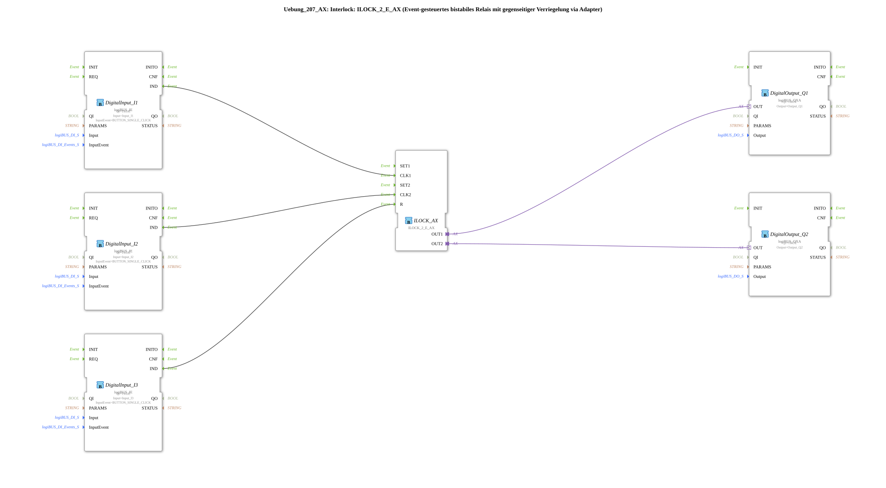

# Exercise_207_AX: Interlock: ILOCK_2_E_AX (Event-driven bistable relay with mutual interlock via adapter)

* * * * * * * * * *
## Introduction
This exercise demonstrates the use of an event-driven bistable relay with mutual interlock.
Using the function block `ILOCK_2_E_AX`, a simple two-channel set/reset system is built. This system is clocked via two digital inputs and controls two digital outputs. A third digital input serves as a separate reset input.

## Function Blocks Used

| FB Name | Type | Description |
|----------|------|----------------|
| `DigitalInput_I1` | `logiBUS::io::DI::logiBUS_IE` | Digital input, parameterized with `Input_I1` and event `BUTTON_SINGLE_CLICK` |
| `DigitalInput_I2` | `logiBUS::io::DI::logiBUS_IE` | Digital input, parameterized with `Input_I2` and event `BUTTON_SINGLE_CLICK` |
| `DigitalInput_I3` | `logiBUS::io::DI::logiBUS_IE` | Digital input, parameterized with `Input_I3` and event `BUTTON_SINGLE_CLICK` |
| `ILOCK_AX` | `logiBUS::signalprocessing::interlock::ILOCK_2_E_AX` | Interlock function block with two event-driven set/reset inputs and adapter outputs |
DigitalOutput_Q1` | `logiBUS::io::DQ::logiBUS_QXA` | Digital output, parameterized with `Output_Q1` |
DigitalOutput_Q2` | `logiBUS::io::DQ::logiBUS_QXA` | Digital output, parameterized with `Output_Q2` |

### Sub-function blocks (no custom sub-applications)

This exercise does not use any user-defined sub-function blocks – all function blocks are from the `logiBUS` libraries (Digital Input/Output and Signal Processing).

### Sub-function blocks (no custom sub-applications)

This exercise does not use any user-defined sub-function blocks – all function blocks are from the `logiBUS` libraries (Digital Input/Output and Signal Processing).
## Program Flow and Connections

1. **Event Linking**

- The event outputs `IND` of the three `logiBUS_IE` inputs are connected to `ILOCK_2_E_AX` as follows:
- `DigitalInput_I1.IND` → `ILOCK_AX.CLK1` (Set Channel 1)
- `DigitalInput_I2.IND` → `ILOCK_AX.CLK2` (Set Channel 2)
- `DigitalInput_I3.IND` → `ILOCK_AX.R` (Common Reset)

2. **Adapter Connections**

- The outputs of the interlock module are passed to the digital outputs via adapter connections:
- `ILOCK_AX.OUT1` → `DigitalOutput_Q1.OUT`
- `ILOCK_AX.OUT2` → `DigitalOutput_Q2.OUT`

3. **How it Works**

- An event (single-click) on `I1` sets the output `Q1` and simultaneously clears `Q2` (mutual interlock).
- An event on `I2` sets `Q2` and clears `Q1`.
- An event on `I3` resets both outputs (`R = Reset`).
- The interlock function block operates on an edge-triggered basis: The output states only change when events occur.

**Learning Objectives**:

- Understanding the principle of mutual interlocking in automation technology
- Working with event-driven function blocks (event-controlled)
- Communication via adapter interfaces between signal processing and input/output
- Parameterization of digital inputs with various event types

**Difficulty Level**: Medium
**Prerequisites**: Basic knowledge of IEC 61499, operation of the 4diac IDE, setting up simple networks with input/output function blocks

**Procedure**: After opening the exercise in the 4diac IDE, the system can be started on suitable hardware (e.g., a logiBUS-compatible system). The pushbuttons at inputs I1, I2, and I3 switch outputs Q1 and Q2 according to the interlock logic.

## Summary

Exercise `Uebung_207_AX` demonstrates the practical application of an event-driven interlock function block. It shows how two outputs can be mutually blocked and how a separate reset input puts the system into a defined default state. The use of adapter connections highlights the loose coupling between signal processing and peripherals – a core concept of IEC 61499.

---

### 🌐 Related topic subpages on ms-muc-docs.de
* [🌐 Eclipse 4diac IDE & color reference on ms-muc-docs.de](https://www.ms-muc-docs.de/iec-61499/eclipse-4diac/)
