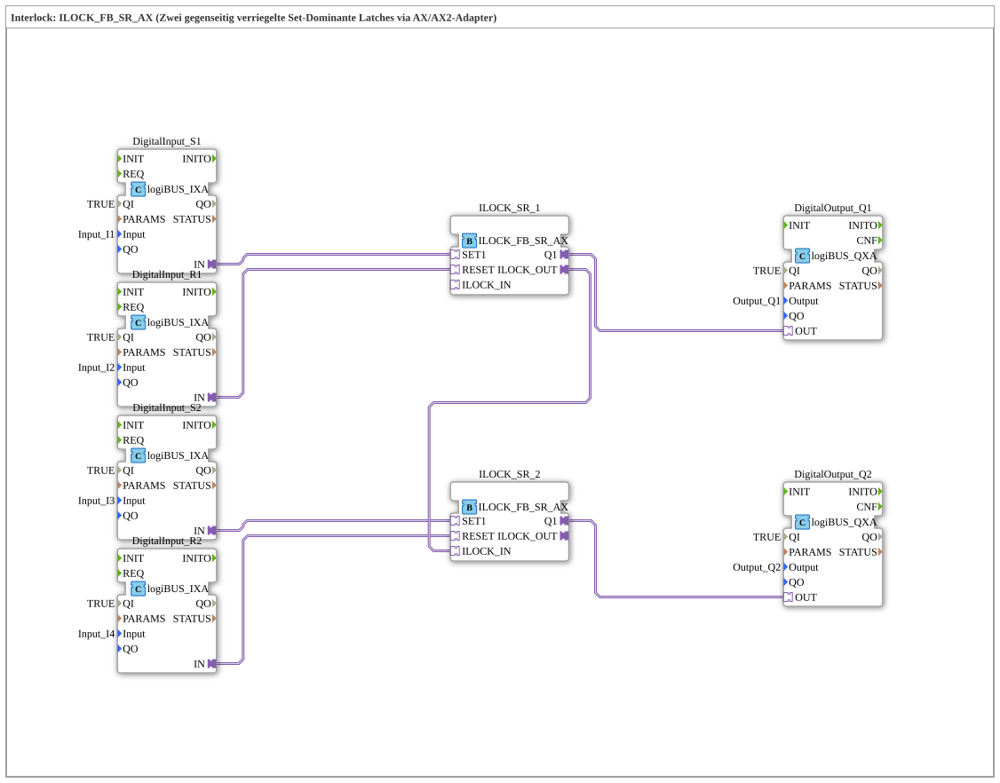

# Exercise_208_AX: Interlock: ILOCK_FB_SR_AX (Two mutually interlocked set-dominant latches via AX/AX2 adapter)

- **Title**: Exercise_208_AX
*Interlock: ILOCK_FB_SR_AX (Two mutually interlocked set-dominant latches via AX/AX2 adapter)*
* * * * * * * * * *
## Introduction

This exercise demonstrates the implementation of a mutual interlock between two set-dominant SR latches. The two latches are interconnected in such a way that only one of the two outputs can be active at any given time. Control is via digital inputs, and the outputs are provided via digital outputs. The locking mechanism is implemented using the special adapters `ILOCK_IN` and `ILOCK_OUT` of the building blocks `ILOCK_FB_SR_AX`.

``` ## Function Blocks (FBs) Used

### Sub-Blocks: DigitalInput_S1, DigitalInput_R1, DigitalInput_S2, DigitalInput_R2
- **Type**: `logiBUS::io::DI::logiBUS_IXA`
- **Internal FBs Used**: None (Hardware Adapter Block)
- **Parameters**:
- `QI` = `TRUE`
- `Input` = `Input_I1` (or `Input_I2`, `Input_I3`, `Input_I4`)
- **Functionality**: These blocks read the digital input signals from the logiBUS hardware and output them via the adapter output. The following sub-function blocks are available: `IN`. They serve as an interface to the physical inputs.

### Sub-function blocks: ILOCK_SR_1, ILOCK_SR_2
- **Type**: `logiBUS::signalprocessing::interlock::ILOCK_FB_SR_AX`
- **Internal Function Blocks Used**: None (predefined interlock block)
- **Parameters**: None (default configuration)
- **Functionality**: These blocks each implement a set-dominant SR latch. They have two adapter interfaces:
- `SET1`: Set input (active-high)
- `RESET`: Reset input (active-high)
- `Q1`: Output (active-high)
- `ILOCK_IN`: Input for interlocking another latch
- `ILOCK_OUT`: Output for interlocking another latch

Interlocking means that an active `ILOCK_IN` prevents its own latch from being set. Therefore, only one of the two latches can be set at any given time.

### Sub-Blocks: DigitalOutput_Q1, DigitalOutput_Q2
- **Type**: `logiBUS::io::DQ::logiBUS_QXA`
- **Internal Function Blocks Used**: None (Hardware Adapter Block)
- **Parameters**:
- `QI` = `TRUE`
- `Output` = `Output_Q1` (or `Output_Q2`)
- **Functionality**: These blocks output the state of input `OUT` as a digital output signal to the logiBUS hardware. They serve as an interface to the physical outputs.

## Program Flow and Connections

The exercise consists of two identical parallel branches connected via a mutual interlock.

- **First Branch**:

Digital input `DigitalInput_S1` (connected to hardware input `Input_I1`) sends the set signal to `ILOCK_SR_1.SET1`.

Digital input `DigitalInput_R1` (connected to `Input_I2`) sends the reset signal to `ILOCK_SR_1.RESET`.

Output `ILOCK_SR_1.Q1` is fed to `DigitalOutput_Q1.OUT` and switches the hardware output `Output_Q1`.

- **Second Branch**:

Similarly, `ILOCK_SR_2` is set by `DigitalInput_S2` (via `Input_I3`) and reset by `DigitalInput_R2` (via `Input_I4`). Its output, `Q1`, controls `Output_Q2`.

- **Interlock Connection**:

The output `ILOCK_SR_1.ILOCK_OUT` is connected to the input `ILOCK_SR_2.ILOCK_IN`. This ensures that if `ILOCK_SR_1` is set (Q1 = TRUE), setting `ILOCK_SR_2` is blocked. Conversely (symmetry) – in this configuration, only one direction is explicitly wired; the other is implicitly implemented through the component's internal logic. In fact, `ILOCK_FB_SR_AX` has a bidirectional interlock: both latches block each other. The additional connection between `ILOCK_OUT` of one and `ILOCK_IN` of the other ensures that only one is active at any given time.

**Procedure**:

1. If a TRUE signal is present at `S1` (and `ILOCK_SR_1` is not blocked by `ILOCK_SR_2`), then `Q1` is set.

2. If a TRUE signal is present at `S2` (and `ILOCK_SR_2` is not blocked by `ILOCK_SR_1`), then `Q2` is set.

3. A reset via `R1` or `R2` resets the respective latch.

4. Due to the interlock, `Q1` and `Q2` can never be TRUE simultaneously. Attempting to set the blocked latch will be ineffective.

**Learning Objectives**:

- Understanding of mutual interlocks in control engineering.
- Application of set-dominant SR latches.
- Working with adapter connections in the 4diac IDE (AX/AX2 concept).

**Difficulty Level**: Intermediate
**Prerequisites**: Basic knowledge of logiBUS input/output, SR latch functionality.

## Summary

Exercise `Uebung_208_AX` demonstrates how to create a mutual interlock between two set-dominant latches using the special interlock blocks `ILOCK_FB_SR_AX`. The adapter connections `ILOCK_IN` and `ILOCK_OUT` ensure that only one of the two outputs can be active at any given time. This is typical for applications where two states must be mutually exclusive (e.g., motor directions, valve controls). This exercise reinforces the use of hardware adapters and the interlock mechanisms of the logiBUS library.

---

### 🌐 Related topic subpages on ms-muc-docs.de
* [🌐 Eclipse 4diac IDE & Color Reference on ms-muc-docs.de](https://www.ms-muc-docs.de/iec-61499/eclipse-4diac/)

]