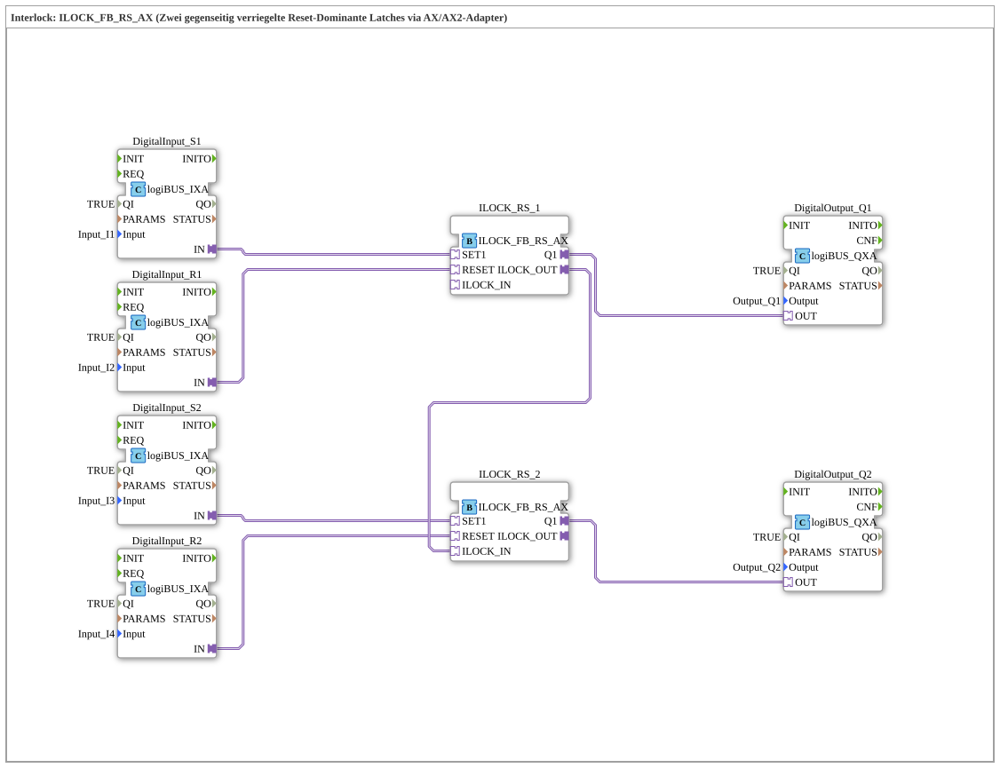

# Exercise_209_AX: Interlock: ILOCK_FB_RS_AX (Two mutually interlocked reset-dominant latches via AX/AX2 adapter)

* * * * * * * * * *
## Introduction
This exercise demonstrates the construction of a **mutual interlock** between two reset-dominant RS latches. The circuit prevents both outputs from being active simultaneously – a typical safety feature in control engineering. This is implemented using two **ILOCK_FB_RS_AX** blocks connected via an AX/AX2 adapter. A set input and a reset input each control the latches, while the outputs drive the digital outputs Q1 and Q2.
## Function Blocks (FBs) Used

The following function blocks are used in this exercise:

| FB Name | Type | Purpose |

| ---------------------- | ------------------------------- | ----------------------------------------- |

| `DigitalInput_S1` | `logiBUS_IXA` | Read the set signal S1 (input I1) |

| `DigitalInput_R1` | `logiBUS_IXA` | Read the reset signal R1 (I2) |

| `DigitalInput_S2` | `logiBUS_IXA` | Read the set signal S2 (I3) |

| `DigitalInput_R2` | `logiBUS_IXA` | Read the reset signal R2 (I4) |

| `ILOCK_RS_1` | `ILOCK_FB_RS_AX` | First locked RS latch |

| `ILOCK_RS_2` | `ILOCK_FB_RS_AX` | Second locked RS latch |

| `DigitalOutput_Q1` | `logiBUS_QXA` | Output to Q1 |

| `DigitalOutput_Q2` | `logiBUS_QXA` | Output to Q2 |

### Sub-Blocks: `ILOCK_FB_RS_AX`
- **Type**: Library block from the logiBUS library (`logiBUS::signalprocessing::interlock::ILOCK_FB_RS_AX`)
- **Internal Function Blocks Used** (Conceptual):
- Two reset-dominant RS latches (SR)
- One interlock gate that mutually blocks the outputs of the latches
- **Interfaces (Adapters)**:
- `SET1`: Set input via AX adapter
- `RESET`: Reset input via AX adapter
- `Q1`: Output of the latch (AX adapter)
- `ILOCK_IN`: Input for interlocking from the other latch
- `ILOCK_OUT`: Output that reports its own state to the other latch
- **Functionality**:

This function block implements a reset-dominant RS latch. Its output, `Q1`, is set when `SET1` is active and no active RESET signal is present. The output remains set until `RESET` becomes active (reset dominance). Additionally, the state of the other latch is received via `ILOCK_IN`: If the other latch is active, setting the own latch is prevented. The own state is then passed to the other latch via `ILOCK_OUT`.

``` ## Program Flow and Connections

The wiring in `SubAppNetwork` is done via adapter connections:

1. **Input Processing**:

- `DigitalInput_S1` provides the set command for `ILOCK_RS_1` (S1).
- `DigitalInput_R1` provides the reset command for `ILOCK_RS_1` (R1).
- Similarly for the second group: `DigitalInput_S2` → `ILOCK_RS_2.SET1`, `DigitalInput_R2` → `ILOCK_RS_2.RESET`.

2. **Interlock Chaining**:

- Output `ILOCK_RS_1.ILOCK_OUT` is connected to `ILOCK_RS_2.ILOCK_IN`.
- This connection ensures that `ILOCK_RS_2` can only be set if `ILOCK_RS_1` is not active (or vice versa, since the second block would also have to specify its ILOCK_OUT – in this configuration, only one direction is explicitly wired, but the internal logic takes the mutual locking into account).

3. **Output Control**:

- `ILOCK_RS_1.Q1` controls output Q1 via `DigitalOutput_Q1`.
- `ILOCK_RS_2.Q1` controls output Q2 via `DigitalOutput_Q2`.

**Procedure**:

A button on S1 activates the first latch (Q1) as long as R1 is not pressed. When S2 is pressed, the second latch can only become active if the first latch is inactive (due to interlock). Only after the first latch (R1) has been reset can the second latch be set. This prevents both outputs from being switched on simultaneously.

## Summary

Exercise **Exercise_209_AX** demonstrates the fundamental principle of an **interlock** with two reset-dominant RS latches. Using the pre-built function block `ILOCK_FB_RS_AX` and the AX adapters, the interlock is implemented simply and clearly. Learning objectives are:

- Understanding the interlock mechanism in control engineering
- Working with adapter-based connections in 4diac
- Recognizing safety requirements (mutual locking)

This circuit is used, for example, to control two counter-rotating motors or in state machines where only one state may be active at a time.

--

### 🌐 Related topic subpages on ms-muc-docs.de
* [🌐 Eclipse 4diac IDE & color reference on ms-muc-docs.de](https://www.ms-muc-docs.de/iec-61499/eclipse-4diac/)

]