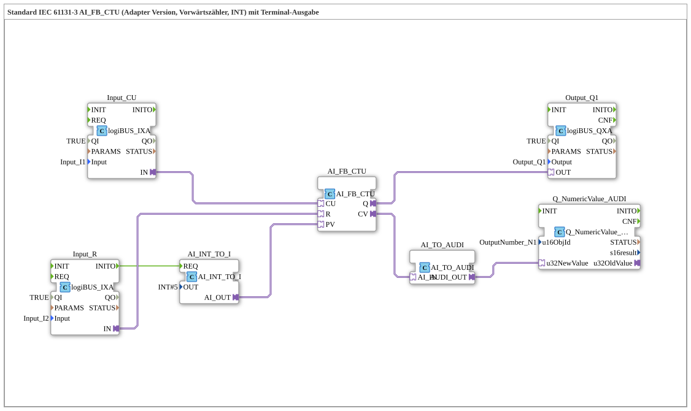

# Exercise_210_AI: Standard IEC 61131-3 AI_FB_CTU (Adapter Version, Up Counter, INT) with Terminal Output

* * * * * * * * * *
## Introduction
This exercise implements an up counter (CTU) according to IEC 61131-3 in an adapter-based version. The counted value is output via a terminal. The circuit demonstrates the interaction between logiBUS inputs, a counter block, conversion blocks, and a terminal output.
## Function Blocks (FBs) Used

### FB: AI_FB_CTU
- **Type**: `adapter::iec61131::counters::AI_FB_CTU`
- **Function**: Up counter with adapter interface. Increments the internal counter by 1 for each positive event at input CU. The counter is reset via input R. The current counter value (CV) and the output Q (if CV ≥ PV) are provided via adapter outputs.

### FB: AI_INT_TO_I
- **Type**: `adapter::conversion::unidirectional::AI_INT_TO_I`
- **Parameter**: `OUT = INT#5` (fixed preset value)
- **Function**: Converts a constant integer value (5) into the required adapter format and provides it as a preset value (PV) for the counter.

### FB: Input_CU
- **Type**: `logiBUS::io::DI::logiBUS_IXA`
- **Parameters**: `QI = TRUE`, `Input = Input_I1`
- **Function**: Reads the digital input `Input_I1` and provides it as a count pulse (CU) via an adapter output.

### FB: Input_R
- **Type**: `logiBUS::io::DI::logiBUS_IXA`
- **Parameters**: `QI = TRUE`, `Input = Input_I2`
- **Function**: Reads the digital input `Input_I2` and provides it as a reset signal (R) via an adapter output.

#
## ##
- **Type**: `logiBUS::io::DQ::logiBUS_QXA`
- **Parameters**: `QI = TRUE`, `Output = Output_Q1`
- **Function**: Controls the digital output `Output_Q1`. The output becomes active as soon as the counter reaches or exceeds the preset value.

### FB: AI_TO_AUDI
- **Type**: `adapter::conversion::unidirectional::AI_TO_AUDI`
- **Function**: Converts the analog counter value (CV) to the AUDI format required for terminal output. **Note**: This function block cannot represent negative numbers.
...### FB: AI_TO_AUDI

- **Type**: `logiBUS::io::DQ::logiBUS_QXA`
- **Function**: Converts the analog counter value (CV) to the AUDI format required for terminal output. **Note**: This function block cannot represent negative numbers.

- **Type**: `logiBUS::io::DQ::logiBUS_QXA`
- **Function**: `QI = TRUE`, `Output = Output_Q1`
- **Function**: `QI = TRUE`, `Output = Output_Q1`
- **Function**: `Output_Q1`
- **Function**: q
### FB: Q_NumericValue_AUDI
- **Type**: `isobus::UT::Q::Q_NumericValue_AUDI`
- **Parameter**: `u16ObjId = OutputNumber_N1`
- **Function**: Outputs the passed numeric value to the terminal. The object ID `OutputNumber_N1` defines the display position.

## Program Flow and Connections

The circuit operates as follows:

1. **Input Signals**:

- The digital input `Input_I1` is forwarded via `Input_CU` as a count pulse (CU) to the counter `AI_FB_CTU`.
- The digital input `Input_I2` is passed to the counter as a reset signal (R) via `Input_R`.

2. **Preset Value**:

- The function block `AI_INT_TO_I` provides a fixed value of 5. This is set once via an event connection from `Input_R.INITO` (initialization event) to `AI_INT_TO_I.REQ` and then passed to the counter as the preset value (PV).

3. **Counter Behavior**:

- On each rising edge at CU, the internal counter is incremented by 1.
- A positive pulse at R resets the counter to 0.
- When the counter value (CV) reaches the preset value (5), the output Q is set.
- Output Q is routed via the adapter output to the digital output `Output_Q1`.

4. **Terminal Output**:

- The current counter value (CV) is converted to AUDI format via `AI_TO_AUDI`.
- The value is then displayed on the terminal via `Q_NumericValue_AUDI`.

5. **Notes from the Comments**:

- The function block `AI_TO_AUDI` does not support negative numbers (this can lead to errors in certain applications).
- To reduce the event rate, a `AX_D_FF` (D flip-flop) can optionally be inserted.

## Summary

This exercise demonstrates the implementation of an IEC 61131-3 forward counter with an adapter interface (CTU) in 4diac. The inputs and outputs are connected to the hardware via logiBUS components. The counter reading is continuously displayed on a terminal, while output Q controls a digital output. The configuration demonstrates the use of adapter-based function blocks, type conversions, and terminal output.

---

### 🌐 Related topic subpages on ms-muc-docs.de
* [🌐 Eclipse 4diac IDE & color reference on ms-muc-docs.de](https://www.ms-muc-docs.de/iec-61499/eclipse-4diac/)

]
