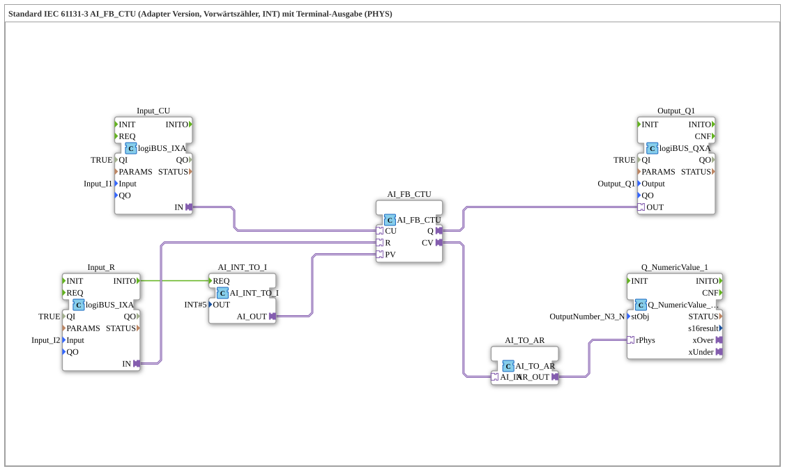

# Exercise_210b_AR: Standard IEC 61131-3 AI_FB_CTU (Adapter Version, Up Counter, INT) with Terminal Output (PHYS)

* * * * * * * * * *
## Introduction

This exercise demonstrates the use of an IEC 61131-3 up counter (CTU) in an adapter version. The counter is controlled via two digital inputs (CU for counting pulses, R for reset). The current counter value is output to a terminal (PHYS) via an analog output. A preset value (PV) is set to 5 at startup. The counter's output Q is routed to a digital output.

## Function Blocks (FBs) Used

- **AI_FB_CTU**

Type: `adapter::iec61131::counters::AI_FB_CTU`

Up counter (CTU) with INT data type. Counts up on each rising edge at the CU input and sets the output Q if CV >= PV.

- **AI_INT_TO_I**

Type: `adapter::conversion::unidirectional::AI_INT_TO_I`

Converts a constant integer value into an IBN-compliant signal. Parameter: `OUT = INT#5` (default value).

- **Input_CU**

Type: `logiBUS::io::DI::logiBUS_IXA`

Digital input for the count pulses, connected to `Input_I1`. Parameter: `QI = TRUE`.

- **Input_R**

Type: `logiBUS::io::DI::logiBUS_IXA`

Digital input for the reset, connected to `Input_I2`. Parameter: `QI = TRUE`.

- **Output_Q1**

Type: `logiBUS::io::DQ::logiBUS_QXA`

Digital output, connected to `Output_Q1`. Active when meter reading ≥ PV.

- **AI_TO_AR**

Type: `adapter::conversion::unidirectional::AI_TO_AR`

Converts the analog meter reading (CV) to an AR value for terminal output.

- **Q_NumericValue_1**

Type: `isobus::UT::Q::Q_NumericValue_PHYSA`

Terminal output (PHYS), displays the meter reading numerically. Parameter: `stObj = OutputNumber_N3`.

---

## Program Flow and Connections

1. **Initialization**

At startup, the function block `AI_INT_TO_I` is triggered via the event output `Input_R.INITO`. This delivers the constant value 5 to the PV input of the counter.

2. **Counting**

Each rising edge at the digital input `Input_CU` (connected to `Input_I1`) increments the counter value (CV) by 1.

3. **Reset**

A signal at the input `Input_R` (connected to `Input_I2`) resets the counter value to 0.

4. **Output Q**

If CV >= PV (5), the output Q is activated. This is connected to the digital output `Output_Q1`.

5. **Display on the Terminal**

The current counter reading (CV) is converted into an AR value via `AI_TO_AR` and sent to the terminal output `Q_NumericValue_1`. This allows the value to be displayed on a physical display or a visualization.

**Configuration Notes:**

- The comment indicates that negative values are possible.
- To reduce the event rate, a `AX_D_FF` block could be added.

--

## Summary

This exercise teaches how to use an IEC 61131-3 counter (CTU) in an adapter-based environment.

**Learning Objectives:**

- Configure a forward counter with preset and reset functions.

**Configuration Notes:** - Initialization of a preset value via a constant block.

- Connection of digital inputs and outputs via logiBUS.
- Output of a counter reading to a terminal (PHYS).

**Difficulty Level:** Intermediate
**Prerequisites:** Basic knowledge of the 4diac IDE, working with logiBUS inputs/outputs.

---

### 🌐 Related topic subpages on ms-muc-docs.de

* [🌐 Eclipse 4diac IDE & color reference on ms-muc-docs.de](https://www.ms-muc-docs.de/iec-61499/eclipse-4diac/)

]
