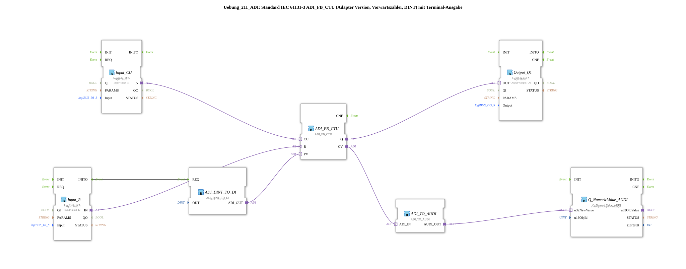

# Exercise_211_ADI: Standard IEC 61131-3 ADI_FB_CTU (Adapter Version, Up Counter, DINT) with Terminal Output

* * * * * * * * * *
## Introduction
This exercise implements a standard IEC 61131-3 up counter (Counter Up, CTU) as an adapter version for the DINT data type. The counter value is also output via a terminal. The hardware inputs (CU and R) are read via logiBUS DI blocks, and the output Q controls a logiBUS DO terminal. The counter end value (PV) is set to a constant value of 5.
## Function Blocks (FBs) Used

### Sub-Blocks: ADI_FB_CTU
- **Type**: adapter::iec61131::counters::ADI_FB_CTU
- **Internal FBs Used**: None (Basic Function Block)
- **Parameters**: None
- **Event Inputs**: CU (Count Pulse), R (Reset)
- **Data Outputs**: Q (Output when CV >= PV), CV (Current Counter Value)
- **Data Inputs**: PV (Final Value)
- **Functionality**: The block increments the internal counter CV (DINT) on every rising edge at the event input CU. When CV reaches the value PV, Q is set. A signal at input R resets CV to 0 and Q.

``` ### Sub-Blocks: ADI_DINT_TO_DI
- **Type**: adapter::conversion::unidirectional::ADI_DINT_TO_DI
- **Internal Function Blocks Used**: None
- **Parameters**: `OUT = DINT#5` (fixed end value)
- **Functionality**: Converts a DINT value into an adapter data output (ADI). Here, the constant value 5 is provided as PV for the meter.

### Sub-Blocks: ADI_TO_AUDI
- **Type**: adapter::conversion::unidirectional::ADI_TO_AUDI
- **Internal Function Blocks Used**: None
- **Parameters**: None
- **Functionality**: Converts the adapter data output (ADI) into an AUDI data output suitable for terminal output. (Note: This function block does not support negative numbers – see the comment in the network.)

### Sub-function block: Q_NumericValue_AUDI
- **Type**: isobus::UT::Q::Q_NumericValue_AUDI
- **Internal Function Blocks Used**: None
- **Parameters**: `u16ObjId = OutputNumber_N1` (Reference to the terminal output object)
- **Functionality**: Receives an AUDI data value (u32NewValue) and outputs it to the terminal. The object ID refers to the predefined output location.

### Sub-Blocks: Input_CU
- **Type**: logiBUS::io::DI::logiBUS_IXA
- **Internal Function Blocks Used**: None
- **Parameters**: `QI = TRUE`, `Input = Input_I1` (physical input)
- **Functionality**: Reads the digital input I1 and makes it available as an adapter data output (IN) for the counting pulse CU. The block is always enabled (QI = TRUE).

### Sub-Blocks: Input_R
- **Type**: logiBUS::io::DI::logiBUS_IXA
- **Internal Function Blocks Used**: None
- **Parameters**: `QI = TRUE`, `Input = Input_I2` (physical input)
- **Functionality**: Reads the digital input I2 and makes it available as an adapter data output (IN) for the Reset R. Additionally, the event output INITO triggers a one-time initialization of the PV value.

**Type**: Reads the digital input I2 and makes it available as an adapter data output (IN) for the Reset R. ### Sub-Blocks: Output_Q1

- **Type**: logiBUS::io::DQ::logiBUS_QXA
- **Internal Function Blocks Used**: None
- **Parameters**: `QI = TRUE`, `Output = Output_Q1` (physical output)
- **Functionality**: Receives the adapter data input (OUT) from the counter output Q and sets the physical output Q1 accordingly.

## Program Flow and Connections

1. **Initialization**: At startup, the Input_R block triggers the INITO event. This triggers the ADI_DINT_TO_DI block, which provides the fixed PV value (5) as a DINT and sends it via the adapter output ADI_OUT to the PV input of ADI_FB_CTU.

2. **Counting Pulses**: A rising edge at input I1 (logiBUS) is forwarded via Input_CU as an adapter signal (IN) to the CU input of the counter. The counter increments its internal CV with each event.

3. **Reset**: A rising edge at input I2 is forwarded via Input_R as an adapter signal to the R input of the counter and resets CV.

4. **Output**: The counter output Q (set when CV >= PV) is passed via an adapter connection to the OUT input of Output_Q1 and switches the physical output Q1.

5. **Terminal Output**: The current counter value CV is converted to an AUDIO format via ADI_TO_AUDI and passed to Q_NumericValue_AUDI. The function block outputs the value to the terminal (object OutputNumber_N1).

**Notes**:

- The network comment indicates that ADI_TO_AUDI cannot process negative numbers – however, this is not relevant here since CV ≥ 0.
- A possible AX_D_FF could reduce the event rate if the counting pulses arrive too quickly.

## Summary

This exercise demonstrates the use of an adaptable forward counter (ADI_FB_CTU) according to IEC 61131-3. The use of adapter blocks creates a flexible and standardized interface. The counter reading is output both as a binary output (Q1) and numerically on a terminal, which facilitates troubleshooting and visualization. The inputs/outputs are configured via logiBUS terminals and are ready for real-world use.