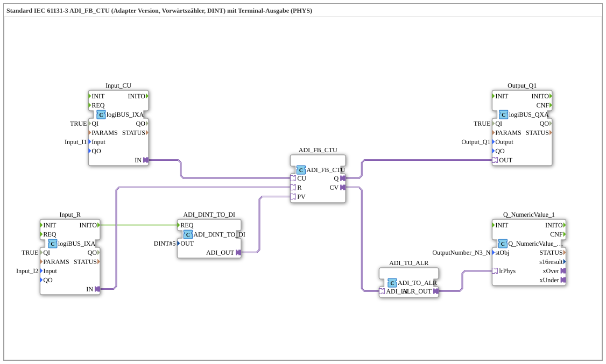

# Exercise_211b_ALR: Standard IEC 61131-3 ADI_FB_CTU (Adapter Version, Up Counter, DINT) with Terminal Output (PHYS)

* * * * * * * * * *
## Introduction
This exercise implements an up counter according to IEC 61131-3 (ADI_FB_CTU) in adapter format. The counter value is output to a terminal (PHYS). The configuration allows for pulse counting, resetting the counter, and displaying the current counter value, including negative values.
## Function Blocks (FBs) Used
- **ADI_FB_CTU**

Type: `adapter::iec61131::counters::ADI_FB_CTU`

Up counter block (DINT). Counts on each rising edge at input CU. The current counter value is output at CV. When the setpoint applied to PV is reached, output Q is set. Input R resets the counter.

- **ADI_DINT_TO_DI**

Type: `adapter::conversion::unidirectional::ADI_DINT_TO_DI`

Converts a DINT value into a DI data stream.

Parameter: OUT = DINT#5 (initial setpoint for the counter).

- **Input_CU**

Type: `logiBUS::io::DI::logiBUS_IXA`

Digital input for the counting pulse (CU).

Parameter: QI = TRUE, Input = Input_I1.

- **Input_R**

Type: `logiBUS::io::DI::logiBUS_IXA`

Digital input for the reset command (R).

Parameter: QI = TRUE, Input = Input_I2.

- **Output_Q1**

Type: `logiBUS::io::DQ::logiBUS_QXA`

Digital output for the counter event (Q).

Parameters: QI = TRUE, Output = Output_Q1.

- **ADI_TO_ALR**

Type: `adapter::conversion::unidirectional::ADI_TO_ALR`

Converts the ADI data stream of the counter reading to an ALR format (for terminal output).

- **Q_NumericValue_1**

Type: `isobus::UT::Q::Q_NumericValue_PHYSA_LREAL`

Outputs the counter reading as a numeric value on the terminal (PHYS).

Parameters: stObj = OutputNumber_N3.

## Program Flow and Connections

The program flow is event-driven:

1. **Initialization**: At startup, the setpoint (PV) is set to DINT#5 by the function block ADI_DINT_TO_DI. This is done via the event connection from `Input_R.INITO` to `ADI_DINT_TO_DI.REQ`.

2. **Count Pulses**: The digital input Input_CU (I1) sends count pulses via the adapter `Input_CU.IN` to the counter input `ADI_FB_CTU.CU`.

3. **Reset**: The digital input Input_R (I2) sends reset signals via `Input_R.IN` to the R input `ADI_FB_CTU.R`.

4. **Counter Output**: The counter's output Q is passed via `ADI_FB_CTU.Q` to the digital output `Output_Q1.OUT` (e.g., for a display or control).

5. **Counter Reading**: The current counter value (CV) is passed via `ADI_FB_CTU.CV` to `ADI_TO_ALR.ADI_IN`. The function block ADI_TO_ALR converts the format to ALR and forwards it to `Q_NumericValue_1.lrPhys`. This enables the counter reading to be displayed on the terminal (PHYS).

**Implementation Notes**:

- Negative counter values are possible.
- In case of high event rates, an AX_D_FF (event filter) can be inserted to reduce the event load.

## Summary
This exercise demonstrates the use of a standardized IEC 61131-3 forward counter (ADI_FB_CTU) in the 4diac IDE using adapter technology. The connection of digital inputs/outputs, conversion blocks, and terminal output illustrates a typical industrial control task. Learning objectives include understanding counter logic, event control, and the integration of physical I/O into a function block network. Basic knowledge of the 4diac IDE and IEC 61131-3 adapter blocks is required.

---

### 🌐 Related topic subpages on ms-muc-docs.de
* [🌐 Eclipse 4diac IDE & color reference on ms-muc-docs.de](https://www.ms-muc-docs.de/iec-61499/eclipse-4diac/)

]
