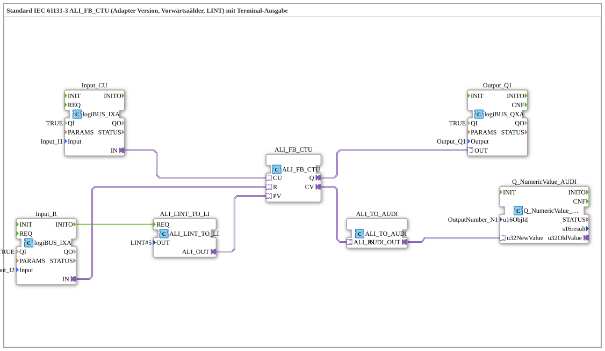

# Exercise_212_ALI: Standard IEC 61131-3 ALI_FB_CTU (Adapter Version, Up Counter, LINT) with Terminal Output

* * * * * * * * * *

## Introduction

This exercise demonstrates the use of an up counter (CTU) according to IEC 61131-3 in the adapter version (ALI_FB_CTU). The counter counts input pulses (CU) upwards, can be reset via a reset input (R), and outputs the current counter value via a terminal output. Additionally, an output signal (Q) is set as soon as the counter value reaches or exceeds the predefined setpoint (PV).

## Function Blocks (FBs) Used

- **ALI_FB_CTU** (`adapter::iec61131::counters::ALI_FB_CTU`)

Up counter (Count Up) as an adapter block.

- Event inputs: – (controlled via adapter connections)
- Data: PV (setpoint, LINT), CU (count pulse), R (reset)
- Outputs: Q (bool), CV (current counter reading, LINT)
- **ALI_LINT_TO_LI** (`adapter::conversion::unidirectional::ALI_LINT_TO_LI`)

Converts a LINT value to an LI value (LINT to LINT?).

- Parameter: `OUT` = `LINT#5` (default value, set during initialization)
- Event input: `REQ` – triggers the conversion
- Data output: `ALI_OUT` (LI) is connected to `PV` of the counter
- **Input_CU** (`logiBUS::io::DI::logiBUS_IXA`)

Digital input for the counting pulse (CU).

- Parameters: `QI` = `TRUE`, `Input` = `Input_I1`
- **Input_R** (`logiBUS::io::DI::logiBUS_IXA`)

Digital input for resetting (R).

- Parameters: `QI` = `TRUE`, `Input` = `Input_I2`
- **Output_Q1** (`logiBUS::io::DQ::logiBUS_QXA`)

Digital output that signals the counter output Q (reached/exceeded).

- Parameters: `QI` = `TRUE`, `Output` = `Output_Q1`
- **ALI_TO_AUDI** (`adapter::conversion::unidirectional::ALI_TO_AUDI`)

Converts an ALI value (here, the counter reading) into an AUDI value for terminal output.

- Note: The conversion does not support negative numbers (see comment in the model).
- **Q_NumericValue_AUDI** (`isobus::UT::Q::Q_NumericValue_AUDI`)

Block for displaying a numeric value on the terminal (HMI).

- Parameter: `u16ObjId` = `OutputNumber_N1`

## Program Flow and Connections

The flow is controlled by event and adapter connections:

1. **Initialization**

At startup (event `INITO` from `Input_R`), the target value (PV) is set via the function block `ALI_LINT_TO_LI`. By default, this returns the value `LINT#5` as the target value.

1. **Counting Operation**

- Each rising edge at input `Input_CU` (connected to the adapter input `CU` of the counter) increments the internal counter reading by 1.
- A signal at `Input_R` (connected to the adapter input `R`) resets the counter to 0.
- The output `Q` of the counter becomes `TRUE` as soon as the counter reading is greater than or equal to the setpoint (PV). This signal is then passed on to the digital output `Output_Q1`.
...` 2 √2 √2 √2 √2 √2 √2 √2 √2 √2 √2 √2 √2 √2 √2 √2 √2 √2 √2 √2 √2 3. **Meter Reading Output**

The current meter reading (CV) is transmitted via the adapter connection to `ALI_TO_AUDI`, converted there into an AUDI format, and finally sent to the terminal block `Q_NumericValue_AUDI`.

- **Note**: The conversion via `ALI_TO_AUDI` cannot process negative numbers. If the meter reading is also to be negative, a different conversion block must be used.
- **Optimization Suggestion**: To reduce the number of events, a `AX_D_FF` (D flip-flop) could be inserted (see comment in the model).

## Summary

This exercise demonstrates the practical application of an IEC 61131-3 compliant forward counter (adapter version) with terminal output. The counter counts pulses up to an adjustable setpoint, sets an output when the setpoint is reached, and displays the counter reading on a terminal. The conversion blocks used demonstrate the data flow and adapter concepts of the 4diac IDE.

---

### 🌐 Related topic subpages on ms-muc-docs.de

- [🌐 Eclipse 4diac IDE & Color Reference on ms-muc-docs.de](https://www.ms-muc-docs.de/iec-61499/eclipse-4diac/)

]
